# MuscleMap Data Flow

This document describes how data flows through the MuscleMap system, from client requests to database operations and back.

## System Overview

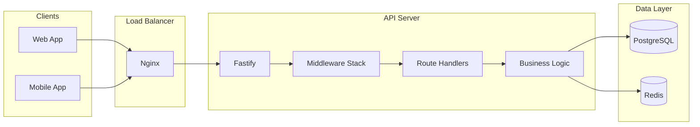
```mermaid
graph LR
    subgraph Clients
        Web[Web App]
        Mobile[Mobile App]
    end

    subgraph Load Balancer
        Nginx[Nginx]
    end

    subgraph API Server
        Fastify[Fastify]
        Middleware[Middleware Stack]
        Routes[Route Handlers]
        Modules[Business Logic]
    end

    subgraph Data Layer
        PG[(PostgreSQL)]
        Redis[(Redis)]
    end

    Web --> Nginx
    Mobile --> Nginx
    Nginx --> Fastify
    Fastify --> Middleware
    Middleware --> Routes
    Routes --> Modules
    Modules --> PG
    Modules --> Redis
```

---

## Request Lifecycle

### 1. Request Ingress

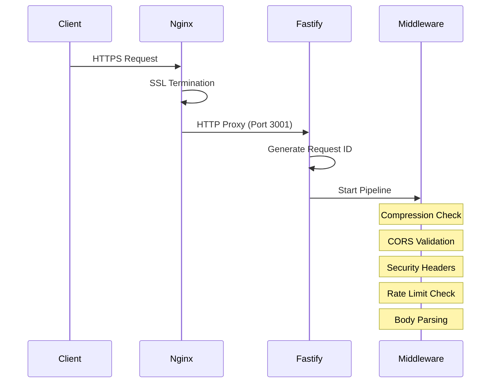
```mermaid
sequenceDiagram
    participant Client
    participant Nginx
    participant Fastify
    participant Middleware

    Client->>Nginx: HTTPS Request
    Nginx->>Nginx: SSL Termination
    Nginx->>Fastify: HTTP Proxy (Port 3001)
    Fastify->>Fastify: Generate Request ID
    Fastify->>Middleware: Start Pipeline

    Note over Middleware: Compression Check
    Note over Middleware: CORS Validation
    Note over Middleware: Security Headers
    Note over Middleware: Rate Limit Check
    Note over Middleware: Body Parsing
```

### 2. Authentication Flow

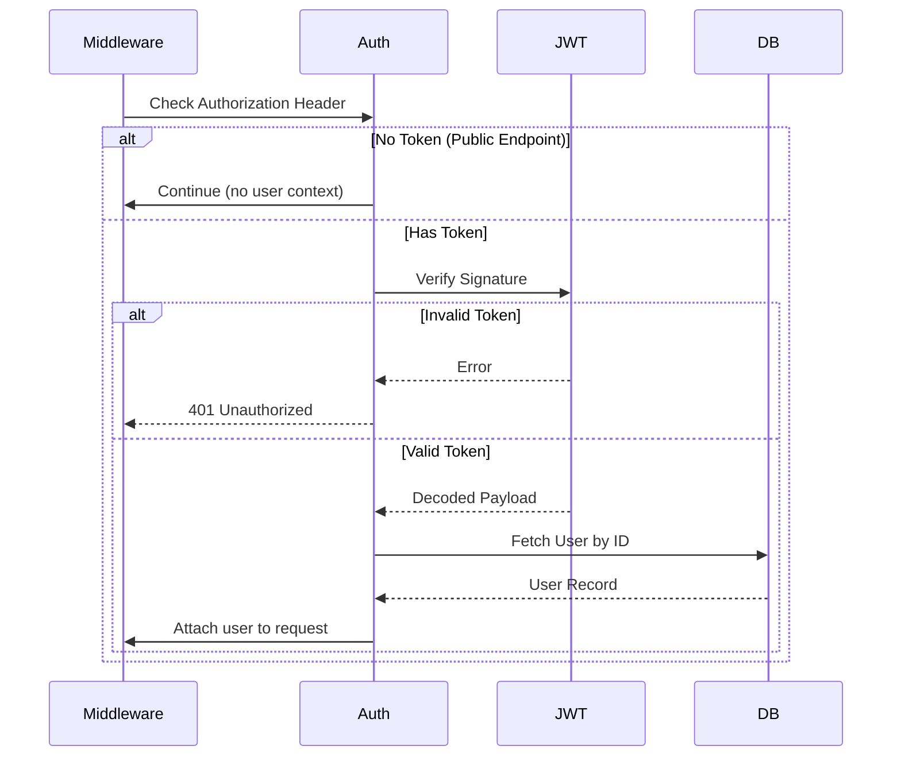
```mermaid
sequenceDiagram
    participant Middleware
    participant Auth
    participant JWT
    participant DB

    Middleware->>Auth: Check Authorization Header

    alt No Token (Public Endpoint)
        Auth->>Middleware: Continue (no user context)
    else Has Token
        Auth->>JWT: Verify Signature
        alt Invalid Token
            JWT-->>Auth: Error
            Auth-->>Middleware: 401 Unauthorized
        else Valid Token
            JWT-->>Auth: Decoded Payload
            Auth->>DB: Fetch User by ID
            DB-->>Auth: User Record
            Auth->>Middleware: Attach user to request
        end
    end
```

### 3. Route Handling

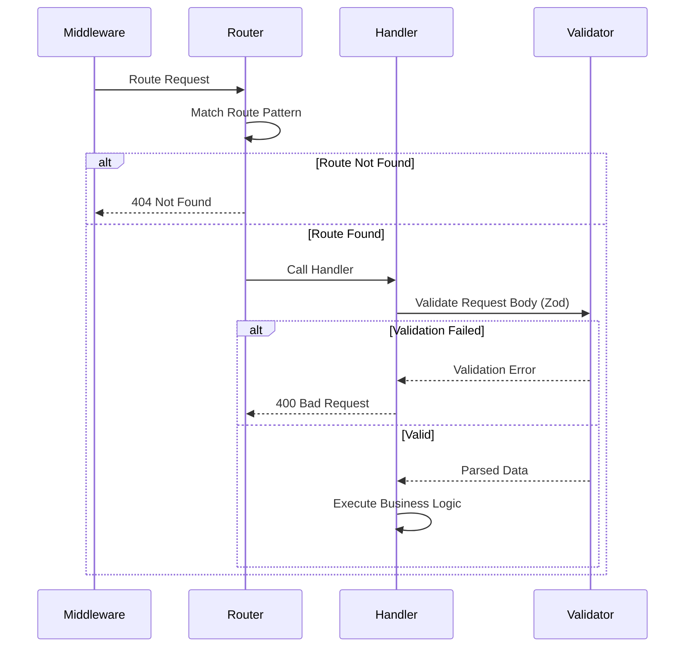
```mermaid
sequenceDiagram
    participant Middleware
    participant Router
    participant Handler
    participant Validator

    Middleware->>Router: Route Request
    Router->>Router: Match Route Pattern

    alt Route Not Found
        Router-->>Middleware: 404 Not Found
    else Route Found
        Router->>Handler: Call Handler
        Handler->>Validator: Validate Request Body (Zod)

        alt Validation Failed
            Validator-->>Handler: Validation Error
            Handler-->>Router: 400 Bad Request
        else Valid
            Validator-->>Handler: Parsed Data
            Handler->>Handler: Execute Business Logic
        end
    end
```

---

## Core Data Flows

### Workout Logging Flow

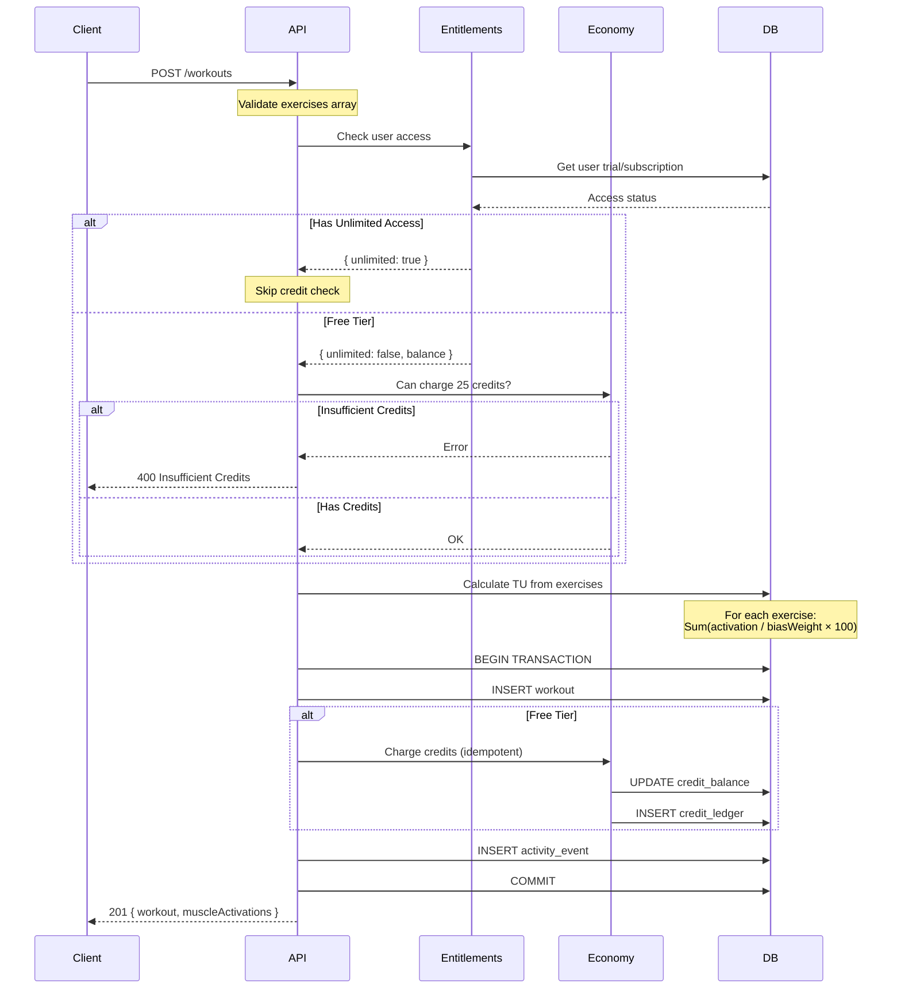
```mermaid
sequenceDiagram
    participant Client
    participant API
    participant Entitlements
    participant Economy
    participant DB

    Client->>API: POST /workouts
    Note over API: Validate exercises array

    API->>Entitlements: Check user access
    Entitlements->>DB: Get user trial/subscription
    DB-->>Entitlements: Access status

    alt Has Unlimited Access
        Entitlements-->>API: { unlimited: true }
        Note over API: Skip credit check
    else Free Tier
        Entitlements-->>API: { unlimited: false, balance }
        API->>Economy: Can charge 25 credits?

        alt Insufficient Credits
            Economy-->>API: Error
            API-->>Client: 400 Insufficient Credits
        else Has Credits
            Economy-->>API: OK
        end
    end

    API->>DB: Calculate TU from exercises
    Note over DB: For each exercise:<br/>Sum(activation / biasWeight × 100)

    API->>DB: BEGIN TRANSACTION
    API->>DB: INSERT workout

    alt Free Tier
        API->>Economy: Charge credits (idempotent)
        Economy->>DB: UPDATE credit_balance
        Economy->>DB: INSERT credit_ledger
    end

    API->>DB: INSERT activity_event
    API->>DB: COMMIT

    API-->>Client: 201 { workout, muscleActivations }
```

### Credit Transaction Flow

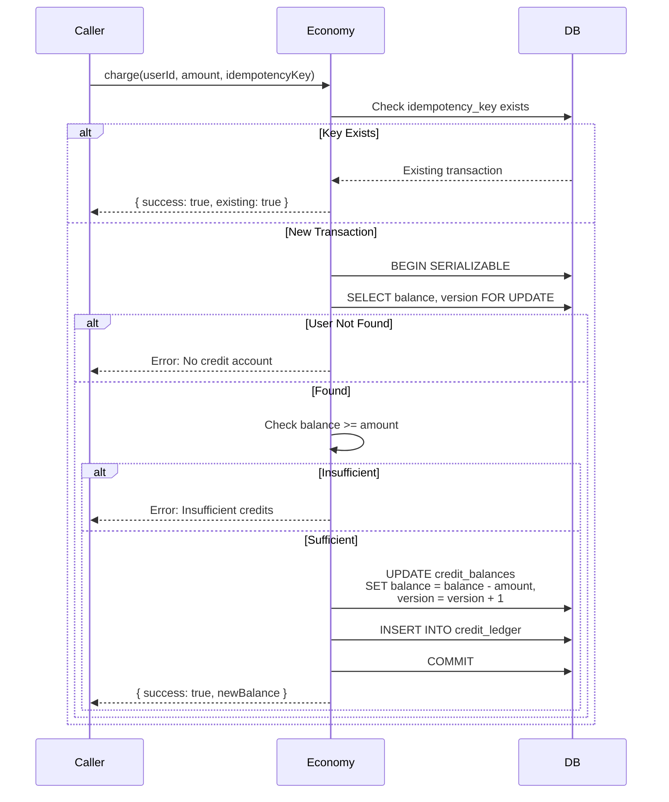
```mermaid
sequenceDiagram
    participant Caller
    participant Economy
    participant DB

    Caller->>Economy: charge(userId, amount, idempotencyKey)

    Economy->>DB: Check idempotency_key exists

    alt Key Exists
        DB-->>Economy: Existing transaction
        Economy-->>Caller: { success: true, existing: true }
    else New Transaction
        Economy->>DB: BEGIN SERIALIZABLE
        Economy->>DB: SELECT balance, version FOR UPDATE

        alt User Not Found
            Economy-->>Caller: Error: No credit account
        else Found
            Economy->>Economy: Check balance >= amount

            alt Insufficient
                Economy-->>Caller: Error: Insufficient credits
            else Sufficient
                Economy->>DB: UPDATE credit_balances<br/>SET balance = balance - amount,<br/>version = version + 1
                Economy->>DB: INSERT INTO credit_ledger
                Economy->>DB: COMMIT
                Economy-->>Caller: { success: true, newBalance }
            end
        end
    end
```

### Real-time Presence Flow

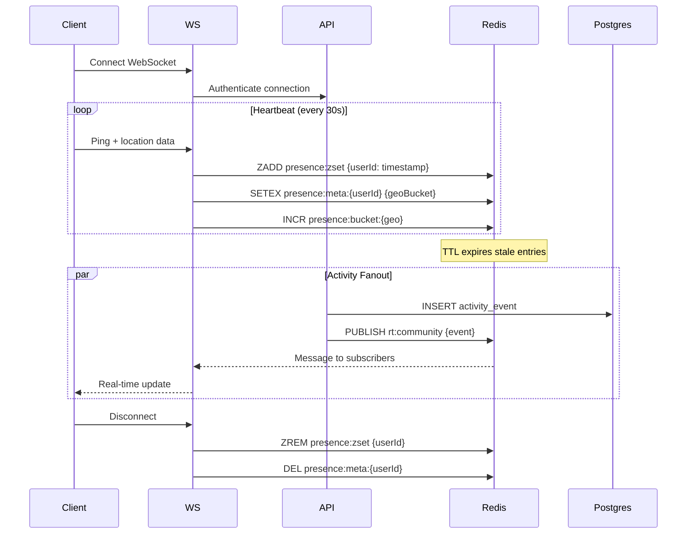
```mermaid
sequenceDiagram
    participant Client
    participant WS
    participant API
    participant Redis
    participant Postgres

    Client->>WS: Connect WebSocket
    WS->>API: Authenticate connection

    loop Heartbeat (every 30s)
        Client->>WS: Ping + location data
        WS->>Redis: ZADD presence:zset {userId: timestamp}
        WS->>Redis: SETEX presence:meta:{userId} {geoBucket}
        WS->>Redis: INCR presence:bucket:{geo}
    end

    Note over Redis: TTL expires stale entries

    par Activity Fanout
        API->>Postgres: INSERT activity_event
        API->>Redis: PUBLISH rt:community {event}
        Redis-->>WS: Message to subscribers
        WS-->>Client: Real-time update
    end

    Client->>WS: Disconnect
    WS->>Redis: ZREM presence:zset {userId}
    WS->>Redis: DEL presence:meta:{userId}
```

### Subscription Verification Flow

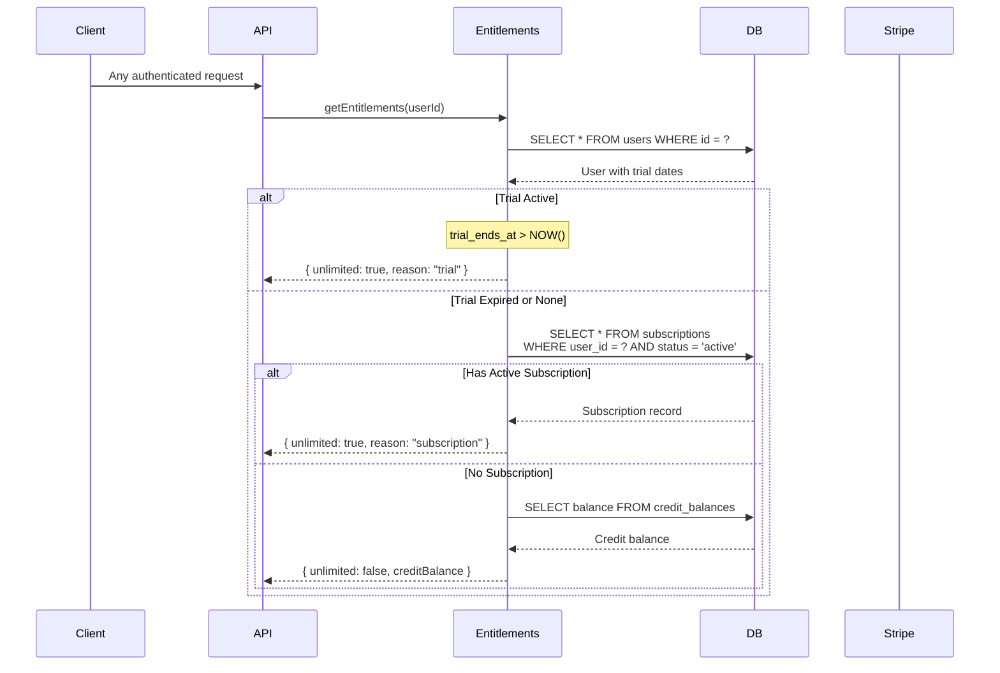
```mermaid
sequenceDiagram
    participant Client
    participant API
    participant Entitlements
    participant DB
    participant Stripe

    Client->>API: Any authenticated request
    API->>Entitlements: getEntitlements(userId)

    Entitlements->>DB: SELECT * FROM users WHERE id = ?
    DB-->>Entitlements: User with trial dates

    alt Trial Active
        Note over Entitlements: trial_ends_at > NOW()
        Entitlements-->>API: { unlimited: true, reason: "trial" }
    else Trial Expired or None
        Entitlements->>DB: SELECT * FROM subscriptions<br/>WHERE user_id = ? AND status = 'active'

        alt Has Active Subscription
            DB-->>Entitlements: Subscription record
            Entitlements-->>API: { unlimited: true, reason: "subscription" }
        else No Subscription
            Entitlements->>DB: SELECT balance FROM credit_balances
            DB-->>Entitlements: Credit balance
            Entitlements-->>API: { unlimited: false, creditBalance }
        end
    end
```

---

## Database Query Patterns

### Connection Pooling

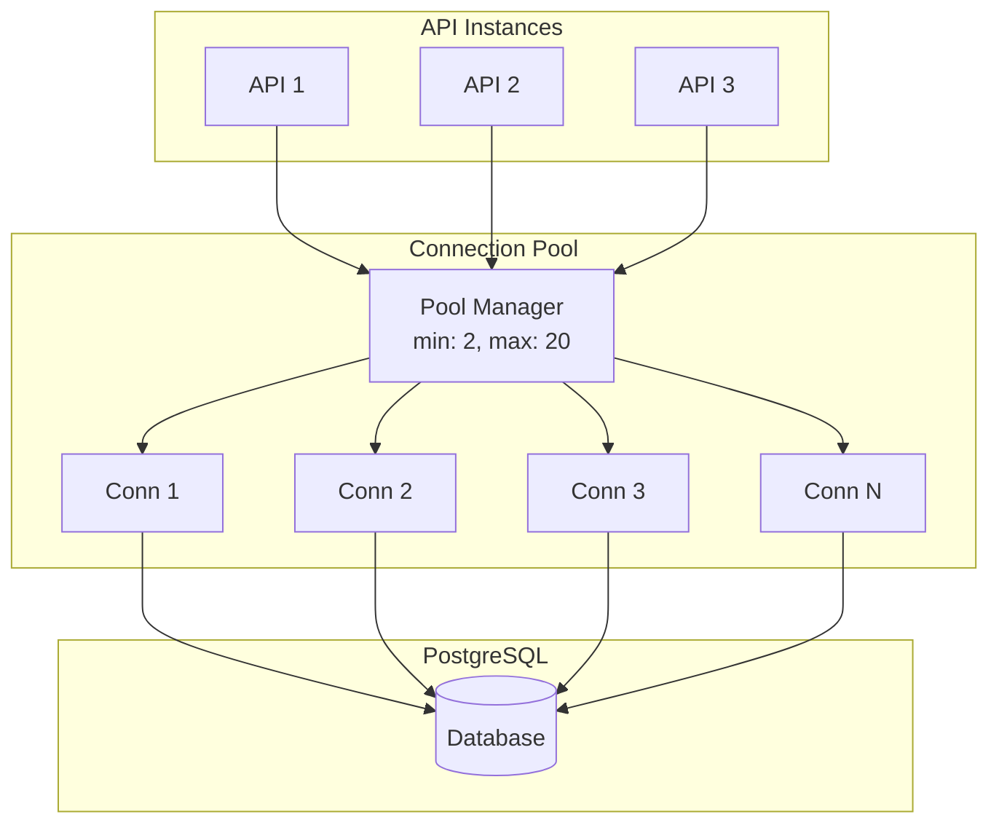
```mermaid
graph TD
    subgraph API Instances
        A1[API 1]
        A2[API 2]
        A3[API 3]
    end

    subgraph Connection Pool
        P[Pool Manager<br/>min: 2, max: 20]
        C1[Conn 1]
        C2[Conn 2]
        C3[Conn 3]
        CN[Conn N]
    end

    subgraph PostgreSQL
        DB[(Database)]
    end

    A1 --> P
    A2 --> P
    A3 --> P
    P --> C1
    P --> C2
    P --> C3
    P --> CN
    C1 --> DB
    C2 --> DB
    C3 --> DB
    CN --> DB
```

**Pool Configuration:**
- Minimum connections: 2 (kept alive)
- Maximum connections: 20 (hard limit)
- Idle timeout: 30 seconds
- Connection timeout: 5 seconds
- Statement timeout: 30 seconds

### Transaction Isolation

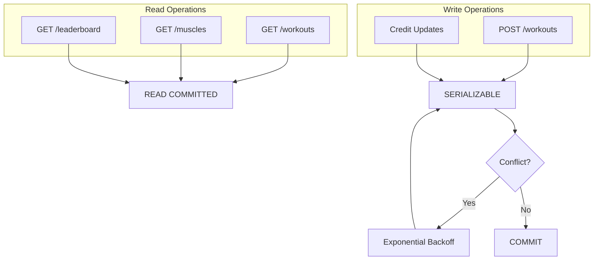
```mermaid
graph TD
    subgraph Read Operations
        R1[GET /workouts]
        R2[GET /muscles]
        R3[GET /leaderboard]
    end

    subgraph Write Operations
        W1[POST /workouts]
        W2[Credit Updates]
    end

    R1 --> RC[READ COMMITTED]
    R2 --> RC
    R3 --> RC

    W1 --> SER[SERIALIZABLE]
    W2 --> SER

    SER --> Retry{Conflict?}
    Retry -->|Yes| Backoff[Exponential Backoff]
    Backoff --> SER
    Retry -->|No| Commit[COMMIT]
```

---

## Caching Strategies

### Redis Cache Patterns

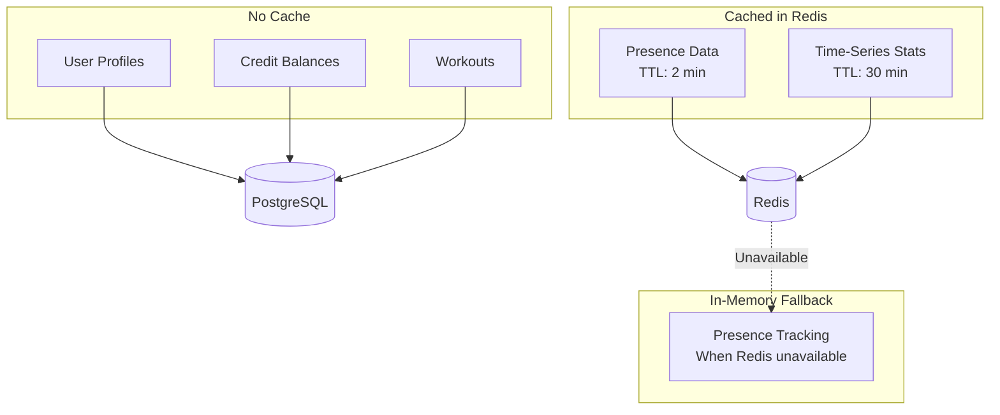
```mermaid
graph TD
    subgraph No Cache
        NC1[User Profiles]
        NC2[Credit Balances]
        NC3[Workouts]
    end

    subgraph Cached in Redis
        C1[Presence Data<br/>TTL: 2 min]
        C2[Time-Series Stats<br/>TTL: 30 min]
    end

    subgraph In-Memory Fallback
        M1[Presence Tracking<br/>When Redis unavailable]
    end

    NC1 --> DB[(PostgreSQL)]
    NC2 --> DB
    NC3 --> DB

    C1 --> Redis[(Redis)]
    C2 --> Redis

    Redis -.->|Unavailable| M1
```

### Cache Invalidation

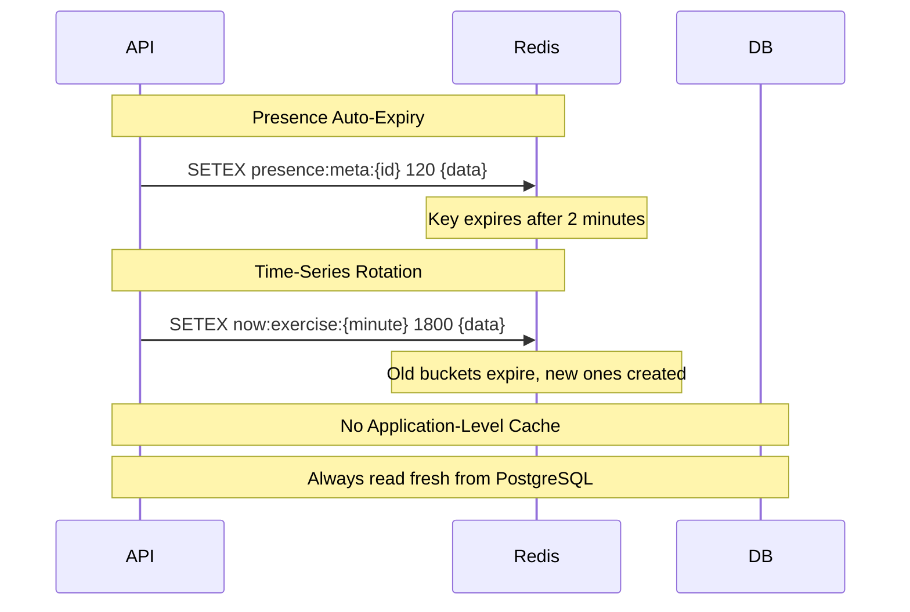
```mermaid
sequenceDiagram
    participant API
    participant Redis
    participant DB

    Note over API,Redis: Presence Auto-Expiry
    API->>Redis: SETEX presence:meta:{id} 120 {data}
    Note over Redis: Key expires after 2 minutes

    Note over API,Redis: Time-Series Rotation
    API->>Redis: SETEX now:exercise:{minute} 1800 {data}
    Note over Redis: Old buckets expire, new ones created

    Note over API,DB: No Application-Level Cache
    Note over API,DB: Always read fresh from PostgreSQL
```

---

## Event Flow

### Activity Event Pipeline

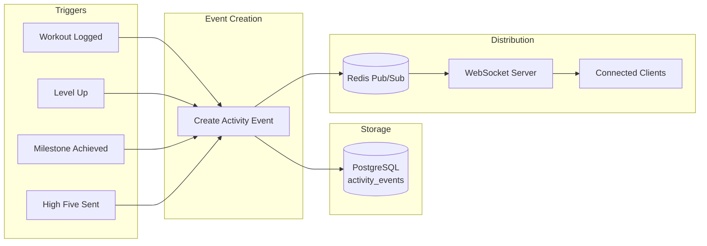
```mermaid
graph LR
    subgraph Triggers
        T1[Workout Logged]
        T2[Level Up]
        T3[Milestone Achieved]
        T4[High Five Sent]
    end

    subgraph Event Creation
        E[Create Activity Event]
    end

    subgraph Storage
        PG[(PostgreSQL<br/>activity_events)]
    end

    subgraph Distribution
        Redis[(Redis Pub/Sub)]
        WS[WebSocket Server]
        Clients[Connected Clients]
    end

    T1 --> E
    T2 --> E
    T3 --> E
    T4 --> E

    E --> PG
    E --> Redis
    Redis --> WS
    WS --> Clients
```

### Event Visibility Scopes

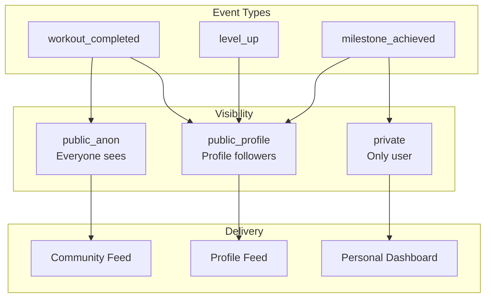
```mermaid
graph TD
    subgraph Event Types
        E1[workout_completed]
        E2[level_up]
        E3[milestone_achieved]
    end

    subgraph Visibility
        V1[public_anon<br/>Everyone sees]
        V2[public_profile<br/>Profile followers]
        V3[private<br/>Only user]
    end

    subgraph Delivery
        D1[Community Feed]
        D2[Profile Feed]
        D3[Personal Dashboard]
    end

    E1 --> V1
    E1 --> V2
    E2 --> V2
    E3 --> V2
    E3 --> V3

    V1 --> D1
    V2 --> D2
    V3 --> D3
```

---

## Error Handling Flow

### Error Propagation

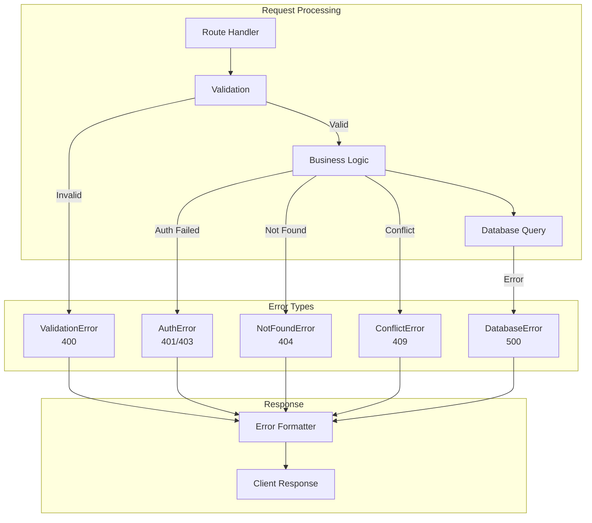
```mermaid
graph TD
    subgraph Request Processing
        R[Route Handler]
        V[Validation]
        B[Business Logic]
        D[Database Query]
    end

    subgraph Error Types
        E1[ValidationError<br/>400]
        E2[AuthError<br/>401/403]
        E3[NotFoundError<br/>404]
        E4[ConflictError<br/>409]
        E5[DatabaseError<br/>500]
    end

    subgraph Response
        F[Error Formatter]
        C[Client Response]
    end

    R --> V
    V -->|Invalid| E1
    V -->|Valid| B
    B -->|Auth Failed| E2
    B -->|Not Found| E3
    B -->|Conflict| E4
    B --> D
    D -->|Error| E5

    E1 --> F
    E2 --> F
    E3 --> F
    E4 --> F
    E5 --> F
    F --> C
```

### Error Response Format

```json
{
  "error": {
    "code": "INSUFFICIENT_CREDITS",
    "message": "You need 25 credits but only have 10",
    "statusCode": 400
  }
}
```

---

## Background Job Flow

### Cron Job Pipeline

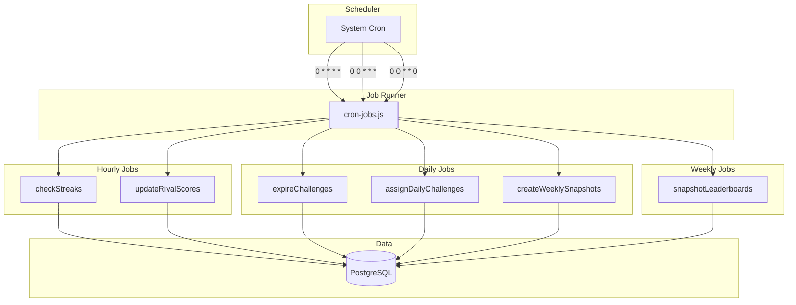
```mermaid
graph TD
    subgraph Scheduler
        Cron[System Cron]
    end

    subgraph Job Runner
        Runner[cron-jobs.js]
    end

    subgraph Hourly Jobs
        H1[checkStreaks]
        H2[updateRivalScores]
    end

    subgraph Daily Jobs
        D1[expireChallenges]
        D2[assignDailyChallenges]
        D3[createWeeklySnapshots]
    end

    subgraph Weekly Jobs
        W1[snapshotLeaderboards]
    end

    subgraph Data
        PG[(PostgreSQL)]
    end

    Cron -->|"0 * * * *"| Runner
    Cron -->|"0 0 * * *"| Runner
    Cron -->|"0 0 * * 0"| Runner

    Runner --> H1
    Runner --> H2
    Runner --> D1
    Runner --> D2
    Runner --> D3
    Runner --> W1

    H1 --> PG
    H2 --> PG
    D1 --> PG
    D2 --> PG
    D3 --> PG
    W1 --> PG
```

---

## Deployment Flow

### Code Deployment

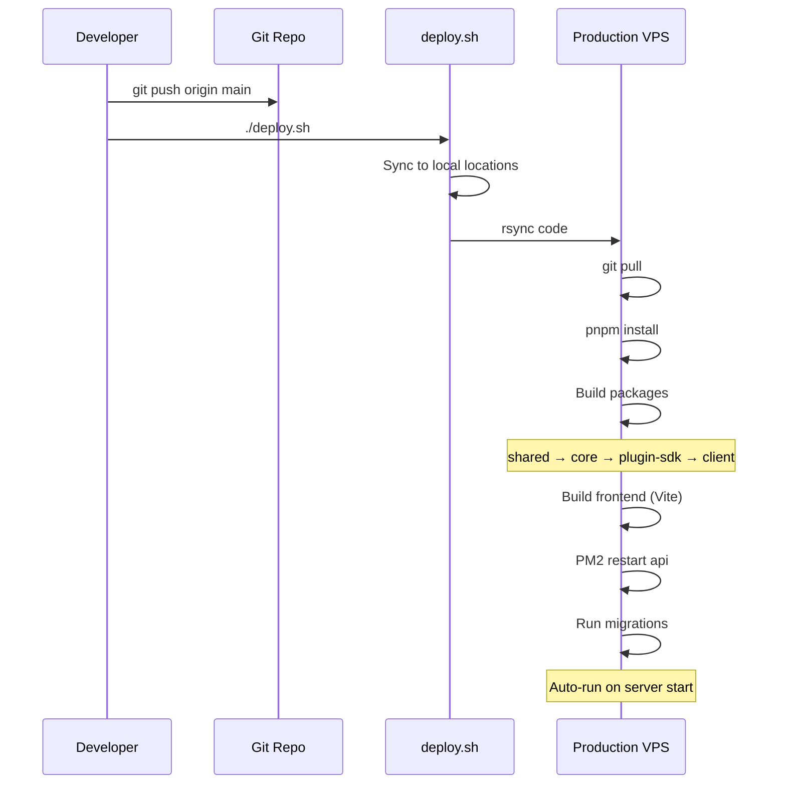
```mermaid
sequenceDiagram
    participant Dev as Developer
    participant Git as Git Repo
    participant Script as deploy.sh
    participant VPS as Production VPS

    Dev->>Git: git push origin main
    Dev->>Script: ./deploy.sh

    Script->>Script: Sync to local locations
    Script->>VPS: rsync code

    VPS->>VPS: git pull
    VPS->>VPS: pnpm install
    VPS->>VPS: Build packages
    Note over VPS: shared → core → plugin-sdk → client
    VPS->>VPS: Build frontend (Vite)
    VPS->>VPS: PM2 restart api

    VPS->>VPS: Run migrations
    Note over VPS: Auto-run on server start
```

---

## Performance Considerations

### Hot Paths

| Operation | Frequency | Optimization |
|-----------|-----------|--------------|
| GET /exercises | Very High | In-memory after first load |
| GET /muscles | Very High | In-memory after first load |
| POST /workouts | High | Connection pooling, prepared statements |
| GET /community/feed | Medium | Indexed queries, cursor pagination |
| Credit operations | Medium | Optimistic locking, idempotency |

### Bottlenecks

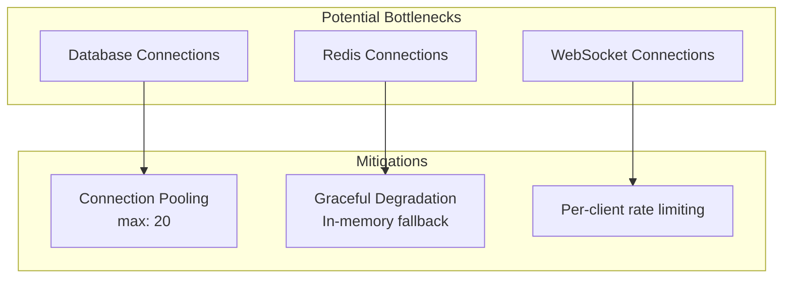
```mermaid
graph TD
    subgraph Potential Bottlenecks
        B1[Database Connections]
        B2[Redis Connections]
        B3[WebSocket Connections]
    end

    subgraph Mitigations
        M1[Connection Pooling<br/>max: 20]
        M2[Graceful Degradation<br/>In-memory fallback]
        M3[Per-client rate limiting]
    end

    B1 --> M1
    B2 --> M2
    B3 --> M3
```

---

## Related Documentation

- [ARCHITECTURE.md](./ARCHITECTURE.md) - System overview
- [DATA_MODEL.md](./DATA_MODEL.md) - Database schema
- [API_REFERENCE.md](./API_REFERENCE.md) - API endpoints
