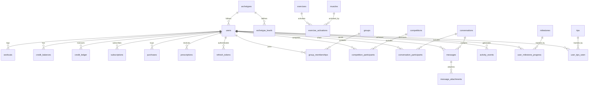

# MuscleMap Data Model

This document describes the PostgreSQL database schema and Redis key patterns used by MuscleMap.

## Entity Relationship Diagram



## PostgreSQL Schema

### Extensions

```sql
CREATE EXTENSION IF NOT EXISTS "uuid-ossp";  -- UUID generation
CREATE EXTENSION IF NOT EXISTS "pg_trgm";    -- Trigram text search
```

---

## Core Tables

### users

Primary user accounts table.

| Column | Type | Constraints | Description |
|--------|------|-------------|-------------|
| `id` | TEXT | PK, auto-generated | Format: `user_{uuid}` |
| `email` | TEXT | UNIQUE, NOT NULL | Valid email format |
| `username` | TEXT | UNIQUE, NOT NULL | 3-30 chars, alphanumeric + underscore |
| `display_name` | TEXT | - | User's display name |
| `password_hash` | TEXT | NOT NULL | PBKDF2 hashed password |
| `avatar_url` | TEXT | - | Profile picture URL |
| `roles` | JSONB | DEFAULT `["user"]` | Array of role strings |
| `flags` | JSONB | DEFAULT | Account flags (verified, banned, suspended, emailConfirmed) |
| `current_archetype_id` | TEXT | FK archetypes | Selected training archetype |
| `current_level` | INTEGER | DEFAULT 1 | Progression level within archetype |
| `trial_started_at` | TIMESTAMPTZ | - | Trial period start |
| `trial_ends_at` | TIMESTAMPTZ | - | Trial period end (90 days from start) |
| `created_at` | TIMESTAMPTZ | DEFAULT NOW() | Account creation |
| `updated_at` | TIMESTAMPTZ | AUTO | Last modification |

**Indexes:**
- `idx_users_email` - Email lookup
- `idx_users_username` - Username lookup
- `idx_users_created_at` - Recent users
- `idx_users_roles` - GIN index for role queries

**Flags JSONB structure:**
```json
{
  "verified": false,
  "banned": false,
  "suspended": false,
  "emailConfirmed": false
}
```

### refresh_tokens

JWT refresh token management for secure re-authentication.

| Column | Type | Constraints | Description |
|--------|------|-------------|-------------|
| `id` | TEXT | PK | Format: `rt_{uuid}` |
| `user_id` | TEXT | FK users, NOT NULL | Token owner |
| `token_hash` | TEXT | NOT NULL | Hashed refresh token |
| `expires_at` | TIMESTAMPTZ | NOT NULL | Token expiration |
| `created_at` | TIMESTAMPTZ | DEFAULT NOW() | Token creation |
| `revoked_at` | TIMESTAMPTZ | - | Revocation timestamp (null = active) |

**Indexes:**
- `idx_refresh_tokens_user` - User's tokens
- `idx_refresh_tokens_hash` - Token lookup (WHERE revoked_at IS NULL)

---

## Economy Tables

### credit_balances

Current credit balance per user with optimistic locking.

| Column | Type | Constraints | Description |
|--------|------|-------------|-------------|
| `user_id` | TEXT | PK, FK users | Balance owner |
| `balance` | INTEGER | NOT NULL, >= 0 | Current credits |
| `lifetime_earned` | INTEGER | NOT NULL, >= 0 | Total credits ever earned |
| `lifetime_spent` | INTEGER | NOT NULL, >= 0 | Total credits ever spent |
| `version` | INTEGER | NOT NULL, DEFAULT 0 | Optimistic lock version |
| `updated_at` | TIMESTAMPTZ | DEFAULT NOW() | Last update |

### credit_ledger

Immutable transaction history (append-only).

| Column | Type | Constraints | Description |
|--------|------|-------------|-------------|
| `id` | TEXT | PK | Format: `txn_{uuid}` |
| `user_id` | TEXT | FK users, NOT NULL | Transaction owner |
| `action` | TEXT | NOT NULL | Action type (e.g., "workout", "purchase", "signup_bonus") |
| `amount` | INTEGER | NOT NULL | Credit change (positive or negative) |
| `balance_after` | INTEGER | NOT NULL, >= 0 | Balance after transaction |
| `metadata` | JSONB | - | Additional transaction data |
| `idempotency_key` | TEXT | UNIQUE | Prevents duplicate transactions |
| `created_at` | TIMESTAMPTZ | DEFAULT NOW() | Transaction time |

**Indexes:**
- `idx_credit_ledger_user` - User's transactions
- `idx_credit_ledger_created` - Recent transactions
- `idx_credit_ledger_action` - Action type queries

### credit_actions

Catalog of actions that cost credits.

| Column | Type | Constraints | Description |
|--------|------|-------------|-------------|
| `id` | TEXT | PK | Action identifier |
| `name` | TEXT | NOT NULL | Display name |
| `description` | TEXT | - | What the action does |
| `default_cost` | INTEGER | NOT NULL, >= 0 | Credit cost |
| `plugin_id` | TEXT | - | Owning plugin (if any) |
| `enabled` | BOOLEAN | DEFAULT TRUE | Action availability |
| `created_at` | TIMESTAMPTZ | DEFAULT NOW() | Creation time |

### purchases

One-time credit purchases via Stripe.

| Column | Type | Constraints | Description |
|--------|------|-------------|-------------|
| `id` | TEXT | PK | Format: `purch_{uuid}` |
| `user_id` | TEXT | FK users, NOT NULL | Purchaser |
| `tier_id` | TEXT | NOT NULL | Pricing tier selected |
| `credits` | INTEGER | NOT NULL, > 0 | Credits purchased |
| `amount_cents` | INTEGER | NOT NULL, >= 0 | Payment amount in cents |
| `status` | TEXT | NOT NULL | pending, completed, failed, refunded |
| `stripe_payment_id` | TEXT | - | Stripe PaymentIntent ID |
| `stripe_session_id` | TEXT | - | Stripe Checkout Session ID |
| `metadata` | JSONB | - | Additional data |
| `created_at` | TIMESTAMPTZ | DEFAULT NOW() | Purchase initiated |
| `completed_at` | TIMESTAMPTZ | - | Purchase completed |

### subscriptions

Stripe subscription records.

| Column | Type | Constraints | Description |
|--------|------|-------------|-------------|
| `id` | TEXT | PK | Format: `sub_{uuid}` |
| `user_id` | TEXT | FK users, NOT NULL | Subscriber |
| `stripe_customer_id` | TEXT | - | Stripe Customer ID |
| `stripe_subscription_id` | TEXT | UNIQUE | Stripe Subscription ID |
| `status` | TEXT | NOT NULL | inactive, active, past_due, canceled, unpaid |
| `current_period_start` | TIMESTAMPTZ | - | Billing period start |
| `current_period_end` | TIMESTAMPTZ | - | Billing period end |
| `cancel_at_period_end` | BOOLEAN | DEFAULT FALSE | Scheduled cancellation |
| `created_at` | TIMESTAMPTZ | DEFAULT NOW() | Subscription created |
| `updated_at` | TIMESTAMPTZ | AUTO | Last modification |

---

## Fitness Data Tables

### muscles

Muscle catalog with bias weights for TU normalization.

| Column | Type | Constraints | Description |
|--------|------|-------------|-------------|
| `id` | TEXT | PK | Muscle identifier (e.g., "glutes") |
| `name` | TEXT | NOT NULL | Display name |
| `anatomical_name` | TEXT | - | Scientific name |
| `muscle_group` | TEXT | NOT NULL | Group (e.g., "legs", "back") |
| `bias_weight` | REAL | NOT NULL, > 0 | TU normalization factor (4-22) |
| `optimal_weekly_volume` | INTEGER | - | Recommended weekly sets |
| `recovery_time` | INTEGER | - | Recovery hours |

**Index:** `idx_muscles_group` - Group filtering

### exercises

Exercise catalog (90+ exercises).

| Column | Type | Constraints | Description |
|--------|------|-------------|-------------|
| `id` | TEXT | PK | Exercise identifier |
| `name` | TEXT | NOT NULL | Display name |
| `type` | TEXT | NOT NULL | Category (strength, cardio, etc.) |
| `difficulty` | INTEGER | 1-5, DEFAULT 2 | Skill level required |
| `description` | TEXT | - | Exercise description |
| `cues` | TEXT | - | Form cues |
| `primary_muscles` | TEXT[] | - | Primary muscle IDs |
| `equipment_required` | JSONB | DEFAULT [] | Required equipment |
| `equipment_optional` | JSONB | DEFAULT [] | Optional equipment |
| `locations` | JSONB | DEFAULT ["gym"] | Valid locations |
| `is_compound` | BOOLEAN | DEFAULT FALSE | Multi-joint movement |
| `estimated_seconds` | INTEGER | DEFAULT 45, > 0 | Time per set |
| `rest_seconds` | INTEGER | DEFAULT 60, >= 0 | Rest between sets |
| `movement_pattern` | TEXT | - | Movement classification |

**Indexes:**
- `idx_exercises_type` - Type filtering
- `idx_exercises_difficulty` - Difficulty filtering
- `idx_exercises_name_trgm` - GIN trigram for fuzzy search
- `idx_exercises_locations` - GIN for location filtering

### exercise_activations

Muscle activation percentages per exercise.

| Column | Type | Constraints | Description |
|--------|------|-------------|-------------|
| `exercise_id` | TEXT | PK, FK exercises | Exercise |
| `muscle_id` | TEXT | PK, FK muscles | Activated muscle |
| `activation` | INTEGER | NOT NULL, 0-100 | Activation percentage |

**Index:** `idx_exercise_activations_muscle` - Muscle lookup

### workouts

Logged workout sessions.

| Column | Type | Constraints | Description |
|--------|------|-------------|-------------|
| `id` | TEXT | PK | Format: `workout_{uuid}` |
| `user_id` | TEXT | FK users, NOT NULL | Workout owner |
| `date` | DATE | NOT NULL | Workout date |
| `total_tu` | REAL | NOT NULL, >= 0 | Total Training Units |
| `credits_used` | INTEGER | DEFAULT 25, >= 0 | Credits charged |
| `notes` | TEXT | - | User notes |
| `is_public` | BOOLEAN | DEFAULT TRUE | Feed visibility |
| `exercise_data` | JSONB | NOT NULL, DEFAULT [] | Exercise details |
| `muscle_activations` | JSONB | NOT NULL, DEFAULT {} | Computed activations |
| `created_at` | TIMESTAMPTZ | DEFAULT NOW() | Log time |

**Indexes:**
- `idx_workouts_user` - User's workouts
- `idx_workouts_date` - Date queries
- `idx_workouts_user_date` - User + date compound
- `idx_workouts_public` - Public feed (WHERE is_public = TRUE)

**exercise_data JSONB structure:**
```json
[
  {
    "exerciseId": "bench_press",
    "sets": 3,
    "reps": 10,
    "weight": 135,
    "duration": null,
    "notes": "Felt strong"
  }
]
```

**muscle_activations JSONB structure:**
```json
{
  "pectoralis_major": 85.5,
  "triceps": 45.2,
  "anterior_deltoid": 30.0
}
```

### prescriptions

AI-generated workout plans.

| Column | Type | Constraints | Description |
|--------|------|-------------|-------------|
| `id` | TEXT | PK | Format: `rx_{uuid}` |
| `user_id` | TEXT | FK users, NOT NULL | Plan recipient |
| `constraints` | JSONB | NOT NULL | Generation constraints |
| `exercises` | JSONB | NOT NULL | Prescribed exercises |
| `warmup` | JSONB | - | Warmup routine |
| `cooldown` | JSONB | - | Cooldown routine |
| `substitutions` | JSONB | - | Alternative exercises |
| `muscle_coverage` | JSONB | NOT NULL | Target muscle coverage |
| `estimated_duration` | INTEGER | NOT NULL, > 0 | Planned duration (seconds) |
| `actual_duration` | INTEGER | NOT NULL, > 0 | Actual duration (seconds) |
| `credit_cost` | INTEGER | DEFAULT 1, >= 0 | Credits charged |
| `created_at` | TIMESTAMPTZ | DEFAULT NOW() | Generation time |

---

## Archetypes & Progression Tables

### archetypes

Training philosophy definitions (10 archetypes).

| Column | Type | Constraints | Description |
|--------|------|-------------|-------------|
| `id` | TEXT | PK | Archetype identifier |
| `name` | TEXT | NOT NULL | Display name |
| `philosophy` | TEXT | - | Training philosophy |
| `description` | TEXT | - | Full description |
| `focus_areas` | JSONB | - | Target muscle groups |
| `icon_url` | TEXT | - | Archetype icon |

### archetype_levels

Progression levels within each archetype.

| Column | Type | Constraints | Description |
|--------|------|-------------|-------------|
| `id` | SERIAL | PK | Auto-increment ID |
| `archetype_id` | TEXT | FK archetypes, NOT NULL | Parent archetype |
| `level` | INTEGER | NOT NULL, > 0 | Level number |
| `name` | TEXT | NOT NULL | Level name |
| `total_tu` | INTEGER | NOT NULL, >= 0 | TU required to reach |
| `description` | TEXT | - | Level description |
| `muscle_targets` | JSONB | - | Target muscle focus |

**Constraint:** UNIQUE(archetype_id, level)

---

## Community Tables

### groups

User groups for social features.

| Column | Type | Constraints | Description |
|--------|------|-------------|-------------|
| `id` | TEXT | PK | Format: `grp_{uuid}` |
| `name` | TEXT | NOT NULL | Group name |
| `description` | TEXT | - | Group description |
| `avatar_url` | TEXT | - | Group avatar |
| `owner_id` | TEXT | FK users, NOT NULL | Group owner |
| `settings` | JSONB | DEFAULT {} | Group settings |
| `created_at` | TIMESTAMPTZ | DEFAULT NOW() | Creation time |
| `updated_at` | TIMESTAMPTZ | AUTO | Last modification |

### group_memberships

Group membership with roles.

| Column | Type | Constraints | Description |
|--------|------|-------------|-------------|
| `group_id` | TEXT | PK, FK groups | Group |
| `user_id` | TEXT | PK, FK users | Member |
| `role` | TEXT | NOT NULL | member, moderator, admin, owner |
| `joined_at` | TIMESTAMPTZ | DEFAULT NOW() | Join time |

### competitions

Leaderboard competitions.

| Column | Type | Constraints | Description |
|--------|------|-------------|-------------|
| `id` | TEXT | PK | Format: `comp_{uuid}` |
| `name` | TEXT | NOT NULL | Competition name |
| `description` | TEXT | - | Description |
| `creator_id` | TEXT | FK users, NOT NULL | Creator |
| `type` | TEXT | NOT NULL | total_tu, streak, workouts, custom |
| `status` | TEXT | NOT NULL | draft, active, completed, canceled |
| `start_date` | TIMESTAMPTZ | NOT NULL | Start time |
| `end_date` | TIMESTAMPTZ | NOT NULL | End time (must be after start) |
| `max_participants` | INTEGER | - | Participant limit |
| `entry_fee` | INTEGER | >= 0 | Credit entry fee |
| `prize_pool` | INTEGER | >= 0 | Total prize credits |
| `rules` | JSONB | - | Competition rules |
| `is_public` | BOOLEAN | DEFAULT TRUE | Public visibility |
| `created_at` | TIMESTAMPTZ | DEFAULT NOW() | Creation time |

### competition_participants

Leaderboard entries.

| Column | Type | Constraints | Description |
|--------|------|-------------|-------------|
| `competition_id` | TEXT | PK, FK competitions | Competition |
| `user_id` | TEXT | PK, FK users | Participant |
| `score` | REAL | DEFAULT 0 | Current score |
| `rank` | INTEGER | - | Current rank |
| `joined_at` | TIMESTAMPTZ | DEFAULT NOW() | Join time |

### activity_events

Community activity feed (append-only).

| Column | Type | Constraints | Description |
|--------|------|-------------|-------------|
| `id` | TEXT | PK | Format: `evt_{uuid}` |
| `user_id` | TEXT | FK users (SET NULL) | Event creator |
| `event_type` | TEXT | NOT NULL | Event type |
| `payload` | JSONB | NOT NULL, DEFAULT {} | Event data |
| `visibility_scope` | TEXT | NOT NULL | public_anon, public_profile, private |
| `geo_bucket` | TEXT | - | Geographic region |
| `created_at` | TIMESTAMPTZ | DEFAULT NOW() | Event time |

**Indexes:**
- `idx_activity_events_created` - Recent events
- `idx_activity_events_user` - User's events
- `idx_activity_events_visibility` - Visibility + time compound

### user_blocks

User blocking for community moderation.

| Column | Type | Constraints | Description |
|--------|------|-------------|-------------|
| `blocker_id` | TEXT | PK, FK users | User doing blocking |
| `blocked_id` | TEXT | PK, FK users | Blocked user |
| `created_at` | TIMESTAMPTZ | DEFAULT NOW() | Block time |

---

## Messaging Tables

### conversations

Direct or group messaging channels.

| Column | Type | Constraints | Description |
|--------|------|-------------|-------------|
| `id` | TEXT | PK | Format: `conv_{uuid}` |
| `type` | TEXT | NOT NULL | direct, group |
| `name` | TEXT | - | Conversation name (groups) |
| `created_by` | TEXT | FK users, NOT NULL | Creator |
| `last_message_at` | TIMESTAMPTZ | - | Last message time |
| `metadata` | JSONB | - | Additional data |
| `created_at` | TIMESTAMPTZ | DEFAULT NOW() | Creation time |
| `updated_at` | TIMESTAMPTZ | AUTO | Last modification |

### conversation_participants

Channel membership.

| Column | Type | Constraints | Description |
|--------|------|-------------|-------------|
| `conversation_id` | TEXT | PK, FK conversations | Conversation |
| `user_id` | TEXT | PK, FK users | Participant |
| `joined_at` | TIMESTAMPTZ | DEFAULT NOW() | Join time |
| `last_read_at` | TIMESTAMPTZ | - | Last read position |
| `muted` | BOOLEAN | DEFAULT FALSE | Notifications muted |
| `role` | TEXT | NOT NULL | member, owner |

### messages

Individual messages.

| Column | Type | Constraints | Description |
|--------|------|-------------|-------------|
| `id` | TEXT | PK | Format: `msg_{uuid}` |
| `conversation_id` | TEXT | FK conversations, NOT NULL | Parent conversation |
| `sender_id` | TEXT | FK users, NOT NULL | Message sender |
| `content` | TEXT | - | Message content |
| `content_type` | TEXT | NOT NULL | text, image, file, system |
| `reply_to_id` | TEXT | FK messages | Reply reference |
| `edited_at` | TIMESTAMPTZ | - | Edit timestamp |
| `deleted_at` | TIMESTAMPTZ | - | Soft delete timestamp |
| `metadata` | JSONB | - | Additional data |
| `created_at` | TIMESTAMPTZ | DEFAULT NOW() | Send time |

**Indexes:**
- `idx_messages_conversation` - Conversation + time compound
- `idx_messages_sender` - Sender's messages

### message_attachments

File attachments with content moderation.

| Column | Type | Constraints | Description |
|--------|------|-------------|-------------|
| `id` | TEXT | PK | Format: `att_{uuid}` |
| `message_id` | TEXT | FK messages, NOT NULL | Parent message |
| `file_name` | TEXT | NOT NULL | Original filename |
| `file_type` | TEXT | NOT NULL | MIME type |
| `file_size` | INTEGER | NOT NULL, > 0 | Size in bytes |
| `storage_path` | TEXT | NOT NULL | Storage location |
| `thumbnail_path` | TEXT | - | Thumbnail location |
| `moderation_status` | TEXT | DEFAULT pending | pending, approved, rejected |
| `moderation_result` | TEXT | - | Moderation outcome |
| `moderation_scores` | JSONB | - | NSFW detection scores |
| `moderated_at` | TIMESTAMPTZ | - | Moderation time |
| `created_at` | TIMESTAMPTZ | DEFAULT NOW() | Upload time |

---

## Tips & Milestones Tables

### tips

Contextual tips for user guidance.

| Column | Type | Constraints | Description |
|--------|------|-------------|-------------|
| `id` | TEXT | PK | Format: `tip_{uuid}` |
| `trigger_type` | TEXT | NOT NULL | Trigger condition type |
| `trigger_value` | TEXT | - | Trigger value |
| `category` | TEXT | NOT NULL | Tip category |
| `title` | TEXT | NOT NULL | Tip title |
| `content` | TEXT | NOT NULL | Tip content |
| `priority` | INTEGER | DEFAULT 0 | Display priority |
| `display_context` | TEXT[] | - | Where to show |
| `min_level` | INTEGER | DEFAULT 1 | Minimum user level |
| `max_level` | INTEGER | - | Maximum user level |
| `created_at` | TIMESTAMPTZ | DEFAULT NOW() | Creation time |

### user_tips_seen

Tip dismissal tracking.

| Column | Type | Constraints | Description |
|--------|------|-------------|-------------|
| `user_id` | TEXT | PK, FK users | User |
| `tip_id` | TEXT | PK, FK tips | Dismissed tip |
| `seen_at` | TIMESTAMPTZ | DEFAULT NOW() | Dismissal time |

### milestones

Achievement definitions.

| Column | Type | Constraints | Description |
|--------|------|-------------|-------------|
| `id` | TEXT | PK | Format: `ms_{uuid}` |
| `name` | TEXT | NOT NULL | Milestone name |
| `description` | TEXT | - | Description |
| `category` | TEXT | NOT NULL | Milestone category |
| `condition_type` | TEXT | NOT NULL | Completion condition type |
| `condition_value` | JSONB | NOT NULL | Condition parameters |
| `reward_credits` | INTEGER | DEFAULT 0, >= 0 | Credit reward |
| `badge_icon` | TEXT | - | Badge icon URL |
| `created_at` | TIMESTAMPTZ | DEFAULT NOW() | Creation time |

### user_milestone_progress

User progress on achievements.

| Column | Type | Constraints | Description |
|--------|------|-------------|-------------|
| `user_id` | TEXT | PK, FK users | User |
| `milestone_id` | TEXT | PK, FK milestones | Milestone |
| `progress` | INTEGER | DEFAULT 0 | Current progress |
| `completed_at` | TIMESTAMPTZ | - | Completion time |
| `reward_claimed` | BOOLEAN | DEFAULT FALSE | Reward claimed |

---

## Plugin Tables

### installed_plugins

Plugin registry.

| Column | Type | Constraints | Description |
|--------|------|-------------|-------------|
| `id` | TEXT | PK | Plugin identifier |
| `name` | TEXT | NOT NULL | Plugin name |
| `version` | TEXT | NOT NULL | Installed version |
| `display_name` | TEXT | - | Display name |
| `description` | TEXT | - | Description |
| `enabled` | BOOLEAN | DEFAULT TRUE | Plugin enabled |
| `config` | JSONB | - | Plugin configuration |
| `installed_at` | TIMESTAMPTZ | DEFAULT NOW() | Installation time |
| `updated_at` | TIMESTAMPTZ | AUTO | Last update |

---

## Database Views

### active_users

Non-banned users with activity metrics.

```sql
SELECT
  u.id, u.username, u.display_name,
  u.current_archetype_id, u.current_level,
  cb.balance as credit_balance,
  (weekly workout count) as workouts_this_week,
  (total TU) as total_tu
FROM users u
LEFT JOIN credit_balances cb ON cb.user_id = u.id
WHERE u.flags->>'banned' = 'false'
  AND u.flags->>'suspended' = 'false';
```

### leaderboard

Ranked users by total TU.

```sql
SELECT
  u.id as user_id, u.username, u.display_name,
  u.avatar_url, u.current_archetype_id, u.current_level,
  COALESCE(SUM(w.total_tu), 0) as total_tu,
  COUNT(w.id) as workout_count,
  RANK() OVER (ORDER BY total_tu DESC) as rank
FROM users u
LEFT JOIN workouts w ON w.user_id = u.id AND w.is_public = TRUE
WHERE u.flags->>'banned' = 'false'
GROUP BY u.id
ORDER BY total_tu DESC;
```

---

## Database Functions

### update_updated_at()

Trigger function to auto-update `updated_at` columns.

```sql
CREATE OR REPLACE FUNCTION update_updated_at()
RETURNS TRIGGER AS $$
BEGIN
  NEW.updated_at = NOW();
  RETURN NEW;
END;
$$ LANGUAGE plpgsql;
```

Applied to: `users`, `groups`, `subscriptions`, `conversations`, `installed_plugins`

### update_credit_balance()

Atomic credit balance update with idempotency and optimistic locking.

**Parameters:**
- `p_user_id` - User ID
- `p_amount` - Credit change (positive or negative)
- `p_action` - Action type
- `p_metadata` - Additional data
- `p_idempotency_key` - Unique transaction key
- `p_expected_version` - Expected balance version

**Returns:** `(success, new_balance, entry_id, error_message)`

**Features:**
- Idempotent: Returns existing transaction if key exists
- Optimistic locking: Fails on version mismatch
- Balance protection: Prevents negative balance
- Automatic ledger entry

---

## Redis Key Patterns

Redis is optional (`REDIS_ENABLED=true` to activate).

### Presence Tracking

| Key | Type | TTL | Description |
|-----|------|-----|-------------|
| `presence:zset` | ZSET | - | User ID → timestamp (sorted set) |
| `presence:meta:{userId}` | STRING | 120s | JSON: `{geoBucket, stageId}` |
| `presence:bucket:{geoBucket}` | STRING | - | User count in geographic area |

### Pub/Sub Channels

| Channel | Purpose |
|---------|---------|
| `rt:community` | Real-time community activity feed |
| `rt:monitor` | System monitoring events |

### Time-Series Stats

| Key Pattern | Type | TTL | Description |
|-------------|------|-----|-------------|
| `now:exercise:selected:{minuteKey}` | HASH | 1800s | Exercise selection counts |
| `now:stage:entered:{minuteKey}` | HASH | 1800s | Stage entry counts |

**Minute Key Format:** `YYYYMMDDHHMM` (UTC)

Example: `20260104143500` = January 4, 2026 at 14:35 UTC

---

## Migrations

Migrations run automatically on server startup. See `apps/api/src/db/migrations/`.

| Migration | Description |
|-----------|-------------|
| `001_add_trial_and_subscriptions.ts` | Trial periods (90 days), Stripe integration |
| `002_community_dashboard.ts` | Activity events, privacy settings |
| `003_messaging.ts` | Direct messaging tables |
| `004_exercise_equipment_locations.ts` | Equipment & location metadata |
| `005_tips_and_milestones.ts` | Contextual tips system |
| `006_performance_optimization.ts` | Database indexes |

## Related Documentation

- [ARCHITECTURE.md](./ARCHITECTURE.md) - System overview
- [API_REFERENCE.md](./API_REFERENCE.md) - API endpoints
- [DATA_FLOW.md](./DATA_FLOW.md) - Request lifecycle
