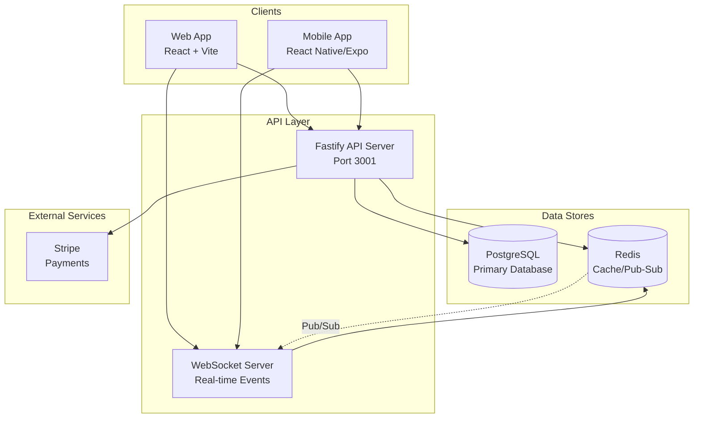
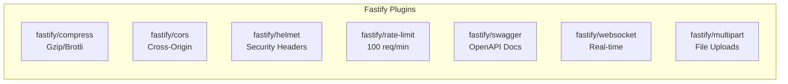
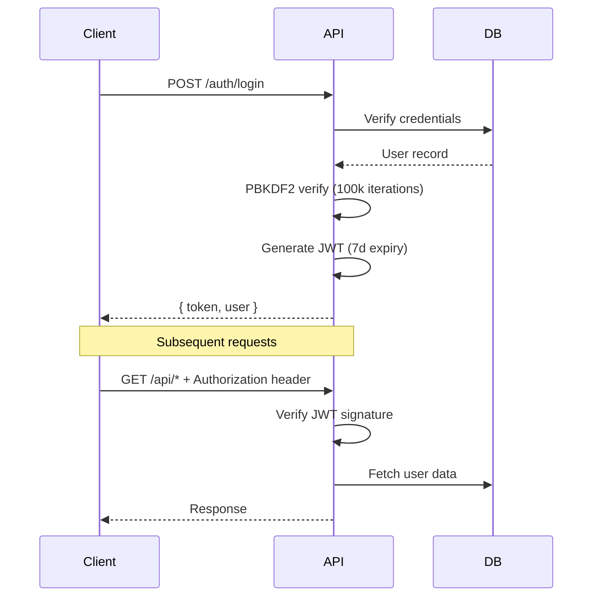

# MuscleMap Architecture

## Overview

MuscleMap is a fitness visualization platform that transforms workout data into real-time muscle activation displays using a proprietary Training Units (TU) bias weight normalization system. The platform includes workout logging, AI-powered workout generation, a credit-based economy, social features, and real-time community presence.



## Tech Stack

### Backend
| Component | Technology | Purpose |
|-----------|------------|---------|
| Runtime | Node.js 20+ | JavaScript runtime |
| Language | TypeScript 5.x | Type-safe development |
| Framework | Fastify 5.x | High-performance HTTP server |
| Database | PostgreSQL 16+ | Primary data store |
| Cache | Redis (ioredis) | Caching, pub/sub, presence |
| Validation | Zod | Schema validation |
| Logging | Pino | Structured JSON logging |
| Auth | JWT + PBKDF2 | Authentication & password hashing |
| Payments | Stripe API | Subscription & purchases |

### Frontend
| Component | Technology | Purpose |
|-----------|------------|---------|
| Build Tool | Vite 5.x | Fast development & bundling |
| Framework | React 18.x | UI components |
| Styling | Tailwind CSS 3.x | Utility-first CSS |
| 3D Graphics | Three.js + @react-three/fiber | Muscle visualization |
| Animation | Framer Motion | UI animations |
| State | Zustand | State management |
| HTTP Client | @musclemap/client | Retry/caching HTTP client |

### Infrastructure
| Component | Technology | Purpose |
|-----------|------------|---------|
| Hosting | VPS | Production server |
| Reverse Proxy | Nginx | SSL termination, routing |
| Process Manager | PM2 | Process supervision |
| Package Manager | pnpm | Monorepo workspaces |

## Monorepo Structure

```
musclemap/
├── apps/
│   ├── api/                    # Fastify REST API server
│   │   ├── src/
│   │   │   ├── index.ts        # Entry point
│   │   │   ├── config/         # Environment config (Zod validated)
│   │   │   ├── db/
│   │   │   │   ├── client.ts   # PostgreSQL connection pool
│   │   │   │   ├── schema.sql  # Database schema
│   │   │   │   ├── seed.ts     # Data seeding
│   │   │   │   ├── migrate.ts  # Migration runner
│   │   │   │   └── migrations/ # Incremental migrations
│   │   │   ├── http/
│   │   │   │   ├── server.ts   # Fastify configuration
│   │   │   │   ├── router.ts   # Route mounting
│   │   │   │   └── routes/     # Route handlers
│   │   │   ├── lib/
│   │   │   │   ├── logger.ts   # Pino logger
│   │   │   │   ├── errors.ts   # Error types
│   │   │   │   └── redis.ts    # Redis client
│   │   │   ├── modules/        # Business logic
│   │   │   │   ├── economy/    # Credit system
│   │   │   │   └── entitlements/ # Access control
│   │   │   └── plugins/        # Plugin loader
│   │   └── package.json
│   └── mobile/                 # React Native app (Expo)
├── packages/
│   ├── client/                 # HTTP client with retry/caching
│   ├── core/                   # Shared types, constants, permissions
│   ├── shared/                 # Utilities (error extraction)
│   ├── plugin-sdk/             # Plugin development SDK
│   └── ui/                     # Shared UI components
├── plugins/                    # Drop-in plugins
│   ├── admin-tools/
│   └── leaderboard/
├── src/                        # Frontend (Vite + React)
│   ├── components/
│   ├── contexts/
│   ├── pages/
│   └── utils/
├── docs/                       # Documentation
├── cron-jobs.js                # Scheduled tasks
└── deploy.sh                   # Deployment script
```

## Component Architecture

### API Server

The API server uses Fastify with the following plugins:



**Server Configuration:**
- Body limit: 10MB
- File uploads: 10MB max, 5 files max
- Rate limiting: 100 requests/minute (configurable)
- Trust proxy: enabled
- Request ID format: `req_{timestamp}_{random}`

### Database Layer

PostgreSQL connection pool with optimized settings:

```typescript
// apps/api/src/db/client.ts
{
  min: PG_POOL_MIN,        // Default: 2
  max: PG_POOL_MAX,        // Default: 20
  idleTimeoutMillis: 30000,
  connectionTimeoutMillis: 5000,
  statement_timeout: 30000
}
```

**Features:**
- Connection pooling with min/max limits
- Statement timeout protection (30s)
- Automatic retry for serialization conflicts
- Pool metrics for monitoring
- SSL support for production

### Redis Layer (Optional)

Redis provides caching and real-time features when enabled:

```mermaid
graph TD
    subgraph Redis Clients
        Main[Main Client<br/>General Operations]
        Sub[Subscriber Client<br/>Pub/Sub Receive]
        Pub[Publisher Client<br/>Pub/Sub Send]
    end

    subgraph Key Patterns
        Presence[presence:zset<br/>Online Users]
        Meta[presence:meta:{userId}<br/>User Metadata]
        Bucket[presence:bucket:{geo}<br/>Geo Counts]
        Now[now:*:{minute}<br/>Time-Series Stats]
    end

    subgraph Channels
        Community[rt:community<br/>Activity Feed]
        Monitor[rt:monitor<br/>System Events]
    end

    Main --> Presence
    Main --> Meta
    Main --> Bucket
    Main --> Now
    Pub --> Community
    Pub --> Monitor
    Sub --> Community
    Sub --> Monitor
```

**TTL Values:**
- Presence metadata: 120 seconds (2 minutes)
- "Now" stats buckets: 1800 seconds (30 minutes)

## Core Concepts

### Training Units (TU)

The proprietary bias weight system normalizes muscle activation across different muscle sizes:

```
normalizedActivation = rawActivation / biasWeight × 100
```

| Muscle Size | Bias Weight | Examples |
|-------------|-------------|----------|
| Large | 18-22 | Glutes, Lats, Quads |
| Medium | 10-14 | Deltoids, Biceps, Triceps |
| Small | 4-8 | Rear Delts, Rotator Cuff |

This ensures balanced visual feedback regardless of muscle size.

### Archetypes

Users select a training archetype that defines their fitness path:

| Archetype | Focus |
|-----------|-------|
| Bodybuilder | Aesthetic muscle building |
| Powerlifter | Strength-focused training |
| Gymnast | Bodyweight mastery |
| CrossFit | Functional fitness |
| Martial Artist | Combat conditioning |
| Runner | Endurance training |
| Climber | Grip and pull strength |
| Strongman | Functional strength |
| Functional | General fitness |
| Swimmer | Aquatic conditioning |

Each archetype has multiple progression levels with specific muscle targets.

### Credit Economy

Users spend credits to complete workouts:

| Trigger | Credits |
|---------|---------|
| Registration bonus | +100 |
| Workout (free tier) | -25 |
| Trial period (90 days) | Unlimited |
| Active subscription | Unlimited |

**Transaction Safety:**
- Idempotent transactions via unique `idempotency_key`
- Optimistic locking with version field
- Serializable isolation with automatic retry
- Immutable ledger (append-only)

### Plugin System

Plugins extend functionality without modifying core code:

```
plugins/
└── my-plugin/
    ├── plugin.json         # Manifest
    └── backend/
        └── index.js        # Entry point
```

**Manifest format:**
```json
{
  "id": "my-plugin",
  "name": "My Plugin",
  "version": "1.0.0",
  "entry": { "backend": "./backend/index.js" },
  "capabilities": ["routes", "hooks"],
  "requires": { "host": ">=2.0.0" }
}
```

**Plugin Hooks:**
- `onServerStart(ctx)` - Server initialization
- `onShutdown(ctx)` - Graceful shutdown

## Authentication Flow



**Security:**
- Password hashing: PBKDF2 with 100,000 iterations (SHA-512)
- JWT expiry: 7 days (configurable)
- JWT secret: minimum 32 characters
- Rate limiting: 100 requests/minute

## Error Handling

All API errors follow a consistent format:

```json
{
  "error": {
    "code": "ERROR_CODE",
    "message": "Human readable message",
    "statusCode": 400
  }
}
```

The `@musclemap/shared` package provides `extractErrorMessage()` for safe error extraction.

## Logging

Structured JSON logging with Pino:

```typescript
// Child loggers by module
loggers.http      // HTTP requests
loggers.db        // Database operations
loggers.auth      // Authentication
loggers.economy   // Credit transactions
loggers.plugins   // Plugin loading
loggers.core      // General operations
```

## Deployment

### Production Server

1. Code syncs via `deploy.sh` to VPS
2. Build packages: `pnpm build`
3. PM2 manages API process
4. Nginx proxies requests to Fastify

### Scheduled Tasks

Cron jobs via `cron-jobs.js`:

| Schedule | Task |
|----------|------|
| Hourly | `checkStreaks`, `updateRivalScores` |
| Daily (midnight) | `expireChallenges`, `assignDailyChallenges`, `createWeeklySnapshots` |
| Weekly (Sunday) | `snapshotLeaderboards` |

## Environment Configuration

Configuration is validated with Zod on startup. See `apps/api/src/config/index.ts`.

| Variable | Required | Default | Purpose |
|----------|----------|---------|---------|
| `NODE_ENV` | No | development | Environment mode |
| `PORT` | No | 3001 | API server port |
| `DATABASE_URL` | No | - | PostgreSQL URL (or use PG* vars) |
| `JWT_SECRET` | Yes | - | JWT signing secret (min 32 chars) |
| `REDIS_URL` | No | redis://localhost:6379 | Redis connection |
| `REDIS_ENABLED` | No | false | Enable Redis features |
| `STRIPE_SECRET_KEY` | No | - | Stripe API key |
| `LOG_LEVEL` | No | info | Logging verbosity |
| `RATE_LIMIT_MAX` | No | 100 | Max requests per minute |

## Health Endpoints

| Endpoint | Purpose | Checks |
|----------|---------|--------|
| `GET /health` | Full health check | Database, Redis, version, pool stats |
| `GET /ready` | K8s readiness probe | Database only |

## Related Documentation

- [DATA_MODEL.md](./DATA_MODEL.md) - Database schema and Redis key patterns
- [API_REFERENCE.md](./API_REFERENCE.md) - REST API endpoint documentation
- [DATA_FLOW.md](./DATA_FLOW.md) - Request lifecycle and data flow diagrams
- [PLUGINS.md](./PLUGINS.md) - Plugin development guide
- [SECURITY.md](./SECURITY.md) - Security practices
