# MuscleMap API Reference

MuscleMap uses a REST API built on Fastify. All endpoints are prefixed with `/api` in production.

**Base URL:** `http://localhost:3001/api` (development) or `https://musclemap.me/api` (production)

**Documentation:** Swagger UI available at `/docs` when server is running.

---

## Authentication

All authenticated endpoints require a JWT token in the Authorization header:

```
Authorization: Bearer <token>
```

### Authentication Endpoints

#### POST /auth/register

Create a new user account.

**Request Body:**
```json
{
  "email": "user@example.com",
  "username": "myusername",
  "password": "securepassword123",
  "displayName": "My Name"
}
```

**Response (201):**
```json
{
  "user": {
    "id": "user_abc123",
    "email": "user@example.com",
    "username": "myusername",
    "displayName": "My Name",
    "roles": ["user"],
    "currentArchetypeId": null,
    "currentLevel": 1,
    "createdAt": "2026-01-04T12:00:00Z"
  },
  "token": "eyJhbGciOiJIUzI1NiIs..."
}
```

**Errors:**
- `400` - Validation error (invalid email, username taken, etc.)
- `409` - Email or username already exists

---

#### POST /auth/login

Authenticate and receive a JWT token.

**Request Body:**
```json
{
  "email": "user@example.com",
  "password": "securepassword123"
}
```

**Response (200):**
```json
{
  "user": {
    "id": "user_abc123",
    "email": "user@example.com",
    "username": "myusername",
    "displayName": "My Name",
    "roles": ["user"],
    "currentArchetypeId": "bodybuilder",
    "currentLevel": 3,
    "trialEndsAt": "2026-04-04T12:00:00Z"
  },
  "token": "eyJhbGciOiJIUzI1NiIs..."
}
```

**Errors:**
- `401` - Invalid credentials

---

#### GET /auth/profile

Get the current authenticated user's profile.

**Headers:** `Authorization: Bearer <token>` (required)

**Response (200):**
```json
{
  "id": "user_abc123",
  "email": "user@example.com",
  "username": "myusername",
  "displayName": "My Name",
  "avatarUrl": "https://...",
  "roles": ["user"],
  "flags": {
    "verified": true,
    "banned": false,
    "suspended": false,
    "emailConfirmed": true
  },
  "currentArchetypeId": "bodybuilder",
  "currentLevel": 3,
  "trialStartedAt": "2026-01-04T12:00:00Z",
  "trialEndsAt": "2026-04-04T12:00:00Z",
  "createdAt": "2026-01-04T12:00:00Z"
}
```

---

## Exercises & Muscles

#### GET /muscles

Get all muscles with bias weights.

**Response (200):**
```json
[
  {
    "id": "glutes",
    "name": "Glutes",
    "anatomicalName": "Gluteus Maximus",
    "muscleGroup": "legs",
    "biasWeight": 22,
    "optimalWeeklyVolume": 16,
    "recoveryTime": 48
  }
]
```

---

#### GET /exercises

Get exercise catalog with optional filtering.

**Query Parameters:**
| Parameter | Type | Description |
|-----------|------|-------------|
| `location` | string | Filter by location (gym, home, outdoor) |
| `equipment` | string | Filter by equipment |
| `difficulty` | number | Filter by difficulty (1-5) |
| `search` | string | Search by name (fuzzy) |

**Response (200):**
```json
[
  {
    "id": "bench_press",
    "name": "Barbell Bench Press",
    "type": "strength",
    "difficulty": 3,
    "description": "Lie on a flat bench...",
    "cues": "Keep your back flat...",
    "primaryMuscles": ["pectoralis_major", "anterior_deltoid"],
    "equipmentRequired": ["barbell", "bench"],
    "equipmentOptional": ["spotter"],
    "locations": ["gym"],
    "isCompound": true,
    "estimatedSeconds": 45,
    "restSeconds": 90,
    "movementPattern": "horizontal_push"
  }
]
```

---

#### GET /exercises/:id/activations

Get muscle activation percentages for an exercise.

**Response (200):**
```json
{
  "exerciseId": "bench_press",
  "activations": [
    { "muscleId": "pectoralis_major", "activation": 85 },
    { "muscleId": "anterior_deltoid", "activation": 45 },
    { "muscleId": "triceps", "activation": 40 }
  ]
}
```

---

## Workouts

#### POST /workouts

Log a completed workout.

**Headers:** `Authorization: Bearer <token>` (required)

**Request Body:**
```json
{
  "date": "2026-01-04",
  "exercises": [
    {
      "exerciseId": "bench_press",
      "sets": 3,
      "reps": 10,
      "weight": 135,
      "notes": "Felt strong"
    },
    {
      "exerciseId": "incline_dumbbell_press",
      "sets": 3,
      "reps": 12,
      "weight": 50
    }
  ],
  "notes": "Great chest day!",
  "isPublic": true,
  "idempotencyKey": "workout_2026-01-04_abc123"
}
```

**Response (201):**
```json
{
  "id": "workout_xyz789",
  "userId": "user_abc123",
  "date": "2026-01-04",
  "totalTu": 245.5,
  "creditsUsed": 25,
  "exerciseData": [...],
  "muscleActivations": {
    "pectoralis_major": 85.5,
    "anterior_deltoid": 45.2,
    "triceps": 40.0
  },
  "notes": "Great chest day!",
  "isPublic": true,
  "createdAt": "2026-01-04T18:30:00Z"
}
```

**Notes:**
- `idempotencyKey` prevents duplicate charges
- Credits are only charged for free tier users
- Trial and subscription users have unlimited workouts

---

#### GET /workouts

Get workout history.

**Headers:** `Authorization: Bearer <token>` (required)

**Query Parameters:**
| Parameter | Type | Default | Description |
|-----------|------|---------|-------------|
| `limit` | number | 20 | Max results (1-100) |
| `offset` | number | 0 | Pagination offset |
| `startDate` | string | - | Filter by start date |
| `endDate` | string | - | Filter by end date |

**Response (200):**
```json
{
  "workouts": [
    {
      "id": "workout_xyz789",
      "date": "2026-01-04",
      "totalTu": 245.5,
      "creditsUsed": 25,
      "exerciseData": [...],
      "muscleActivations": {...},
      "createdAt": "2026-01-04T18:30:00Z"
    }
  ],
  "total": 42,
  "limit": 20,
  "offset": 0
}
```

---

#### GET /workouts/:id

Get a specific workout.

**Headers:** `Authorization: Bearer <token>` (required)

**Response (200):**
```json
{
  "id": "workout_xyz789",
  "userId": "user_abc123",
  "date": "2026-01-04",
  "totalTu": 245.5,
  "creditsUsed": 25,
  "notes": "Great chest day!",
  "isPublic": true,
  "exerciseData": [
    {
      "exerciseId": "bench_press",
      "sets": 3,
      "reps": 10,
      "weight": 135,
      "notes": "Felt strong"
    }
  ],
  "muscleActivations": {
    "pectoralis_major": 85.5,
    "anterior_deltoid": 45.2
  },
  "createdAt": "2026-01-04T18:30:00Z"
}
```

---

## Prescriptions

#### POST /prescription/generate

Generate an AI-powered workout plan.

**Headers:** `Authorization: Bearer <token>` (required)

**Request Body:**
```json
{
  "duration": 45,
  "location": "gym",
  "equipment": ["barbell", "dumbbell", "cable"],
  "muscleTargets": ["chest", "triceps"],
  "excludeExercises": ["dips"]
}
```

**Response (200):**
```json
{
  "id": "rx_abc123",
  "exercises": [
    {
      "exerciseId": "bench_press",
      "sets": 3,
      "reps": "8-10",
      "restSeconds": 90
    },
    {
      "exerciseId": "incline_dumbbell_press",
      "sets": 3,
      "reps": "10-12",
      "restSeconds": 60
    }
  ],
  "warmup": [
    { "exerciseId": "arm_circles", "duration": 60 }
  ],
  "cooldown": [
    { "exerciseId": "chest_stretch", "duration": 30 }
  ],
  "substitutions": {
    "bench_press": ["dumbbell_bench_press", "push_ups"]
  },
  "muscleCoverage": {
    "pectoralis_major": 95,
    "triceps": 75,
    "anterior_deltoid": 60
  },
  "estimatedDuration": 42,
  "creditCost": 1
}
```

---

## Economy

#### GET /economy/balance

Get current credit balance.

**Headers:** `Authorization: Bearer <token>` (required)

**Response (200):**
```json
{
  "balance": 75,
  "lifetimeEarned": 200,
  "lifetimeSpent": 125,
  "unlimited": false,
  "unlimitedReason": null
}
```

**Note:** If user has trial or active subscription, `unlimited` is `true`.

---

#### GET /credits/balance

Alias for `/economy/balance`.

---

#### GET /economy/history

Get credit transaction history.

**Headers:** `Authorization: Bearer <token>` (required)

**Query Parameters:**
| Parameter | Type | Default | Max |
|-----------|------|---------|-----|
| `limit` | number | 20 | 100 |
| `offset` | number | 0 | - |

**Response (200):**
```json
{
  "transactions": [
    {
      "id": "txn_abc123",
      "action": "workout",
      "amount": -25,
      "balanceAfter": 75,
      "metadata": { "workoutId": "workout_xyz789" },
      "createdAt": "2026-01-04T18:30:00Z"
    },
    {
      "id": "txn_def456",
      "action": "signup_bonus",
      "amount": 100,
      "balanceAfter": 100,
      "metadata": null,
      "createdAt": "2026-01-04T12:00:00Z"
    }
  ],
  "total": 2,
  "limit": 20,
  "offset": 0
}
```

---

#### GET /economy/pricing

Get credit purchase pricing tiers.

**Response (200):**
```json
{
  "tiers": [
    { "id": "starter", "credits": 100, "priceCents": 499, "popular": false },
    { "id": "standard", "credits": 500, "priceCents": 1999, "popular": true },
    { "id": "premium", "credits": 1500, "priceCents": 4999, "popular": false }
  ],
  "subscription": {
    "id": "unlimited",
    "priceCents": 999,
    "interval": "month",
    "features": ["Unlimited workouts", "Priority support"]
  }
}
```

---

#### POST /economy/charge

Charge credits for an action.

**Headers:** `Authorization: Bearer <token>` (required)

**Request Body:**
```json
{
  "action": "custom_action",
  "amount": 10,
  "idempotencyKey": "charge_abc123",
  "metadata": { "reason": "Premium feature" }
}
```

**Response (200):**
```json
{
  "success": true,
  "transactionId": "txn_xyz789",
  "newBalance": 65
}
```

**Errors:**
- `400` - Insufficient credits
- `409` - Idempotency key already used

---

## Journey & Archetypes

#### GET /archetypes

List all training archetypes.

**Response (200):**
```json
[
  {
    "id": "bodybuilder",
    "name": "Bodybuilder",
    "philosophy": "Aesthetic muscle building",
    "description": "Focus on hypertrophy and symmetry...",
    "focusAreas": ["chest", "back", "shoulders", "legs", "arms"],
    "iconUrl": "https://..."
  }
]
```

---

#### GET /archetypes/:id/levels

Get progression levels for an archetype.

**Response (200):**
```json
[
  {
    "level": 1,
    "name": "Novice",
    "totalTu": 0,
    "description": "Beginning your journey...",
    "muscleTargets": { "chest": 1.0, "back": 1.0 }
  },
  {
    "level": 2,
    "name": "Apprentice",
    "totalTu": 1000,
    "description": "Building a foundation...",
    "muscleTargets": { "chest": 1.2, "back": 1.2, "shoulders": 1.0 }
  }
]
```

---

#### GET /journey

Get user's current journey overview.

**Headers:** `Authorization: Bearer <token>` (required)

**Response (200):**
```json
{
  "archetype": {
    "id": "bodybuilder",
    "name": "Bodybuilder"
  },
  "level": 3,
  "levelName": "Intermediate",
  "totalTu": 2500,
  "tuToNextLevel": 500,
  "nextLevelTu": 3000,
  "progressPercent": 83
}
```

---

#### GET /journey/progress

Get weekly progress and muscle balance.

**Headers:** `Authorization: Bearer <token>` (required)

**Response (200):**
```json
{
  "weeklyProgress": {
    "workouts": 4,
    "totalTu": 450,
    "muscleActivations": {
      "chest": 120,
      "back": 95,
      "legs": 80
    }
  },
  "muscleBalance": {
    "overworked": ["chest"],
    "underworked": ["legs", "shoulders"],
    "balanced": ["back", "arms"]
  },
  "streak": 7
}
```

---

#### POST /journey/select-archetype

Select or change training archetype.

**Headers:** `Authorization: Bearer <token>` (required)

**Request Body:**
```json
{
  "archetypeId": "powerlifter"
}
```

**Response (200):**
```json
{
  "success": true,
  "archetype": {
    "id": "powerlifter",
    "name": "Powerlifter"
  },
  "level": 1,
  "levelName": "Novice"
}
```

---

## Community

#### GET /community/feed

Get community activity feed.

**Headers:** `Authorization: Bearer <token>` (optional)

**Query Parameters:**
| Parameter | Type | Default | Description |
|-----------|------|---------|-------------|
| `limit` | number | 20 | Max results |
| `before` | string | - | Cursor for pagination |

**Response (200):**
```json
{
  "events": [
    {
      "id": "evt_abc123",
      "eventType": "workout_completed",
      "payload": {
        "userId": "user_xyz",
        "username": "stronglifter",
        "totalTu": 320,
        "topMuscles": ["chest", "triceps"]
      },
      "visibilityScope": "public_profile",
      "createdAt": "2026-01-04T18:30:00Z"
    }
  ],
  "nextCursor": "evt_def456"
}
```

---

#### GET /community/active-users

Get count of currently active users.

**Response (200):**
```json
{
  "count": 42,
  "lastUpdated": "2026-01-04T18:30:00Z"
}
```

---

#### GET /community/presence/geo

Get users by geographic region.

**Response (200):**
```json
{
  "buckets": {
    "na-west": 15,
    "na-east": 22,
    "eu-west": 8,
    "asia-pacific": 5
  }
}
```

---

#### GET /community/ws

WebSocket endpoint for real-time community updates.

**Protocol:** `wss://`

**Events Received:**
```json
{
  "type": "activity",
  "data": {
    "eventType": "workout_completed",
    "userId": "user_xyz",
    "username": "stronglifter"
  }
}
```

---

## Messaging

#### GET /messaging/conversations

List user's conversations.

**Headers:** `Authorization: Bearer <token>` (required)

**Response (200):**
```json
{
  "conversations": [
    {
      "id": "conv_abc123",
      "type": "direct",
      "name": null,
      "participants": [
        { "userId": "user_xyz", "username": "friend1" }
      ],
      "lastMessage": {
        "content": "Hey, great workout!",
        "senderId": "user_xyz",
        "createdAt": "2026-01-04T18:30:00Z"
      },
      "unreadCount": 2,
      "lastMessageAt": "2026-01-04T18:30:00Z"
    }
  ]
}
```

---

#### POST /messaging/conversations

Create a new conversation.

**Headers:** `Authorization: Bearer <token>` (required)

**Request Body:**
```json
{
  "type": "direct",
  "participantIds": ["user_xyz"],
  "name": null
}
```

**Response (201):**
```json
{
  "id": "conv_abc123",
  "type": "direct",
  "participants": [...],
  "createdAt": "2026-01-04T18:30:00Z"
}
```

---

#### GET /messaging/conversations/:id/messages

Get messages in a conversation.

**Headers:** `Authorization: Bearer <token>` (required)

**Query Parameters:**
| Parameter | Type | Default |
|-----------|------|---------|
| `limit` | number | 50 |
| `before` | string | - |

**Response (200):**
```json
{
  "messages": [
    {
      "id": "msg_abc123",
      "senderId": "user_xyz",
      "content": "Hey!",
      "contentType": "text",
      "replyToId": null,
      "createdAt": "2026-01-04T18:30:00Z"
    }
  ],
  "nextCursor": "msg_def456"
}
```

---

#### POST /messaging/conversations/:id/messages

Send a message.

**Headers:** `Authorization: Bearer <token>` (required)

**Request Body:**
```json
{
  "content": "Hey, how's it going?",
  "contentType": "text",
  "replyToId": null
}
```

**Response (201):**
```json
{
  "id": "msg_xyz789",
  "senderId": "user_abc123",
  "content": "Hey, how's it going?",
  "contentType": "text",
  "createdAt": "2026-01-04T18:35:00Z"
}
```

---

#### GET /messaging/ws

WebSocket endpoint for real-time messaging.

**Protocol:** `wss://`

**Events Received:**
```json
{
  "type": "message",
  "data": {
    "conversationId": "conv_abc123",
    "message": {
      "id": "msg_xyz789",
      "senderId": "user_xyz",
      "content": "New message!"
    }
  }
}
```

---

## Tips & Insights

#### GET /tips/contextual

Get contextual tips based on user state.

**Headers:** `Authorization: Bearer <token>` (required)

**Query Parameters:**
| Parameter | Type | Description |
|-----------|------|-------------|
| `context` | string | Current page/context |

**Response (200):**
```json
{
  "tips": [
    {
      "id": "tip_abc123",
      "title": "Rest Day Reminder",
      "content": "You've trained 5 days in a row. Consider a rest day!",
      "category": "recovery",
      "priority": 1
    }
  ]
}
```

---

#### POST /tips/:id/dismiss

Dismiss a tip.

**Headers:** `Authorization: Bearer <token>` (required)

**Response (200):**
```json
{
  "success": true
}
```

---

#### GET /insights

Get personalized insights.

**Headers:** `Authorization: Bearer <token>` (required)

**Response (200):**
```json
{
  "insights": [
    {
      "type": "muscle_imbalance",
      "title": "Leg Day Neglected",
      "message": "Your legs are 30% behind your upper body.",
      "severity": "warning",
      "suggestion": "Add 2 leg-focused workouts this week."
    }
  ]
}
```

---

#### GET /milestones

Get milestone progress.

**Headers:** `Authorization: Bearer <token>` (required)

**Response (200):**
```json
{
  "milestones": [
    {
      "id": "ms_first_workout",
      "name": "First Steps",
      "description": "Complete your first workout",
      "progress": 1,
      "target": 1,
      "completed": true,
      "completedAt": "2026-01-04T18:30:00Z",
      "rewardCredits": 10,
      "rewardClaimed": true
    },
    {
      "id": "ms_week_streak",
      "name": "Week Warrior",
      "description": "Workout 7 days in a row",
      "progress": 4,
      "target": 7,
      "completed": false,
      "rewardCredits": 50
    }
  ]
}
```

---

## Leaderboards & Competitions

#### GET /progression/leaderboard

Get global leaderboard.

**Query Parameters:**
| Parameter | Type | Default | Max |
|-----------|------|---------|-----|
| `limit` | number | 100 | 100 |

**Response (200):**
```json
{
  "leaderboard": [
    {
      "rank": 1,
      "userId": "user_abc123",
      "username": "toplifter",
      "displayName": "Top Lifter",
      "avatarUrl": "https://...",
      "archetypeId": "powerlifter",
      "level": 15,
      "totalTu": 125000,
      "workoutCount": 500
    }
  ]
}
```

---

#### POST /highfives/send

Send a high-five recognition.

**Headers:** `Authorization: Bearer <token>` (required)

**Request Body:**
```json
{
  "recipientId": "user_xyz",
  "reason": "Great workout streak!"
}
```

**Response (200):**
```json
{
  "success": true
}
```

---

## Settings

#### GET /settings

Get user settings.

**Headers:** `Authorization: Bearer <token>` (required)

**Response (200):**
```json
{
  "notifications": {
    "email": true,
    "push": true,
    "workoutReminders": true
  },
  "privacy": {
    "shareLocation": false,
    "showInFeed": true,
    "publicProfile": true
  },
  "preferences": {
    "weightUnit": "lbs",
    "theme": "dark"
  }
}
```

---

#### PATCH /settings

Update user settings.

**Headers:** `Authorization: Bearer <token>` (required)

**Request Body:**
```json
{
  "privacy": {
    "publicProfile": false
  }
}
```

**Response (200):**
```json
{
  "success": true,
  "settings": {...}
}
```

---

## Locations

#### GET /locations/nearby

Get nearby workout locations.

**Query Parameters:**
| Parameter | Type | Required |
|-----------|------|----------|
| `lat` | number | Yes |
| `lng` | number | Yes |
| `radius` | number | No (default: 10km) |

**Response (200):**
```json
{
  "locations": [
    {
      "id": "loc_abc123",
      "name": "Downtown Gym",
      "type": "gym",
      "address": "123 Main St",
      "lat": 40.7128,
      "lng": -74.0060,
      "distance": 0.5
    }
  ]
}
```

---

## Health Endpoints

#### GET /health

Full health check.

**Response (200):**
```json
{
  "status": "healthy",
  "version": "2.1.0",
  "database": "connected",
  "redis": "connected",
  "poolStats": {
    "total": 10,
    "idle": 8,
    "waiting": 0
  }
}
```

---

#### GET /ready

Kubernetes readiness probe.

**Response (200):**
```json
{
  "ready": true
}
```

---

## Error Responses

All errors follow a consistent format:

```json
{
  "error": {
    "code": "ERROR_CODE",
    "message": "Human readable message",
    "statusCode": 400
  }
}
```

### Common Error Codes

| Code | Status | Description |
|------|--------|-------------|
| `VALIDATION_ERROR` | 400 | Invalid request body |
| `UNAUTHORIZED` | 401 | Missing or invalid token |
| `FORBIDDEN` | 403 | Insufficient permissions |
| `NOT_FOUND` | 404 | Resource not found |
| `CONFLICT` | 409 | Duplicate resource |
| `INSUFFICIENT_CREDITS` | 400 | Not enough credits |
| `RATE_LIMITED` | 429 | Too many requests |
| `INTERNAL_ERROR` | 500 | Server error |

---

## Rate Limiting

Default: 100 requests per minute per IP.

Rate limit headers:
```
X-RateLimit-Limit: 100
X-RateLimit-Remaining: 95
X-RateLimit-Reset: 1704384000
```

---

## Related Documentation

- [ARCHITECTURE.md](./ARCHITECTURE.md) - System overview
- [DATA_MODEL.md](./DATA_MODEL.md) - Database schema
- [DATA_FLOW.md](./DATA_FLOW.md) - Request lifecycle
# MuscleMap Architecture

> **Note:** This repository will be made public on GitHub. The open-source release date is to be determined.

## Overview

MuscleMap is a fitness visualization platform that transforms workout data into real-time muscle activation displays using a proprietary Training Units (TU) bias weight normalization system. The platform includes workout logging, AI-powered workout generation, a credit-based economy, social features, and real-time community presence.

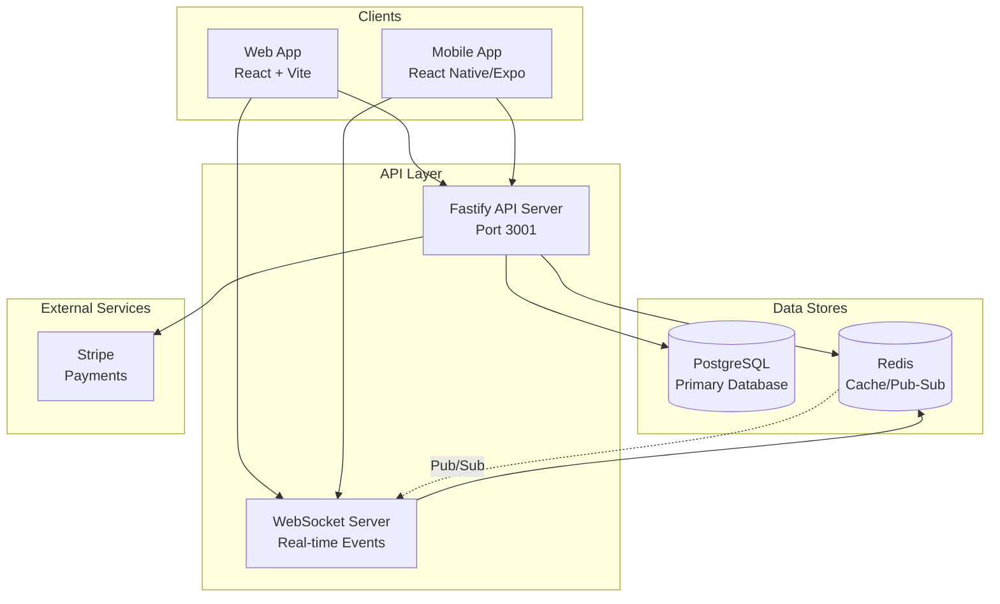
```mermaid
graph TD
    subgraph Clients
        Web[Web App<br/>React + Vite]
        Mobile[Mobile App<br/>React Native/Expo]
    end

    subgraph API Layer
        Fastify[Fastify API Server<br/>Port 3001]
        WS[WebSocket Server<br/>Real-time Events]
    end

    subgraph Data Stores
        Postgres[(PostgreSQL<br/>Primary Database)]
        Redis[(Redis<br/>Cache/Pub-Sub)]
    end

    subgraph External Services
        Stripe[Stripe<br/>Payments]
    end

    Web --> Fastify
    Mobile --> Fastify
    Web --> WS
    Mobile --> WS

    Fastify --> Postgres
    Fastify --> Redis
    WS --> Redis

    Fastify --> Stripe

    Redis -.->|Pub/Sub| WS
```

## Tech Stack

### Backend
| Component | Technology | Purpose |
|-----------|------------|---------|
| Runtime | Node.js 20+ | JavaScript runtime |
| Language | TypeScript 5.x | Type-safe development |
| Framework | Fastify 5.x | High-performance HTTP server |
| Database | PostgreSQL 16+ | Primary data store |
| Cache | Redis (ioredis) | Caching, pub/sub, presence |
| Validation | Zod | Schema validation |
| Logging | Pino | Structured JSON logging |
| Auth | JWT + PBKDF2 | Authentication & password hashing |
| Payments | Stripe API | Subscription & purchases |

### Frontend
| Component | Technology | Purpose |
|-----------|------------|---------|
| Build Tool | Vite 5.x | Fast development & bundling |
| Framework | React 18.x | UI components |
| Styling | Tailwind CSS 3.x | Utility-first CSS |
| 3D Graphics | Three.js + @react-three/fiber | Muscle visualization |
| Animation | Framer Motion | UI animations |
| State | Zustand | State management |
| HTTP Client | @musclemap/client | Retry/caching HTTP client |

### Infrastructure
| Component | Technology | Purpose |
|-----------|------------|---------|
| Hosting | VPS | Production server |
| Reverse Proxy | Caddy | Automatic SSL, HTTP/3, routing |
| Process Manager | PM2 | Process supervision |
| Package Manager | pnpm | Monorepo workspaces |
| Version Control | GitHub | Source code repository (public release planned) |

## Monorepo Structure

```
musclemap/
├── apps/
│   ├── api/                    # Fastify REST API server
│   │   ├── src/
│   │   │   ├── index.ts        # Entry point
│   │   │   ├── config/         # Environment config (Zod validated)
│   │   │   ├── db/
│   │   │   │   ├── client.ts   # PostgreSQL connection pool
│   │   │   │   ├── schema.sql  # Database schema
│   │   │   │   ├── seed.ts     # Data seeding
│   │   │   │   ├── migrate.ts  # Migration runner
│   │   │   │   └── migrations/ # Incremental migrations
│   │   │   ├── http/
│   │   │   │   ├── server.ts   # Fastify configuration
│   │   │   │   ├── router.ts   # Route mounting
│   │   │   │   └── routes/     # Route handlers
│   │   │   ├── lib/
│   │   │   │   ├── logger.ts   # Pino logger
│   │   │   │   ├── errors.ts   # Error types
│   │   │   │   └── redis.ts    # Redis client
│   │   │   ├── modules/        # Business logic
│   │   │   │   ├── economy/    # Credit system
│   │   │   │   └── entitlements/ # Access control
│   │   │   └── plugins/        # Plugin loader
│   │   └── package.json
│   └── mobile/                 # React Native app (Expo)
├── packages/
│   ├── client/                 # HTTP client with retry/caching
│   ├── core/                   # Shared types, constants, permissions
│   ├── shared/                 # Utilities (error extraction)
│   ├── plugin-sdk/             # Plugin development SDK
│   └── ui/                     # Shared UI components
├── plugins/                    # Drop-in plugins
│   ├── admin-tools/
│   └── leaderboard/
├── src/                        # Frontend (Vite + React)
│   ├── components/
│   ├── contexts/
│   ├── pages/
│   └── utils/
├── docs/                       # Documentation
├── cron-jobs.js                # Scheduled tasks
└── deploy.sh                   # Deployment script
```

## Component Architecture

### API Server

The API server uses Fastify with the following plugins:

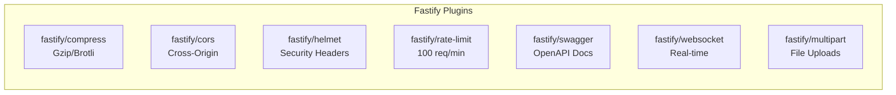
```mermaid
graph LR
    subgraph Fastify Plugins
        Compress[fastify/compress<br/>Gzip/Brotli]
        CORS[fastify/cors<br/>Cross-Origin]
        Helmet[fastify/helmet<br/>Security Headers]
        RateLimit[fastify/rate-limit<br/>100 req/min]
        Swagger[fastify/swagger<br/>OpenAPI Docs]
        WebSocket[fastify/websocket<br/>Real-time]
        Multipart[fastify/multipart<br/>File Uploads]
    end
```

**Server Configuration:**
- Body limit: 10MB
- File uploads: 10MB max, 5 files max
- Rate limiting: 100 requests/minute (configurable)
- Trust proxy: enabled
- Request ID format: `req_{timestamp}_{random}`

### Database Layer

PostgreSQL connection pool with optimized settings:

```typescript
// apps/api/src/db/client.ts
{
  min: PG_POOL_MIN,        // Default: 2
  max: PG_POOL_MAX,        // Default: 20
  idleTimeoutMillis: 30000,
  connectionTimeoutMillis: 5000,
  statement_timeout: 30000
}
```

**Features:**
- Connection pooling with min/max limits
- Statement timeout protection (30s)
- Automatic retry for serialization conflicts
- Pool metrics for monitoring
- SSL support for production

### Redis Layer (Optional)

Redis provides caching and real-time features when enabled:

```mermaid
graph TD
    subgraph Redis Clients
        Main[Main Client<br/>General Operations]
        Sub[Subscriber Client<br/>Pub/Sub Receive]
        Pub[Publisher Client<br/>Pub/Sub Send]
    end

    subgraph Key Patterns
        Presence[presence:zset<br/>Online Users]
        Meta[presence:meta:{userId}<br/>User Metadata]
        Bucket[presence:bucket:{geo}<br/>Geo Counts]
        Now[now:*:{minute}<br/>Time-Series Stats]
    end

    subgraph Channels
        Community[rt:community<br/>Activity Feed]
        Monitor[rt:monitor<br/>System Events]
    end

    Main --> Presence
    Main --> Meta
    Main --> Bucket
    Main --> Now
    Pub --> Community
    Pub --> Monitor
    Sub --> Community
    Sub --> Monitor
```

**TTL Values:**
- Presence metadata: 120 seconds (2 minutes)
- "Now" stats buckets: 1800 seconds (30 minutes)

## Core Concepts

### Training Units (TU)

The proprietary bias weight system normalizes muscle activation across different muscle sizes:

```
normalizedActivation = rawActivation / biasWeight × 100
```

| Muscle Size | Bias Weight | Examples |
|-------------|-------------|----------|
| Large | 18-22 | Glutes, Lats, Quads |
| Medium | 10-14 | Deltoids, Biceps, Triceps |
| Small | 4-8 | Rear Delts, Rotator Cuff |

This ensures balanced visual feedback regardless of muscle size.

### Archetypes

Users select a training archetype that defines their fitness path:

| Archetype | Focus |
|-----------|-------|
| Bodybuilder | Aesthetic muscle building |
| Powerlifter | Strength-focused training |
| Gymnast | Bodyweight mastery |
| CrossFit | Functional fitness |
| Martial Artist | Combat conditioning |
| Runner | Endurance training |
| Climber | Grip and pull strength |
| Strongman | Functional strength |
| Functional | General fitness |
| Swimmer | Aquatic conditioning |

Each archetype has multiple progression levels with specific muscle targets.

### Credit Economy

Users spend credits to complete workouts:

| Trigger | Credits |
|---------|---------|
| Registration bonus | +100 |
| Workout (free tier) | -25 |
| Trial period (90 days) | Unlimited |
| Active subscription | Unlimited |

**Transaction Safety:**
- Idempotent transactions via unique `idempotency_key`
- Optimistic locking with version field
- Serializable isolation with automatic retry
- Immutable ledger (append-only)

### Plugin System

Plugins extend functionality without modifying core code:

```
plugins/
└── my-plugin/
    ├── plugin.json         # Manifest
    └── backend/
        └── index.js        # Entry point
```

**Manifest format:**
```json
{
  "id": "my-plugin",
  "name": "My Plugin",
  "version": "1.0.0",
  "entry": { "backend": "./backend/index.js" },
  "capabilities": ["routes", "hooks"],
  "requires": { "host": ">=2.0.0" }
}
```

**Plugin Hooks:**
- `onServerStart(ctx)` - Server initialization
- `onShutdown(ctx)` - Graceful shutdown

## Authentication Flow

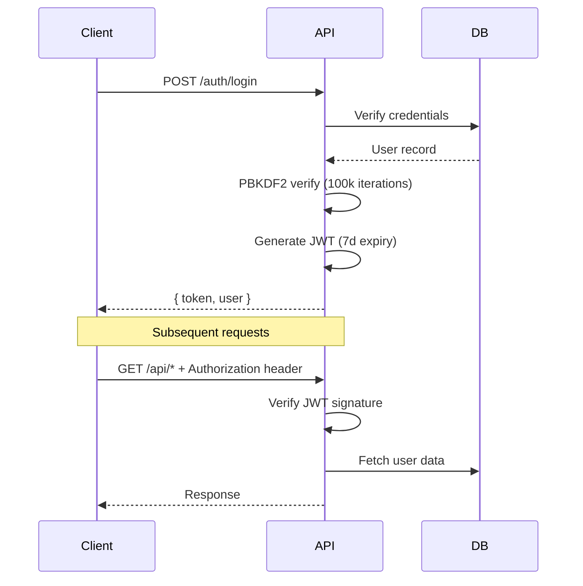
```mermaid
sequenceDiagram
    participant Client
    participant API
    participant DB

    Client->>API: POST /auth/login
    API->>DB: Verify credentials
    DB-->>API: User record
    API->>API: PBKDF2 verify (100k iterations)
    API->>API: Generate JWT (7d expiry)
    API-->>Client: { token, user }

    Note over Client,API: Subsequent requests

    Client->>API: GET /api/* + Authorization header
    API->>API: Verify JWT signature
    API->>DB: Fetch user data
    API-->>Client: Response
```

**Security:**
- Password hashing: PBKDF2 with 100,000 iterations (SHA-512)
- JWT expiry: 7 days (configurable)
- JWT secret: minimum 32 characters
- Rate limiting: 100 requests/minute

## Error Handling

All API errors follow a consistent format:

```json
{
  "error": {
    "code": "ERROR_CODE",
    "message": "Human readable message",
    "statusCode": 400
  }
}
```

The `@musclemap/shared` package provides `extractErrorMessage()` for safe error extraction.

## Logging

Structured JSON logging with Pino:

```typescript
// Child loggers by module
loggers.http      // HTTP requests
loggers.db        // Database operations
loggers.auth      // Authentication
loggers.economy   // Credit transactions
loggers.plugins   // Plugin loading
loggers.core      // General operations
```

## Deployment

### Production Server

1. Code syncs via `deploy.sh` to VPS
2. Build packages: `pnpm build:packages && pnpm -C packages/client build && pnpm build`
3. PM2 manages API process
4. Caddy proxies requests to Fastify with automatic HTTPS

**Deployment Methods:**
- Local: `./scripts/deploy-branch.sh --deploy` (commits, pushes, PRs, merges, SSHs to server)
- GitHub Actions: Automatic deployment on merge to main
- Server: `./scripts/production-deploy.sh` (can be run directly on server)

### Scheduled Tasks

Cron jobs via `cron-jobs.js`:

| Schedule | Task |
|----------|------|
| Hourly | `checkStreaks`, `updateRivalScores` |
| Daily (midnight) | `expireChallenges`, `assignDailyChallenges`, `createWeeklySnapshots` |
| Weekly (Sunday) | `snapshotLeaderboards` |

## Environment Configuration

Configuration is validated with Zod on startup. See `apps/api/src/config/index.ts`.

| Variable | Required | Default | Purpose |
|----------|----------|---------|---------|
| `NODE_ENV` | No | development | Environment mode |
| `PORT` | No | 3001 | API server port |
| `DATABASE_URL` | No | - | PostgreSQL URL (or use PG* vars) |
| `JWT_SECRET` | Yes | - | JWT signing secret (min 32 chars) |
| `REDIS_URL` | No | redis://localhost:6379 | Redis connection |
| `REDIS_ENABLED` | No | false | Enable Redis features |
| `STRIPE_SECRET_KEY` | No | - | Stripe API key |
| `LOG_LEVEL` | No | info | Logging verbosity |
| `RATE_LIMIT_MAX` | No | 100 | Max requests per minute |

## Health Endpoints

| Endpoint | Purpose | Checks |
|----------|---------|--------|
| `GET /health` | Full health check | Database, Redis, version, pool stats |
| `GET /ready` | K8s readiness probe | Database only |

## Related Documentation

- [DATA_MODEL.md](./DATA_MODEL.md) - Database schema and Redis key patterns
- [API_REFERENCE.md](./API_REFERENCE.md) - REST API endpoint documentation
- [DATA_FLOW.md](./DATA_FLOW.md) - Request lifecycle and data flow diagrams
- [PLUGINS.md](./PLUGINS.md) - Plugin development guide
- [SECURITY.md](./SECURITY.md) - Security practices
# Biometric Inputs & Future Integrations

This document outlines the architecture for integrating biometric data into MuscleMap, providing a roadmap for future-proofing the platform against upcoming wearable technologies and health data sources.

## Overview

MuscleMap is designed to accept and process biometric data from multiple sources to enhance workout personalization, recovery recommendations, and progress tracking. The architecture supports both real-time streaming and batch synchronization patterns.

## Data Sources

### Current Support

| Source | Status | Data Types |
|--------|--------|------------|
| Manual Input | Active | Weight, measurements, RPE |
| Workout Logging | Active | Sets, reps, rest periods |

### Planned Integrations

| Source | Priority | Data Types | Integration Method |
|--------|----------|------------|-------------------|
| Apple HealthKit | High | Heart rate, HRV, sleep, calories | iOS SDK |
| Google Fit | High | Heart rate, steps, sleep | REST API |
| Garmin Connect | Medium | HR zones, training load, recovery | OAuth API |
| Whoop | Medium | Strain, recovery, sleep | OAuth API |
| Oura Ring | Medium | Readiness, sleep, HRV | OAuth API |
| Fitbit | Medium | Heart rate, sleep, SpO2 | OAuth API |
| Polar | Low | Training load, orthostatic test | OAuth API |
| Samsung Health | Low | Heart rate, stress, SpO2 | REST API |

---

## Biometric Data Model

### Core Metrics

```typescript
interface BiometricReading {
  id: string;
  userId: string;
  source: BiometricSource;
  metric: BiometricMetric;
  value: number;
  unit: string;
  timestamp: Date;
  confidence?: number;        // 0-1, device-reported accuracy
  metadata?: Record<string, unknown>;
}

type BiometricSource =
  | 'manual'
  | 'apple_health'
  | 'google_fit'
  | 'garmin'
  | 'whoop'
  | 'oura'
  | 'fitbit'
  | 'polar'
  | 'samsung'
  | 'plugin';                 // Third-party plugin

type BiometricMetric =
  // Body Composition
  | 'weight'
  | 'body_fat_percentage'
  | 'muscle_mass'
  | 'bone_mass'
  | 'water_percentage'
  | 'visceral_fat'
  | 'bmr'                     // Basal metabolic rate
  // Cardiovascular
  | 'resting_heart_rate'
  | 'heart_rate'
  | 'hrv_rmssd'               // Heart rate variability
  | 'hrv_sdnn'
  | 'blood_pressure_systolic'
  | 'blood_pressure_diastolic'
  | 'spo2'                    // Blood oxygen
  | 'respiratory_rate'
  // Recovery
  | 'sleep_duration'
  | 'sleep_quality'           // 0-100 score
  | 'deep_sleep_duration'
  | 'rem_sleep_duration'
  | 'sleep_latency'
  | 'recovery_score'          // Platform-specific (Whoop, etc.)
  | 'readiness_score'
  // Activity
  | 'steps'
  | 'active_calories'
  | 'total_calories'
  | 'training_load'
  | 'strain_score'
  // Measurements
  | 'chest_circumference'
  | 'waist_circumference'
  | 'hip_circumference'
  | 'arm_circumference'
  | 'thigh_circumference'
  | 'calf_circumference'
  | 'neck_circumference';
```

### Database Schema

```sql
-- Core biometric readings table
CREATE TABLE biometric_readings (
  id TEXT PRIMARY KEY,
  user_id TEXT NOT NULL REFERENCES users(id),
  source TEXT NOT NULL,
  metric TEXT NOT NULL,
  value NUMERIC NOT NULL,
  unit TEXT NOT NULL,
  recorded_at TIMESTAMPTZ NOT NULL,
  synced_at TIMESTAMPTZ DEFAULT NOW(),
  confidence NUMERIC,
  metadata JSONB,
  UNIQUE(user_id, source, metric, recorded_at)
);

-- Indexes for common queries
CREATE INDEX idx_bio_user_metric ON biometric_readings(user_id, metric);
CREATE INDEX idx_bio_user_time ON biometric_readings(user_id, recorded_at DESC);
CREATE INDEX idx_bio_source ON biometric_readings(source, synced_at);

-- Connected health platforms
CREATE TABLE health_connections (
  id TEXT PRIMARY KEY,
  user_id TEXT NOT NULL REFERENCES users(id),
  platform TEXT NOT NULL,
  access_token TEXT,
  refresh_token TEXT,
  token_expires_at TIMESTAMPTZ,
  last_sync_at TIMESTAMPTZ,
  sync_enabled BOOLEAN DEFAULT true,
  permissions TEXT[],
  created_at TIMESTAMPTZ DEFAULT NOW(),
  UNIQUE(user_id, platform)
);

-- Aggregated daily summaries
CREATE TABLE biometric_daily_summary (
  id TEXT PRIMARY KEY,
  user_id TEXT NOT NULL REFERENCES users(id),
  date DATE NOT NULL,
  avg_resting_hr NUMERIC,
  avg_hrv NUMERIC,
  sleep_score NUMERIC,
  recovery_score NUMERIC,
  training_readiness NUMERIC,
  steps INTEGER,
  active_calories INTEGER,
  computed_at TIMESTAMPTZ DEFAULT NOW(),
  UNIQUE(user_id, date)
);
```

---

## Integration Architecture

### OAuth Flow

```
┌─────────┐     ┌───────────────┐     ┌────────────────┐
│  User   │────▶│ MuscleMap UI  │────▶│ /auth/connect  │
└─────────┘     └───────────────┘     └───────┬────────┘
                                              │
                                              ▼
                                    ┌────────────────────┐
                                    │ Platform OAuth URL │
                                    │ (Garmin, Whoop...) │
                                    └─────────┬──────────┘
                                              │
                                              ▼
                                    ┌────────────────────┐
                                    │ User authorizes    │
                                    └─────────┬──────────┘
                                              │
                                              ▼
                                    ┌────────────────────┐
                                    │ Callback with code │
                                    │ /auth/callback     │
                                    └─────────┬──────────┘
                                              │
                                              ▼
                                    ┌────────────────────┐
                                    │ Exchange for token │
                                    │ Store in DB        │
                                    └─────────┬──────────┘
                                              │
                                              ▼
                                    ┌────────────────────┐
                                    │ Initial sync       │
                                    │ Schedule recurring │
                                    └────────────────────┘
```

### Sync Patterns

#### Pull-Based Sync
Most platforms require periodic polling:

```typescript
interface SyncJob {
  userId: string;
  platform: BiometricSource;
  lastSyncAt: Date;
  syncInterval: number;  // minutes
}

// Scheduled sync job (runs every 15 minutes)
async function syncBiometrics(job: SyncJob) {
  const connection = await getConnection(job.userId, job.platform);
  if (!connection.syncEnabled) return;

  const client = createPlatformClient(job.platform, connection);
  const since = job.lastSyncAt || subDays(new Date(), 7);

  const readings = await client.fetchReadings(since);
  await storeBiometricReadings(job.userId, readings);

  await updateLastSync(job.userId, job.platform);
}
```

#### Push-Based Webhooks
Some platforms support real-time updates:

```typescript
// POST /webhooks/garmin
app.post('/webhooks/garmin', async (req, res) => {
  const { userId, activities, wellness } = req.body;

  if (wellness) {
    await processBiometricWebhook('garmin', userId, wellness);
  }

  res.status(200).send('OK');
});
```

---

## API Endpoints

### Health Connections

```
GET  /health/connections           # List connected platforms
POST /health/connect/:platform     # Initiate OAuth flow
GET  /health/callback/:platform    # OAuth callback
POST /health/disconnect/:platform  # Revoke access
POST /health/sync/:platform        # Force manual sync
```

### Biometric Data

```
GET  /biometrics                   # Get readings (filterable)
GET  /biometrics/latest            # Get latest values per metric
GET  /biometrics/summary           # Get daily/weekly summaries
POST /biometrics                   # Manual entry
GET  /biometrics/trends/:metric    # Get trend analysis
```

### Query Parameters

```typescript
interface BiometricsQuery {
  metrics?: BiometricMetric[];  // Filter by metrics
  sources?: BiometricSource[];  // Filter by sources
  from?: Date;                  // Start date
  to?: Date;                    // End date
  limit?: number;               // Max results
  aggregation?: 'raw' | 'hourly' | 'daily' | 'weekly';
}
```

---

## Recovery & Readiness Scoring

### Training Readiness Algorithm

MuscleMap computes a training readiness score (0-100) based on available biometric data:

```typescript
interface ReadinessFactors {
  sleepScore: number;         // Weight: 30%
  hrvStatus: number;          // Weight: 25%
  restingHRStatus: number;    // Weight: 15%
  recoveryTime: number;       // Weight: 20% (hours since last workout)
  muscleRecovery: number;     // Weight: 10% (based on TU decay)
}

function computeReadinessScore(factors: ReadinessFactors): number {
  const weights = {
    sleepScore: 0.30,
    hrvStatus: 0.25,
    restingHRStatus: 0.15,
    recoveryTime: 0.20,
    muscleRecovery: 0.10,
  };

  let score = 0;
  let totalWeight = 0;

  for (const [key, weight] of Object.entries(weights)) {
    const value = factors[key as keyof ReadinessFactors];
    if (value !== undefined && value !== null) {
      score += value * weight;
      totalWeight += weight;
    }
  }

  // Normalize if some factors are missing
  return totalWeight > 0 ? Math.round((score / totalWeight) * 100) / 100 : null;
}
```

### HRV Status Interpretation

```typescript
function interpretHRV(
  currentHRV: number,
  baseline7Day: number,
  baseline30Day: number
): number {
  // Score 0-100 based on deviation from baseline
  const deviation7 = (currentHRV - baseline7Day) / baseline7Day;
  const deviation30 = (currentHRV - baseline30Day) / baseline30Day;

  // Positive deviation = better recovery
  // Weight recent baseline more heavily
  const combinedDeviation = (deviation7 * 0.7) + (deviation30 * 0.3);

  // Map to 0-100 scale
  // -20% deviation = 0, 0% = 50, +20% = 100
  return Math.max(0, Math.min(100, 50 + (combinedDeviation * 250)));
}
```

---

## Workout Prescription Integration

Biometric data influences workout generation:

```typescript
interface PrescriptionModifiers {
  // Based on readiness score
  intensityMultiplier: number;    // 0.7 - 1.2
  volumeMultiplier: number;       // 0.7 - 1.2

  // Based on sleep
  excludeHighIntensity: boolean;  // If sleep < 6 hours

  // Based on HRV
  preferRecoveryWork: boolean;    // If HRV significantly below baseline

  // Based on recent muscle work
  muscleExclusions: string[];     // Recently taxed muscles
}

function computePrescriptionModifiers(
  biometrics: BiometricDailySummary,
  recentWorkouts: Workout[]
): PrescriptionModifiers {
  const readiness = biometrics.training_readiness ?? 75;

  return {
    // Scale intensity with readiness
    intensityMultiplier: 0.7 + (readiness / 100) * 0.5,
    volumeMultiplier: 0.7 + (readiness / 100) * 0.5,

    // Poor sleep = no max efforts
    excludeHighIntensity: (biometrics.sleep_score ?? 80) < 50,

    // Low HRV = prioritize mobility/recovery
    preferRecoveryWork: (biometrics.avg_hrv ?? 50) <
      (biometrics.hrv_baseline_7d ?? 50) * 0.85,

    // Standard 24-48h muscle recovery
    muscleExclusions: getMuscleExclusions(recentWorkouts),
  };
}
```

---

## Privacy & Data Handling

### Data Retention

| Data Type | Retention | Aggregation |
|-----------|-----------|-------------|
| Raw readings | 90 days | Then aggregate to daily |
| Daily summaries | 2 years | Permanent |
| Trends/baselines | Permanent | Computed from summaries |

### User Controls

```typescript
interface BiometricPrivacySettings {
  shareWithTrainer: boolean;
  shareInCommunity: boolean;
  enabledSources: BiometricSource[];
  enabledMetrics: BiometricMetric[];
  retentionDays: number;           // 30-365
}
```

### Data Export

Users can export all biometric data in standard formats:
- JSON (full fidelity)
- CSV (tabular)
- HealthKit XML (Apple ecosystem)
- FHIR R4 (healthcare interoperability)

---

## Plugin Extension Points

Third-party plugins can provide biometric data:

```typescript
// Plugin biometric provider
module.exports = definePlugin((ctx) => {
  return {
    registerBiometricProvider: () => ({
      id: 'my-device',
      name: 'My Device Integration',

      // Fetch readings from external source
      async fetchReadings(userId: string, since: Date): Promise<BiometricReading[]> {
        // Implement device-specific sync
      },

      // Optional: receive webhooks
      webhookHandler: async (payload: unknown) => {
        // Process incoming data
      },

      // Supported metrics
      supportedMetrics: ['heart_rate', 'hrv_rmssd', 'sleep_duration'],
    }),
  };
});
```

---

## Future Considerations

### Emerging Technologies

| Technology | Timeline | Use Case |
|------------|----------|----------|
| CGM (Continuous Glucose) | 2025 | Nutrition timing, energy availability |
| Smart clothing (EMG) | 2026 | Real-time muscle activation feedback |
| Smart rings (expanded) | 2025 | Temperature, SpO2, stress |
| EEG headbands | 2027 | Focus, fatigue detection |
| Lactate sensors | 2026 | Training zone accuracy |

### AI/ML Integration

```typescript
interface BiometricPredictions {
  // Predicted recovery completion time
  recoveryEstimate: Date;

  // Optimal training windows this week
  optimalTrainingWindows: TimeWindow[];

  // Injury risk indicators
  injuryRiskFactors: RiskFactor[];

  // Performance predictions
  expectedPerformance: PerformanceEstimate;
}
```

### Research & Insights

Anonymous, aggregated biometric data enables:
- Population-level training response analysis
- Recovery time optimization research
- Sleep/performance correlation studies
- Archetype-specific recovery patterns

---

## Implementation Roadmap

### Phase 1: Foundation (Q1)
- [ ] Biometric data model and database schema
- [ ] Manual entry API
- [ ] Basic readiness score display

### Phase 2: Apple HealthKit (Q2)
- [ ] iOS app HealthKit integration
- [ ] Background sync
- [ ] Workout import

### Phase 3: Major Platforms (Q3)
- [ ] Google Fit integration
- [ ] Garmin Connect integration
- [ ] Whoop integration

### Phase 4: Advanced Features (Q4)
- [ ] AI-powered readiness predictions
- [ ] Prescription auto-adjustment
- [ ] Community insights (opt-in)

### Phase 5: Extended Platform (Q1 Next Year)
- [ ] Oura Ring
- [ ] Fitbit
- [ ] Plugin biometric providers
# Contributing to MuscleMap

## Getting Started

1. Clone the repository
2. Install dependencies: `pnpm install`
3. Copy environment: `cp apps/api/.env.example apps/api/.env`
4. Start development: `pnpm dev`

## Development Commands
```bash
# Install dependencies
pnpm install

# Start all packages in dev mode
pnpm dev

# Build all packages
pnpm build

# Run tests
pnpm test

# Lint code
pnpm lint

# Type check
pnpm typecheck
```

## Project Structure

- `apps/api` - Express API server
- `packages/core` - Shared types and utilities
- `packages/plugin-sdk` - Plugin development kit
- `plugins/` - Drop-in plugins

## Code Style

- TypeScript strict mode
- Zod for runtime validation
- Pino for structured logging
- Express Router for endpoints

## Adding a New Module

1. Create `apps/api/src/modules/<name>/index.ts`
2. Export router and service
3. Mount in `apps/api/src/http/router.ts`
4. Add tests

## Adding a Plugin

1. Create `plugins/<name>/plugin.json`
2. Create `plugins/<name>/backend/index.js`
3. Export register function
4. Restart server

## Database Changes

1. Modify `apps/api/src/db/schema.ts`
2. Add seed data if needed
3. Test with fresh database

## Pull Request Process

1. Fork and create feature branch
2. Make changes with tests
3. Run `pnpm lint && pnpm test && pnpm build`
4. Submit PR with description

## Code of Conduct

Be respectful and constructive. We're all here to build something great.
# MuscleMap Data Flow

This document describes how data flows through the MuscleMap system, from client requests to database operations and back.

## System Overview

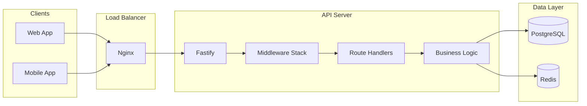
```mermaid
graph LR
    subgraph Clients
        Web[Web App]
        Mobile[Mobile App]
    end

    subgraph Load Balancer
        Nginx[Nginx]
    end

    subgraph API Server
        Fastify[Fastify]
        Middleware[Middleware Stack]
        Routes[Route Handlers]
        Modules[Business Logic]
    end

    subgraph Data Layer
        PG[(PostgreSQL)]
        Redis[(Redis)]
    end

    Web --> Nginx
    Mobile --> Nginx
    Nginx --> Fastify
    Fastify --> Middleware
    Middleware --> Routes
    Routes --> Modules
    Modules --> PG
    Modules --> Redis
```

---

## Request Lifecycle

### 1. Request Ingress

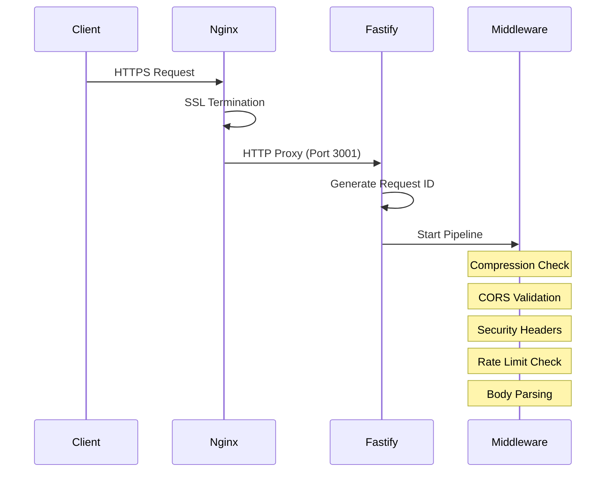
```mermaid
sequenceDiagram
    participant Client
    participant Nginx
    participant Fastify
    participant Middleware

    Client->>Nginx: HTTPS Request
    Nginx->>Nginx: SSL Termination
    Nginx->>Fastify: HTTP Proxy (Port 3001)
    Fastify->>Fastify: Generate Request ID
    Fastify->>Middleware: Start Pipeline

    Note over Middleware: Compression Check
    Note over Middleware: CORS Validation
    Note over Middleware: Security Headers
    Note over Middleware: Rate Limit Check
    Note over Middleware: Body Parsing
```

### 2. Authentication Flow

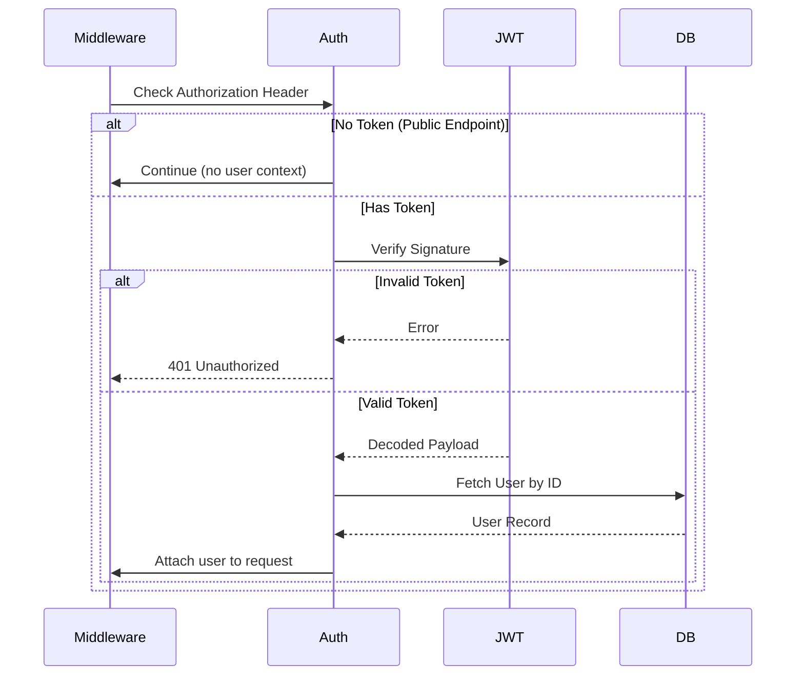
```mermaid
sequenceDiagram
    participant Middleware
    participant Auth
    participant JWT
    participant DB

    Middleware->>Auth: Check Authorization Header

    alt No Token (Public Endpoint)
        Auth->>Middleware: Continue (no user context)
    else Has Token
        Auth->>JWT: Verify Signature
        alt Invalid Token
            JWT-->>Auth: Error
            Auth-->>Middleware: 401 Unauthorized
        else Valid Token
            JWT-->>Auth: Decoded Payload
            Auth->>DB: Fetch User by ID
            DB-->>Auth: User Record
            Auth->>Middleware: Attach user to request
        end
    end
```

### 3. Route Handling

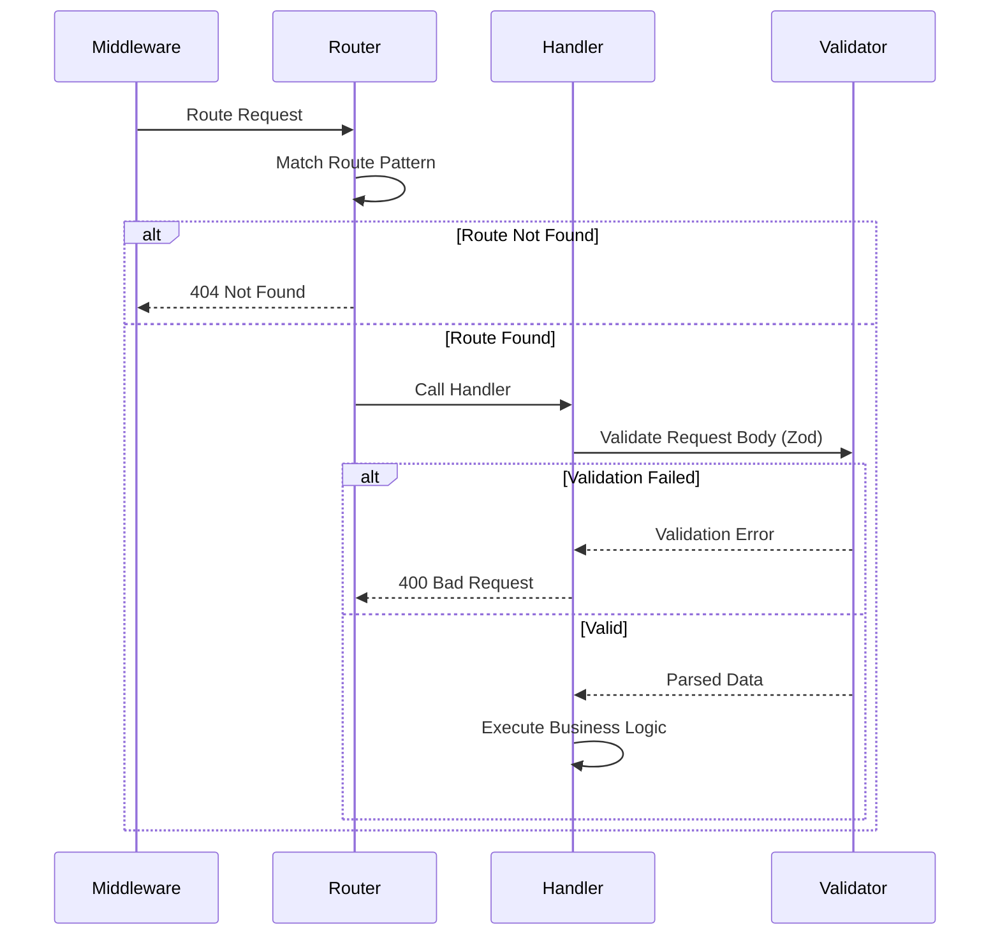
```mermaid
sequenceDiagram
    participant Middleware
    participant Router
    participant Handler
    participant Validator

    Middleware->>Router: Route Request
    Router->>Router: Match Route Pattern

    alt Route Not Found
        Router-->>Middleware: 404 Not Found
    else Route Found
        Router->>Handler: Call Handler
        Handler->>Validator: Validate Request Body (Zod)

        alt Validation Failed
            Validator-->>Handler: Validation Error
            Handler-->>Router: 400 Bad Request
        else Valid
            Validator-->>Handler: Parsed Data
            Handler->>Handler: Execute Business Logic
        end
    end
```

---

## Core Data Flows

### Workout Logging Flow

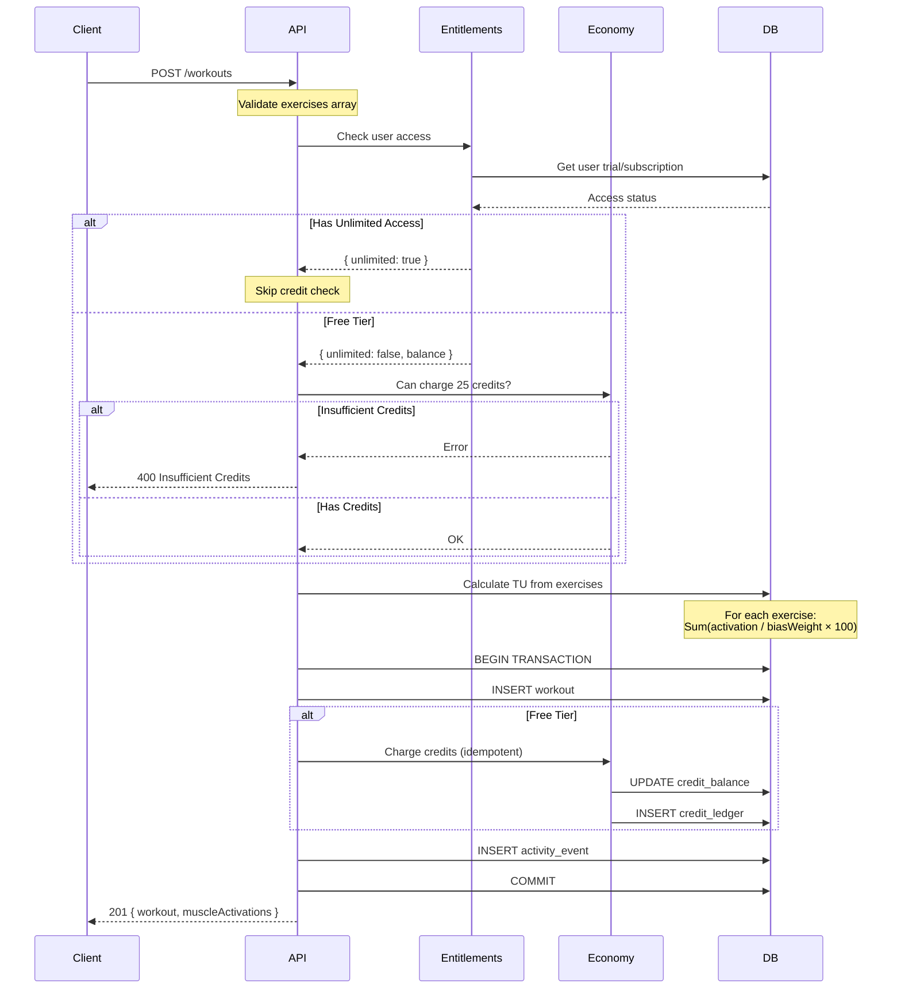
```mermaid
sequenceDiagram
    participant Client
    participant API
    participant Entitlements
    participant Economy
    participant DB

    Client->>API: POST /workouts
    Note over API: Validate exercises array

    API->>Entitlements: Check user access
    Entitlements->>DB: Get user trial/subscription
    DB-->>Entitlements: Access status

    alt Has Unlimited Access
        Entitlements-->>API: { unlimited: true }
        Note over API: Skip credit check
    else Free Tier
        Entitlements-->>API: { unlimited: false, balance }
        API->>Economy: Can charge 25 credits?

        alt Insufficient Credits
            Economy-->>API: Error
            API-->>Client: 400 Insufficient Credits
        else Has Credits
            Economy-->>API: OK
        end
    end

    API->>DB: Calculate TU from exercises
    Note over DB: For each exercise:<br/>Sum(activation / biasWeight × 100)

    API->>DB: BEGIN TRANSACTION
    API->>DB: INSERT workout

    alt Free Tier
        API->>Economy: Charge credits (idempotent)
        Economy->>DB: UPDATE credit_balance
        Economy->>DB: INSERT credit_ledger
    end

    API->>DB: INSERT activity_event
    API->>DB: COMMIT

    API-->>Client: 201 { workout, muscleActivations }
```

### Credit Transaction Flow

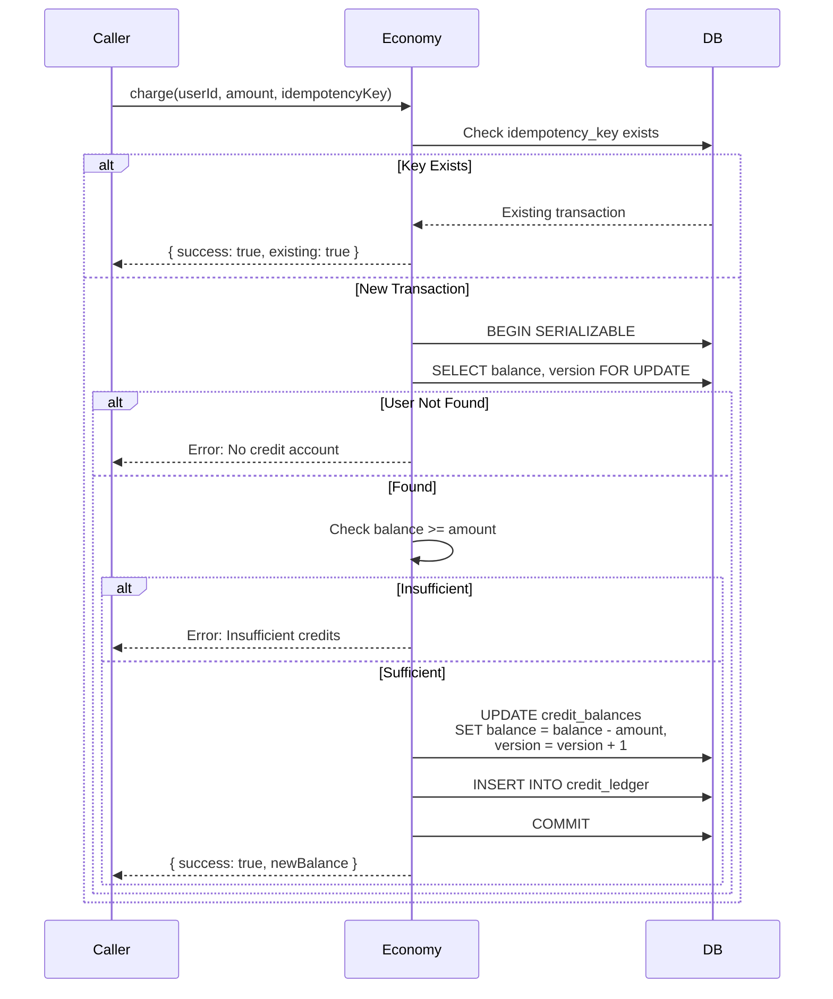
```mermaid
sequenceDiagram
    participant Caller
    participant Economy
    participant DB

    Caller->>Economy: charge(userId, amount, idempotencyKey)

    Economy->>DB: Check idempotency_key exists

    alt Key Exists
        DB-->>Economy: Existing transaction
        Economy-->>Caller: { success: true, existing: true }
    else New Transaction
        Economy->>DB: BEGIN SERIALIZABLE
        Economy->>DB: SELECT balance, version FOR UPDATE

        alt User Not Found
            Economy-->>Caller: Error: No credit account
        else Found
            Economy->>Economy: Check balance >= amount

            alt Insufficient
                Economy-->>Caller: Error: Insufficient credits
            else Sufficient
                Economy->>DB: UPDATE credit_balances<br/>SET balance = balance - amount,<br/>version = version + 1
                Economy->>DB: INSERT INTO credit_ledger
                Economy->>DB: COMMIT
                Economy-->>Caller: { success: true, newBalance }
            end
        end
    end
```

### Real-time Presence Flow

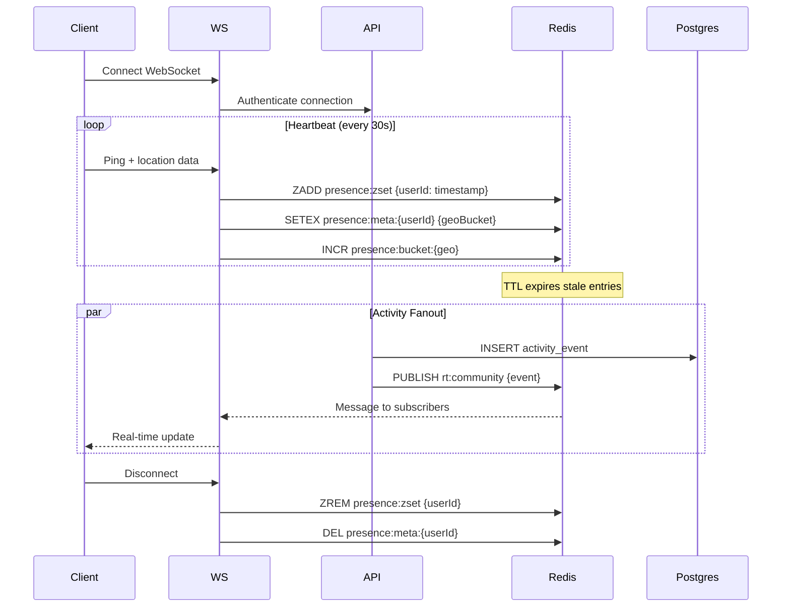
```mermaid
sequenceDiagram
    participant Client
    participant WS
    participant API
    participant Redis
    participant Postgres

    Client->>WS: Connect WebSocket
    WS->>API: Authenticate connection

    loop Heartbeat (every 30s)
        Client->>WS: Ping + location data
        WS->>Redis: ZADD presence:zset {userId: timestamp}
        WS->>Redis: SETEX presence:meta:{userId} {geoBucket}
        WS->>Redis: INCR presence:bucket:{geo}
    end

    Note over Redis: TTL expires stale entries

    par Activity Fanout
        API->>Postgres: INSERT activity_event
        API->>Redis: PUBLISH rt:community {event}
        Redis-->>WS: Message to subscribers
        WS-->>Client: Real-time update
    end

    Client->>WS: Disconnect
    WS->>Redis: ZREM presence:zset {userId}
    WS->>Redis: DEL presence:meta:{userId}
```

### Subscription Verification Flow

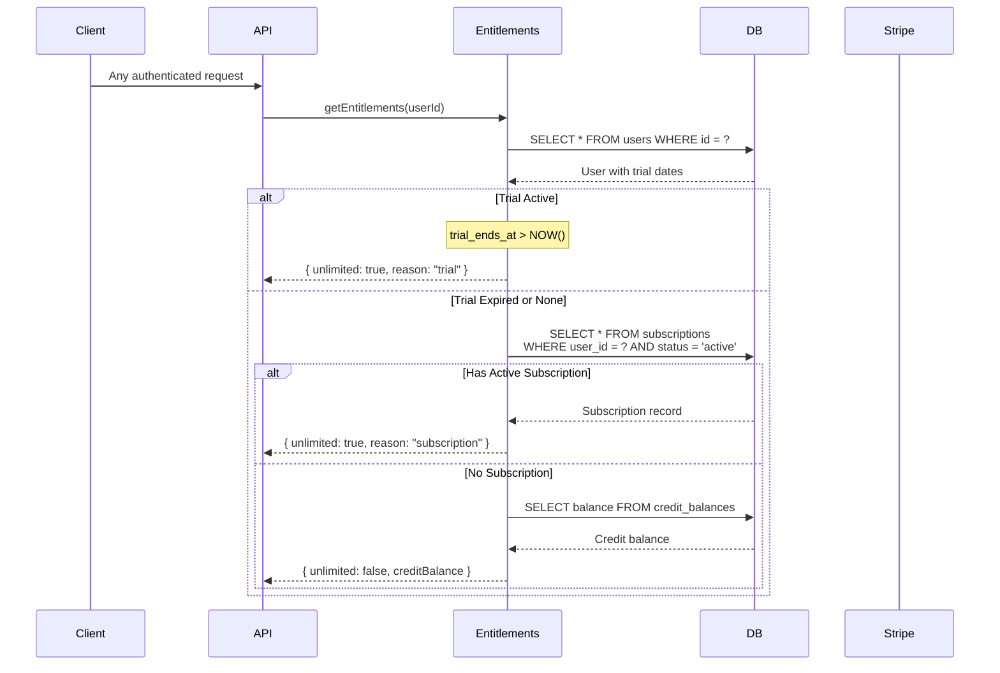
```mermaid
sequenceDiagram
    participant Client
    participant API
    participant Entitlements
    participant DB
    participant Stripe

    Client->>API: Any authenticated request
    API->>Entitlements: getEntitlements(userId)

    Entitlements->>DB: SELECT * FROM users WHERE id = ?
    DB-->>Entitlements: User with trial dates

    alt Trial Active
        Note over Entitlements: trial_ends_at > NOW()
        Entitlements-->>API: { unlimited: true, reason: "trial" }
    else Trial Expired or None
        Entitlements->>DB: SELECT * FROM subscriptions<br/>WHERE user_id = ? AND status = 'active'

        alt Has Active Subscription
            DB-->>Entitlements: Subscription record
            Entitlements-->>API: { unlimited: true, reason: "subscription" }
        else No Subscription
            Entitlements->>DB: SELECT balance FROM credit_balances
            DB-->>Entitlements: Credit balance
            Entitlements-->>API: { unlimited: false, creditBalance }
        end
    end
```

---

## Database Query Patterns

### Connection Pooling

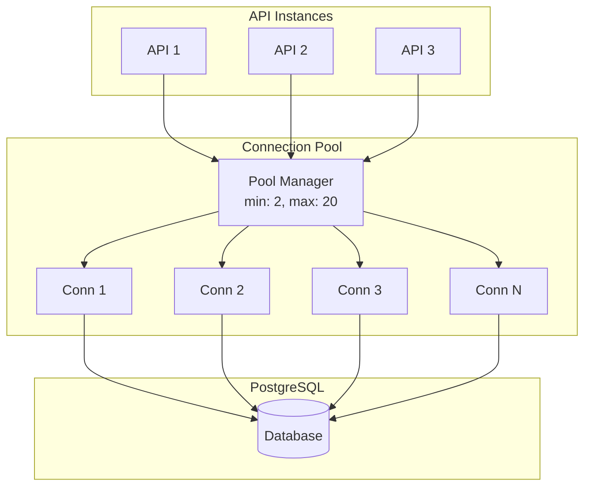
```mermaid
graph TD
    subgraph API Instances
        A1[API 1]
        A2[API 2]
        A3[API 3]
    end

    subgraph Connection Pool
        P[Pool Manager<br/>min: 2, max: 20]
        C1[Conn 1]
        C2[Conn 2]
        C3[Conn 3]
        CN[Conn N]
    end

    subgraph PostgreSQL
        DB[(Database)]
    end

    A1 --> P
    A2 --> P
    A3 --> P
    P --> C1
    P --> C2
    P --> C3
    P --> CN
    C1 --> DB
    C2 --> DB
    C3 --> DB
    CN --> DB
```

**Pool Configuration:**
- Minimum connections: 2 (kept alive)
- Maximum connections: 20 (hard limit)
- Idle timeout: 30 seconds
- Connection timeout: 5 seconds
- Statement timeout: 30 seconds

### Transaction Isolation

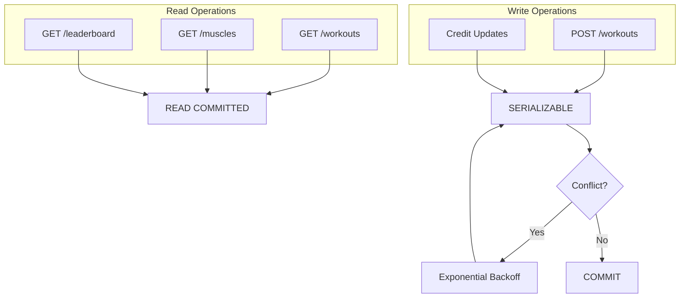
```mermaid
graph TD
    subgraph Read Operations
        R1[GET /workouts]
        R2[GET /muscles]
        R3[GET /leaderboard]
    end

    subgraph Write Operations
        W1[POST /workouts]
        W2[Credit Updates]
    end

    R1 --> RC[READ COMMITTED]
    R2 --> RC
    R3 --> RC

    W1 --> SER[SERIALIZABLE]
    W2 --> SER

    SER --> Retry{Conflict?}
    Retry -->|Yes| Backoff[Exponential Backoff]
    Backoff --> SER
    Retry -->|No| Commit[COMMIT]
```

---

## Caching Strategies

### Redis Cache Patterns

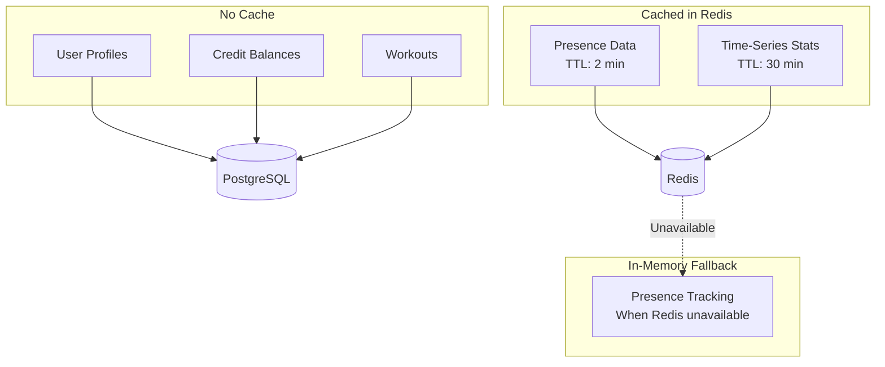
```mermaid
graph TD
    subgraph No Cache
        NC1[User Profiles]
        NC2[Credit Balances]
        NC3[Workouts]
    end

    subgraph Cached in Redis
        C1[Presence Data<br/>TTL: 2 min]
        C2[Time-Series Stats<br/>TTL: 30 min]
    end

    subgraph In-Memory Fallback
        M1[Presence Tracking<br/>When Redis unavailable]
    end

    NC1 --> DB[(PostgreSQL)]
    NC2 --> DB
    NC3 --> DB

    C1 --> Redis[(Redis)]
    C2 --> Redis

    Redis -.->|Unavailable| M1
```

### Cache Invalidation

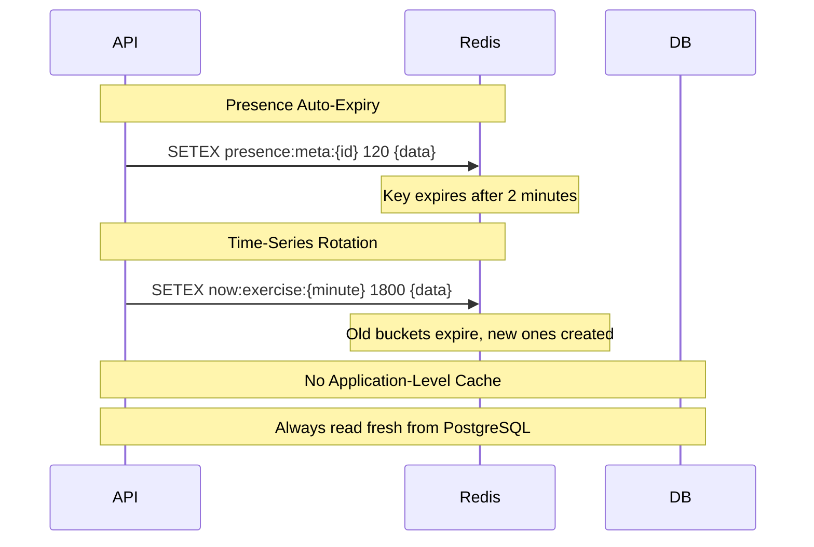
```mermaid
sequenceDiagram
    participant API
    participant Redis
    participant DB

    Note over API,Redis: Presence Auto-Expiry
    API->>Redis: SETEX presence:meta:{id} 120 {data}
    Note over Redis: Key expires after 2 minutes

    Note over API,Redis: Time-Series Rotation
    API->>Redis: SETEX now:exercise:{minute} 1800 {data}
    Note over Redis: Old buckets expire, new ones created

    Note over API,DB: No Application-Level Cache
    Note over API,DB: Always read fresh from PostgreSQL
```

---

## Event Flow

### Activity Event Pipeline

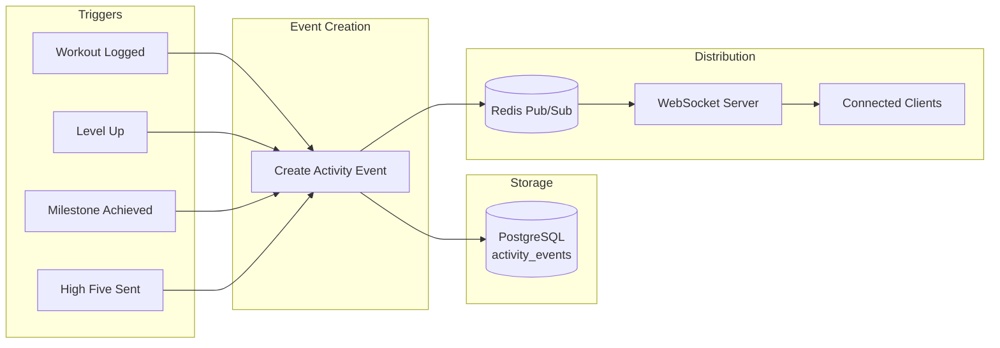
```mermaid
graph LR
    subgraph Triggers
        T1[Workout Logged]
        T2[Level Up]
        T3[Milestone Achieved]
        T4[High Five Sent]
    end

    subgraph Event Creation
        E[Create Activity Event]
    end

    subgraph Storage
        PG[(PostgreSQL<br/>activity_events)]
    end

    subgraph Distribution
        Redis[(Redis Pub/Sub)]
        WS[WebSocket Server]
        Clients[Connected Clients]
    end

    T1 --> E
    T2 --> E
    T3 --> E
    T4 --> E

    E --> PG
    E --> Redis
    Redis --> WS
    WS --> Clients
```

### Event Visibility Scopes

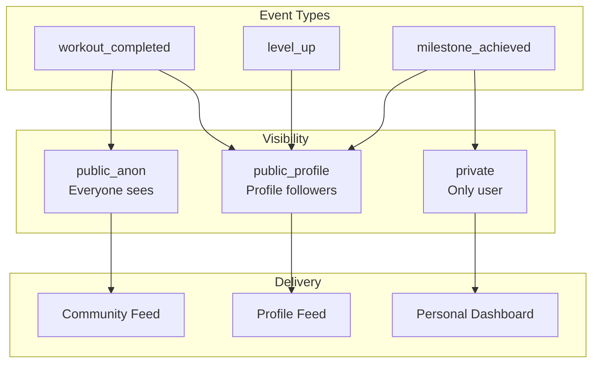
```mermaid
graph TD
    subgraph Event Types
        E1[workout_completed]
        E2[level_up]
        E3[milestone_achieved]
    end

    subgraph Visibility
        V1[public_anon<br/>Everyone sees]
        V2[public_profile<br/>Profile followers]
        V3[private<br/>Only user]
    end

    subgraph Delivery
        D1[Community Feed]
        D2[Profile Feed]
        D3[Personal Dashboard]
    end

    E1 --> V1
    E1 --> V2
    E2 --> V2
    E3 --> V2
    E3 --> V3

    V1 --> D1
    V2 --> D2
    V3 --> D3
```

---

## Error Handling Flow

### Error Propagation

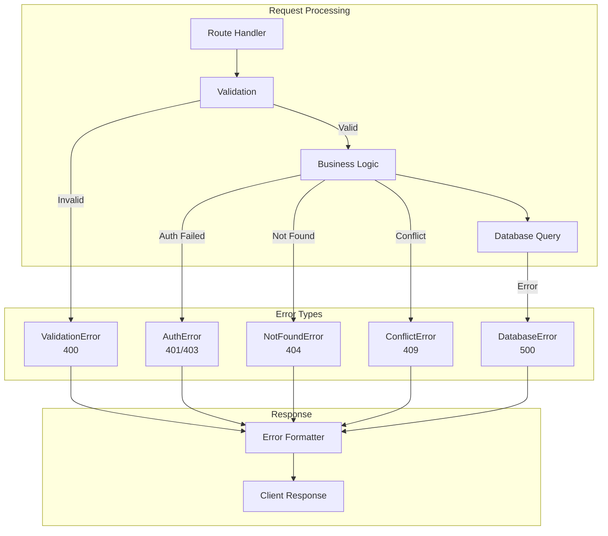
```mermaid
graph TD
    subgraph Request Processing
        R[Route Handler]
        V[Validation]
        B[Business Logic]
        D[Database Query]
    end

    subgraph Error Types
        E1[ValidationError<br/>400]
        E2[AuthError<br/>401/403]
        E3[NotFoundError<br/>404]
        E4[ConflictError<br/>409]
        E5[DatabaseError<br/>500]
    end

    subgraph Response
        F[Error Formatter]
        C[Client Response]
    end

    R --> V
    V -->|Invalid| E1
    V -->|Valid| B
    B -->|Auth Failed| E2
    B -->|Not Found| E3
    B -->|Conflict| E4
    B --> D
    D -->|Error| E5

    E1 --> F
    E2 --> F
    E3 --> F
    E4 --> F
    E5 --> F
    F --> C
```

### Error Response Format

```json
{
  "error": {
    "code": "INSUFFICIENT_CREDITS",
    "message": "You need 25 credits but only have 10",
    "statusCode": 400
  }
}
```

---

## Background Job Flow

### Cron Job Pipeline

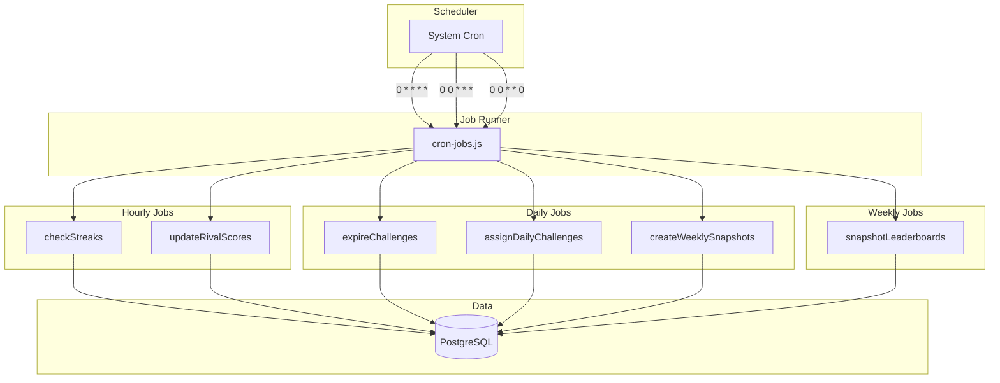
```mermaid
graph TD
    subgraph Scheduler
        Cron[System Cron]
    end

    subgraph Job Runner
        Runner[cron-jobs.js]
    end

    subgraph Hourly Jobs
        H1[checkStreaks]
        H2[updateRivalScores]
    end

    subgraph Daily Jobs
        D1[expireChallenges]
        D2[assignDailyChallenges]
        D3[createWeeklySnapshots]
    end

    subgraph Weekly Jobs
        W1[snapshotLeaderboards]
    end

    subgraph Data
        PG[(PostgreSQL)]
    end

    Cron -->|"0 * * * *"| Runner
    Cron -->|"0 0 * * *"| Runner
    Cron -->|"0 0 * * 0"| Runner

    Runner --> H1
    Runner --> H2
    Runner --> D1
    Runner --> D2
    Runner --> D3
    Runner --> W1

    H1 --> PG
    H2 --> PG
    D1 --> PG
    D2 --> PG
    D3 --> PG
    W1 --> PG
```

---

## Deployment Flow

### Code Deployment

```mermaid
sequenceDiagram
    participant Dev as Developer
    participant Git as Git Repo
    participant Script as deploy.sh
    participant VPS as Production VPS

    Dev->>Git: git push origin main
    Dev->>Script: ./deploy.sh

    Script->>Script: Sync to local locations
    Script->>VPS: rsync code

    VPS->>VPS: git pull
    VPS->>VPS: pnpm install
    VPS->>VPS: Build packages
    Note over VPS: shared → core → plugin-sdk → client
    VPS->>VPS: Build frontend (Vite)
    VPS->>VPS: PM2 restart api

    VPS->>VPS: Run migrations
    Note over VPS: Auto-run on server start
```

---

## Performance Considerations

### Hot Paths

| Operation | Frequency | Optimization |
|-----------|-----------|--------------|
| GET /exercises | Very High | In-memory after first load |
| GET /muscles | Very High | In-memory after first load |
| POST /workouts | High | Connection pooling, prepared statements |
| GET /community/feed | Medium | Indexed queries, cursor pagination |
| Credit operations | Medium | Optimistic locking, idempotency |

### Bottlenecks

```mermaid
graph TD
    subgraph Potential Bottlenecks
        B1[Database Connections]
        B2[Redis Connections]
        B3[WebSocket Connections]
    end

    subgraph Mitigations
        M1[Connection Pooling<br/>max: 20]
        M2[Graceful Degradation<br/>In-memory fallback]
        M3[Per-client rate limiting]
    end

    B1 --> M1
    B2 --> M2
    B3 --> M3
```

---

## Related Documentation

- [ARCHITECTURE.md](./ARCHITECTURE.md) - System overview
- [DATA_MODEL.md](./DATA_MODEL.md) - Database schema
- [API_REFERENCE.md](./API_REFERENCE.md) - API endpoints
# MuscleMap Data Model

This document describes the PostgreSQL database schema and Redis key patterns used by MuscleMap.

## Entity Relationship Diagram

```mermaid
erDiagram
    users ||--o{ workouts : logs
    users ||--o{ credit_balances : has
    users ||--o{ credit_ledger : transacts
    users ||--o{ subscriptions : subscribes
    users ||--o{ purchases : buys
    users ||--o{ prescriptions : receives
    users ||--o{ refresh_tokens : authenticates
    users ||--o{ group_memberships : joins
    users ||--o{ competition_participants : competes
    users ||--o{ conversation_participants : chats
    users ||--o{ messages : sends
    users ||--o{ activity_events : generates
    users ||--o{ user_milestone_progress : achieves
    users ||--o{ user_tips_seen : dismisses

    archetypes ||--o{ archetype_levels : defines
    archetypes ||--o{ users : follows

    exercises ||--o{ exercise_activations : activates
    muscles ||--o{ exercise_activations : activated_by

    groups ||--o{ group_memberships : contains
    competitions ||--o{ competition_participants : includes
    conversations ||--o{ conversation_participants : includes
    conversations ||--o{ messages : contains
    messages ||--o{ message_attachments : attaches

    milestones ||--o{ user_milestone_progress : tracked_by
    tips ||--o{ user_tips_seen : tracked_by
```

## PostgreSQL Schema

### Extensions

```sql
CREATE EXTENSION IF NOT EXISTS "uuid-ossp";  -- UUID generation
CREATE EXTENSION IF NOT EXISTS "pg_trgm";    -- Trigram text search
```

---

## Core Tables

### users

Primary user accounts table.

| Column | Type | Constraints | Description |
|--------|------|-------------|-------------|
| `id` | TEXT | PK, auto-generated | Format: `user_{uuid}` |
| `email` | TEXT | UNIQUE, NOT NULL | Valid email format |
| `username` | TEXT | UNIQUE, NOT NULL | 3-30 chars, alphanumeric + underscore |
| `display_name` | TEXT | - | User's display name |
| `password_hash` | TEXT | NOT NULL | PBKDF2 hashed password |
| `avatar_url` | TEXT | - | Profile picture URL |
| `roles` | JSONB | DEFAULT `["user"]` | Array of role strings |
| `flags` | JSONB | DEFAULT | Account flags (verified, banned, suspended, emailConfirmed) |
| `current_archetype_id` | TEXT | FK archetypes | Selected training archetype |
| `current_level` | INTEGER | DEFAULT 1 | Progression level within archetype |
| `trial_started_at` | TIMESTAMPTZ | - | Trial period start |
| `trial_ends_at` | TIMESTAMPTZ | - | Trial period end (90 days from start) |
| `created_at` | TIMESTAMPTZ | DEFAULT NOW() | Account creation |
| `updated_at` | TIMESTAMPTZ | AUTO | Last modification |

**Indexes:**
- `idx_users_email` - Email lookup
- `idx_users_username` - Username lookup
- `idx_users_created_at` - Recent users
- `idx_users_roles` - GIN index for role queries

**Flags JSONB structure:**
```json
{
  "verified": false,
  "banned": false,
  "suspended": false,
  "emailConfirmed": false
}
```

### refresh_tokens

JWT refresh token management for secure re-authentication.

| Column | Type | Constraints | Description |
|--------|------|-------------|-------------|
| `id` | TEXT | PK | Format: `rt_{uuid}` |
| `user_id` | TEXT | FK users, NOT NULL | Token owner |
| `token_hash` | TEXT | NOT NULL | Hashed refresh token |
| `expires_at` | TIMESTAMPTZ | NOT NULL | Token expiration |
| `created_at` | TIMESTAMPTZ | DEFAULT NOW() | Token creation |
| `revoked_at` | TIMESTAMPTZ | - | Revocation timestamp (null = active) |

**Indexes:**
- `idx_refresh_tokens_user` - User's tokens
- `idx_refresh_tokens_hash` - Token lookup (WHERE revoked_at IS NULL)

---

## Economy Tables

### credit_balances

Current credit balance per user with optimistic locking.

| Column | Type | Constraints | Description |
|--------|------|-------------|-------------|
| `user_id` | TEXT | PK, FK users | Balance owner |
| `balance` | INTEGER | NOT NULL, >= 0 | Current credits |
| `lifetime_earned` | INTEGER | NOT NULL, >= 0 | Total credits ever earned |
| `lifetime_spent` | INTEGER | NOT NULL, >= 0 | Total credits ever spent |
| `version` | INTEGER | NOT NULL, DEFAULT 0 | Optimistic lock version |
| `updated_at` | TIMESTAMPTZ | DEFAULT NOW() | Last update |

### credit_ledger

Immutable transaction history (append-only).

| Column | Type | Constraints | Description |
|--------|------|-------------|-------------|
| `id` | TEXT | PK | Format: `txn_{uuid}` |
| `user_id` | TEXT | FK users, NOT NULL | Transaction owner |
| `action` | TEXT | NOT NULL | Action type (e.g., "workout", "purchase", "signup_bonus") |
| `amount` | INTEGER | NOT NULL | Credit change (positive or negative) |
| `balance_after` | INTEGER | NOT NULL, >= 0 | Balance after transaction |
| `metadata` | JSONB | - | Additional transaction data |
| `idempotency_key` | TEXT | UNIQUE | Prevents duplicate transactions |
| `created_at` | TIMESTAMPTZ | DEFAULT NOW() | Transaction time |

**Indexes:**
- `idx_credit_ledger_user` - User's transactions
- `idx_credit_ledger_created` - Recent transactions
- `idx_credit_ledger_action` - Action type queries

### credit_actions

Catalog of actions that cost credits.

| Column | Type | Constraints | Description |
|--------|------|-------------|-------------|
| `id` | TEXT | PK | Action identifier |
| `name` | TEXT | NOT NULL | Display name |
| `description` | TEXT | - | What the action does |
| `default_cost` | INTEGER | NOT NULL, >= 0 | Credit cost |
| `plugin_id` | TEXT | - | Owning plugin (if any) |
| `enabled` | BOOLEAN | DEFAULT TRUE | Action availability |
| `created_at` | TIMESTAMPTZ | DEFAULT NOW() | Creation time |

### purchases

One-time credit purchases via Stripe.

| Column | Type | Constraints | Description |
|--------|------|-------------|-------------|
| `id` | TEXT | PK | Format: `purch_{uuid}` |
| `user_id` | TEXT | FK users, NOT NULL | Purchaser |
| `tier_id` | TEXT | NOT NULL | Pricing tier selected |
| `credits` | INTEGER | NOT NULL, > 0 | Credits purchased |
| `amount_cents` | INTEGER | NOT NULL, >= 0 | Payment amount in cents |
| `status` | TEXT | NOT NULL | pending, completed, failed, refunded |
| `stripe_payment_id` | TEXT | - | Stripe PaymentIntent ID |
| `stripe_session_id` | TEXT | - | Stripe Checkout Session ID |
| `metadata` | JSONB | - | Additional data |
| `created_at` | TIMESTAMPTZ | DEFAULT NOW() | Purchase initiated |
| `completed_at` | TIMESTAMPTZ | - | Purchase completed |

### subscriptions

Stripe subscription records.

| Column | Type | Constraints | Description |
|--------|------|-------------|-------------|
| `id` | TEXT | PK | Format: `sub_{uuid}` |
| `user_id` | TEXT | FK users, NOT NULL | Subscriber |
| `stripe_customer_id` | TEXT | - | Stripe Customer ID |
| `stripe_subscription_id` | TEXT | UNIQUE | Stripe Subscription ID |
| `status` | TEXT | NOT NULL | inactive, active, past_due, canceled, unpaid |
| `current_period_start` | TIMESTAMPTZ | - | Billing period start |
| `current_period_end` | TIMESTAMPTZ | - | Billing period end |
| `cancel_at_period_end` | BOOLEAN | DEFAULT FALSE | Scheduled cancellation |
| `created_at` | TIMESTAMPTZ | DEFAULT NOW() | Subscription created |
| `updated_at` | TIMESTAMPTZ | AUTO | Last modification |

---

## Fitness Data Tables

### muscles

Muscle catalog with bias weights for TU normalization.

| Column | Type | Constraints | Description |
|--------|------|-------------|-------------|
| `id` | TEXT | PK | Muscle identifier (e.g., "glutes") |
| `name` | TEXT | NOT NULL | Display name |
| `anatomical_name` | TEXT | - | Scientific name |
| `muscle_group` | TEXT | NOT NULL | Group (e.g., "legs", "back") |
| `bias_weight` | REAL | NOT NULL, > 0 | TU normalization factor (4-22) |
| `optimal_weekly_volume` | INTEGER | - | Recommended weekly sets |
| `recovery_time` | INTEGER | - | Recovery hours |

**Index:** `idx_muscles_group` - Group filtering

### exercises

Exercise catalog (90+ exercises).

| Column | Type | Constraints | Description |
|--------|------|-------------|-------------|
| `id` | TEXT | PK | Exercise identifier |
| `name` | TEXT | NOT NULL | Display name |
| `type` | TEXT | NOT NULL | Category (strength, cardio, etc.) |
| `difficulty` | INTEGER | 1-5, DEFAULT 2 | Skill level required |
| `description` | TEXT | - | Exercise description |
| `cues` | TEXT | - | Form cues |
| `primary_muscles` | TEXT[] | - | Primary muscle IDs |
| `equipment_required` | JSONB | DEFAULT [] | Required equipment |
| `equipment_optional` | JSONB | DEFAULT [] | Optional equipment |
| `locations` | JSONB | DEFAULT ["gym"] | Valid locations |
| `is_compound` | BOOLEAN | DEFAULT FALSE | Multi-joint movement |
| `estimated_seconds` | INTEGER | DEFAULT 45, > 0 | Time per set |
| `rest_seconds` | INTEGER | DEFAULT 60, >= 0 | Rest between sets |
| `movement_pattern` | TEXT | - | Movement classification |

**Indexes:**
- `idx_exercises_type` - Type filtering
- `idx_exercises_difficulty` - Difficulty filtering
- `idx_exercises_name_trgm` - GIN trigram for fuzzy search
- `idx_exercises_locations` - GIN for location filtering

### exercise_activations

Muscle activation percentages per exercise.

| Column | Type | Constraints | Description |
|--------|------|-------------|-------------|
| `exercise_id` | TEXT | PK, FK exercises | Exercise |
| `muscle_id` | TEXT | PK, FK muscles | Activated muscle |
| `activation` | INTEGER | NOT NULL, 0-100 | Activation percentage |

**Index:** `idx_exercise_activations_muscle` - Muscle lookup

### workouts

Logged workout sessions.

| Column | Type | Constraints | Description |
|--------|------|-------------|-------------|
| `id` | TEXT | PK | Format: `workout_{uuid}` |
| `user_id` | TEXT | FK users, NOT NULL | Workout owner |
| `date` | DATE | NOT NULL | Workout date |
| `total_tu` | REAL | NOT NULL, >= 0 | Total Training Units |
| `credits_used` | INTEGER | DEFAULT 25, >= 0 | Credits charged |
| `notes` | TEXT | - | User notes |
| `is_public` | BOOLEAN | DEFAULT TRUE | Feed visibility |
| `exercise_data` | JSONB | NOT NULL, DEFAULT [] | Exercise details |
| `muscle_activations` | JSONB | NOT NULL, DEFAULT {} | Computed activations |
| `created_at` | TIMESTAMPTZ | DEFAULT NOW() | Log time |

**Indexes:**
- `idx_workouts_user` - User's workouts
- `idx_workouts_date` - Date queries
- `idx_workouts_user_date` - User + date compound
- `idx_workouts_public` - Public feed (WHERE is_public = TRUE)

**exercise_data JSONB structure:**
```json
[
  {
    "exerciseId": "bench_press",
    "sets": 3,
    "reps": 10,
    "weight": 135,
    "duration": null,
    "notes": "Felt strong"
  }
]
```

**muscle_activations JSONB structure:**
```json
{
  "pectoralis_major": 85.5,
  "triceps": 45.2,
  "anterior_deltoid": 30.0
}
```

### prescriptions

AI-generated workout plans.

| Column | Type | Constraints | Description |
|--------|------|-------------|-------------|
| `id` | TEXT | PK | Format: `rx_{uuid}` |
| `user_id` | TEXT | FK users, NOT NULL | Plan recipient |
| `constraints` | JSONB | NOT NULL | Generation constraints |
| `exercises` | JSONB | NOT NULL | Prescribed exercises |
| `warmup` | JSONB | - | Warmup routine |
| `cooldown` | JSONB | - | Cooldown routine |
| `substitutions` | JSONB | - | Alternative exercises |
| `muscle_coverage` | JSONB | NOT NULL | Target muscle coverage |
| `estimated_duration` | INTEGER | NOT NULL, > 0 | Planned duration (seconds) |
| `actual_duration` | INTEGER | NOT NULL, > 0 | Actual duration (seconds) |
| `credit_cost` | INTEGER | DEFAULT 1, >= 0 | Credits charged |
| `created_at` | TIMESTAMPTZ | DEFAULT NOW() | Generation time |

---

## Archetypes & Progression Tables

### archetypes

Training philosophy definitions (10 archetypes).

| Column | Type | Constraints | Description |
|--------|------|-------------|-------------|
| `id` | TEXT | PK | Archetype identifier |
| `name` | TEXT | NOT NULL | Display name |
| `philosophy` | TEXT | - | Training philosophy |
| `description` | TEXT | - | Full description |
| `focus_areas` | JSONB | - | Target muscle groups |
| `icon_url` | TEXT | - | Archetype icon |

### archetype_levels

Progression levels within each archetype.

| Column | Type | Constraints | Description |
|--------|------|-------------|-------------|
| `id` | SERIAL | PK | Auto-increment ID |
| `archetype_id` | TEXT | FK archetypes, NOT NULL | Parent archetype |
| `level` | INTEGER | NOT NULL, > 0 | Level number |
| `name` | TEXT | NOT NULL | Level name |
| `total_tu` | INTEGER | NOT NULL, >= 0 | TU required to reach |
| `description` | TEXT | - | Level description |
| `muscle_targets` | JSONB | - | Target muscle focus |

**Constraint:** UNIQUE(archetype_id, level)

---

## Community Tables

### groups

User groups for social features.

| Column | Type | Constraints | Description |
|--------|------|-------------|-------------|
| `id` | TEXT | PK | Format: `grp_{uuid}` |
| `name` | TEXT | NOT NULL | Group name |
| `description` | TEXT | - | Group description |
| `avatar_url` | TEXT | - | Group avatar |
| `owner_id` | TEXT | FK users, NOT NULL | Group owner |
| `settings` | JSONB | DEFAULT {} | Group settings |
| `created_at` | TIMESTAMPTZ | DEFAULT NOW() | Creation time |
| `updated_at` | TIMESTAMPTZ | AUTO | Last modification |

### group_memberships

Group membership with roles.

| Column | Type | Constraints | Description |
|--------|------|-------------|-------------|
| `group_id` | TEXT | PK, FK groups | Group |
| `user_id` | TEXT | PK, FK users | Member |
| `role` | TEXT | NOT NULL | member, moderator, admin, owner |
| `joined_at` | TIMESTAMPTZ | DEFAULT NOW() | Join time |

### competitions

Leaderboard competitions.

| Column | Type | Constraints | Description |
|--------|------|-------------|-------------|
| `id` | TEXT | PK | Format: `comp_{uuid}` |
| `name` | TEXT | NOT NULL | Competition name |
| `description` | TEXT | - | Description |
| `creator_id` | TEXT | FK users, NOT NULL | Creator |
| `type` | TEXT | NOT NULL | total_tu, streak, workouts, custom |
| `status` | TEXT | NOT NULL | draft, active, completed, canceled |
| `start_date` | TIMESTAMPTZ | NOT NULL | Start time |
| `end_date` | TIMESTAMPTZ | NOT NULL | End time (must be after start) |
| `max_participants` | INTEGER | - | Participant limit |
| `entry_fee` | INTEGER | >= 0 | Credit entry fee |
| `prize_pool` | INTEGER | >= 0 | Total prize credits |
| `rules` | JSONB | - | Competition rules |
| `is_public` | BOOLEAN | DEFAULT TRUE | Public visibility |
| `created_at` | TIMESTAMPTZ | DEFAULT NOW() | Creation time |

### competition_participants

Leaderboard entries.

| Column | Type | Constraints | Description |
|--------|------|-------------|-------------|
| `competition_id` | TEXT | PK, FK competitions | Competition |
| `user_id` | TEXT | PK, FK users | Participant |
| `score` | REAL | DEFAULT 0 | Current score |
| `rank` | INTEGER | - | Current rank |
| `joined_at` | TIMESTAMPTZ | DEFAULT NOW() | Join time |

### activity_events

Community activity feed (append-only).

| Column | Type | Constraints | Description |
|--------|------|-------------|-------------|
| `id` | TEXT | PK | Format: `evt_{uuid}` |
| `user_id` | TEXT | FK users (SET NULL) | Event creator |
| `event_type` | TEXT | NOT NULL | Event type |
| `payload` | JSONB | NOT NULL, DEFAULT {} | Event data |
| `visibility_scope` | TEXT | NOT NULL | public_anon, public_profile, private |
| `geo_bucket` | TEXT | - | Geographic region |
| `created_at` | TIMESTAMPTZ | DEFAULT NOW() | Event time |

**Indexes:**
- `idx_activity_events_created` - Recent events
- `idx_activity_events_user` - User's events
- `idx_activity_events_visibility` - Visibility + time compound

### user_blocks

User blocking for community moderation.

| Column | Type | Constraints | Description |
|--------|------|-------------|-------------|
| `blocker_id` | TEXT | PK, FK users | User doing blocking |
| `blocked_id` | TEXT | PK, FK users | Blocked user |
| `created_at` | TIMESTAMPTZ | DEFAULT NOW() | Block time |

---

## Messaging Tables

### conversations

Direct or group messaging channels.

| Column | Type | Constraints | Description |
|--------|------|-------------|-------------|
| `id` | TEXT | PK | Format: `conv_{uuid}` |
| `type` | TEXT | NOT NULL | direct, group |
| `name` | TEXT | - | Conversation name (groups) |
| `created_by` | TEXT | FK users, NOT NULL | Creator |
| `last_message_at` | TIMESTAMPTZ | - | Last message time |
| `metadata` | JSONB | - | Additional data |
| `created_at` | TIMESTAMPTZ | DEFAULT NOW() | Creation time |
| `updated_at` | TIMESTAMPTZ | AUTO | Last modification |

### conversation_participants

Channel membership.

| Column | Type | Constraints | Description |
|--------|------|-------------|-------------|
| `conversation_id` | TEXT | PK, FK conversations | Conversation |
| `user_id` | TEXT | PK, FK users | Participant |
| `joined_at` | TIMESTAMPTZ | DEFAULT NOW() | Join time |
| `last_read_at` | TIMESTAMPTZ | - | Last read position |
| `muted` | BOOLEAN | DEFAULT FALSE | Notifications muted |
| `role` | TEXT | NOT NULL | member, owner |

### messages

Individual messages.

| Column | Type | Constraints | Description |
|--------|------|-------------|-------------|
| `id` | TEXT | PK | Format: `msg_{uuid}` |
| `conversation_id` | TEXT | FK conversations, NOT NULL | Parent conversation |
| `sender_id` | TEXT | FK users, NOT NULL | Message sender |
| `content` | TEXT | - | Message content |
| `content_type` | TEXT | NOT NULL | text, image, file, system |
| `reply_to_id` | TEXT | FK messages | Reply reference |
| `edited_at` | TIMESTAMPTZ | - | Edit timestamp |
| `deleted_at` | TIMESTAMPTZ | - | Soft delete timestamp |
| `metadata` | JSONB | - | Additional data |
| `created_at` | TIMESTAMPTZ | DEFAULT NOW() | Send time |

**Indexes:**
- `idx_messages_conversation` - Conversation + time compound
- `idx_messages_sender` - Sender's messages

### message_attachments

File attachments with content moderation.

| Column | Type | Constraints | Description |
|--------|------|-------------|-------------|
| `id` | TEXT | PK | Format: `att_{uuid}` |
| `message_id` | TEXT | FK messages, NOT NULL | Parent message |
| `file_name` | TEXT | NOT NULL | Original filename |
| `file_type` | TEXT | NOT NULL | MIME type |
| `file_size` | INTEGER | NOT NULL, > 0 | Size in bytes |
| `storage_path` | TEXT | NOT NULL | Storage location |
| `thumbnail_path` | TEXT | - | Thumbnail location |
| `moderation_status` | TEXT | DEFAULT pending | pending, approved, rejected |
| `moderation_result` | TEXT | - | Moderation outcome |
| `moderation_scores` | JSONB | - | NSFW detection scores |
| `moderated_at` | TIMESTAMPTZ | - | Moderation time |
| `created_at` | TIMESTAMPTZ | DEFAULT NOW() | Upload time |

---

## Tips & Milestones Tables

### tips

Contextual tips for user guidance.

| Column | Type | Constraints | Description |
|--------|------|-------------|-------------|
| `id` | TEXT | PK | Format: `tip_{uuid}` |
| `trigger_type` | TEXT | NOT NULL | Trigger condition type |
| `trigger_value` | TEXT | - | Trigger value |
| `category` | TEXT | NOT NULL | Tip category |
| `title` | TEXT | NOT NULL | Tip title |
| `content` | TEXT | NOT NULL | Tip content |
| `priority` | INTEGER | DEFAULT 0 | Display priority |
| `display_context` | TEXT[] | - | Where to show |
| `min_level` | INTEGER | DEFAULT 1 | Minimum user level |
| `max_level` | INTEGER | - | Maximum user level |
| `created_at` | TIMESTAMPTZ | DEFAULT NOW() | Creation time |

### user_tips_seen

Tip dismissal tracking.

| Column | Type | Constraints | Description |
|--------|------|-------------|-------------|
| `user_id` | TEXT | PK, FK users | User |
| `tip_id` | TEXT | PK, FK tips | Dismissed tip |
| `seen_at` | TIMESTAMPTZ | DEFAULT NOW() | Dismissal time |

### milestones

Achievement definitions.

| Column | Type | Constraints | Description |
|--------|------|-------------|-------------|
| `id` | TEXT | PK | Format: `ms_{uuid}` |
| `name` | TEXT | NOT NULL | Milestone name |
| `description` | TEXT | - | Description |
| `category` | TEXT | NOT NULL | Milestone category |
| `condition_type` | TEXT | NOT NULL | Completion condition type |
| `condition_value` | JSONB | NOT NULL | Condition parameters |
| `reward_credits` | INTEGER | DEFAULT 0, >= 0 | Credit reward |
| `badge_icon` | TEXT | - | Badge icon URL |
| `created_at` | TIMESTAMPTZ | DEFAULT NOW() | Creation time |

### user_milestone_progress

User progress on achievements.

| Column | Type | Constraints | Description |
|--------|------|-------------|-------------|
| `user_id` | TEXT | PK, FK users | User |
| `milestone_id` | TEXT | PK, FK milestones | Milestone |
| `progress` | INTEGER | DEFAULT 0 | Current progress |
| `completed_at` | TIMESTAMPTZ | - | Completion time |
| `reward_claimed` | BOOLEAN | DEFAULT FALSE | Reward claimed |

---

## Plugin Tables

### installed_plugins

Plugin registry.

| Column | Type | Constraints | Description |
|--------|------|-------------|-------------|
| `id` | TEXT | PK | Plugin identifier |
| `name` | TEXT | NOT NULL | Plugin name |
| `version` | TEXT | NOT NULL | Installed version |
| `display_name` | TEXT | - | Display name |
| `description` | TEXT | - | Description |
| `enabled` | BOOLEAN | DEFAULT TRUE | Plugin enabled |
| `config` | JSONB | - | Plugin configuration |
| `installed_at` | TIMESTAMPTZ | DEFAULT NOW() | Installation time |
| `updated_at` | TIMESTAMPTZ | AUTO | Last update |

---

## Database Views

### active_users

Non-banned users with activity metrics.

```sql
SELECT
  u.id, u.username, u.display_name,
  u.current_archetype_id, u.current_level,
  cb.balance as credit_balance,
  (weekly workout count) as workouts_this_week,
  (total TU) as total_tu
FROM users u
LEFT JOIN credit_balances cb ON cb.user_id = u.id
WHERE u.flags->>'banned' = 'false'
  AND u.flags->>'suspended' = 'false';
```

### leaderboard

Ranked users by total TU.

```sql
SELECT
  u.id as user_id, u.username, u.display_name,
  u.avatar_url, u.current_archetype_id, u.current_level,
  COALESCE(SUM(w.total_tu), 0) as total_tu,
  COUNT(w.id) as workout_count,
  RANK() OVER (ORDER BY total_tu DESC) as rank
FROM users u
LEFT JOIN workouts w ON w.user_id = u.id AND w.is_public = TRUE
WHERE u.flags->>'banned' = 'false'
GROUP BY u.id
ORDER BY total_tu DESC;
```

---

## Database Functions

### update_updated_at()

Trigger function to auto-update `updated_at` columns.

```sql
CREATE OR REPLACE FUNCTION update_updated_at()
RETURNS TRIGGER AS $$
BEGIN
  NEW.updated_at = NOW();
  RETURN NEW;
END;
$$ LANGUAGE plpgsql;
```

Applied to: `users`, `groups`, `subscriptions`, `conversations`, `installed_plugins`

### update_credit_balance()

Atomic credit balance update with idempotency and optimistic locking.

**Parameters:**
- `p_user_id` - User ID
- `p_amount` - Credit change (positive or negative)
- `p_action` - Action type
- `p_metadata` - Additional data
- `p_idempotency_key` - Unique transaction key
- `p_expected_version` - Expected balance version

**Returns:** `(success, new_balance, entry_id, error_message)`

**Features:**
- Idempotent: Returns existing transaction if key exists
- Optimistic locking: Fails on version mismatch
- Balance protection: Prevents negative balance
- Automatic ledger entry

---

## Redis Key Patterns

Redis is optional (`REDIS_ENABLED=true` to activate).

### Presence Tracking

| Key | Type | TTL | Description |
|-----|------|-----|-------------|
| `presence:zset` | ZSET | - | User ID → timestamp (sorted set) |
| `presence:meta:{userId}` | STRING | 120s | JSON: `{geoBucket, stageId}` |
| `presence:bucket:{geoBucket}` | STRING | - | User count in geographic area |

### Pub/Sub Channels

| Channel | Purpose |
|---------|---------|
| `rt:community` | Real-time community activity feed |
| `rt:monitor` | System monitoring events |

### Time-Series Stats

| Key Pattern | Type | TTL | Description |
|-------------|------|-----|-------------|
| `now:exercise:selected:{minuteKey}` | HASH | 1800s | Exercise selection counts |
| `now:stage:entered:{minuteKey}` | HASH | 1800s | Stage entry counts |

**Minute Key Format:** `YYYYMMDDHHMM` (UTC)

Example: `20260104143500` = January 4, 2026 at 14:35 UTC

---

## Migrations

Migrations run automatically on server startup. See `apps/api/src/db/migrations/`.

| Migration | Description |
|-----------|-------------|
| `001_add_trial_and_subscriptions.ts` | Trial periods (90 days), Stripe integration |
| `002_community_dashboard.ts` | Activity events, privacy settings |
| `003_messaging.ts` | Direct messaging tables |
| `004_exercise_equipment_locations.ts` | Equipment & location metadata |
| `005_tips_and_milestones.ts` | Contextual tips system |
| `006_performance_optimization.ts` | Database indexes |

## Related Documentation

- [ARCHITECTURE.md](./ARCHITECTURE.md) - System overview
- [API_REFERENCE.md](./API_REFERENCE.md) - API endpoints
- [DATA_FLOW.md](./DATA_FLOW.md) - Request lifecycle
# MuscleMap Extensibility Guide

This document provides an overview of all extensibility mechanisms in MuscleMap, helping contributors and third-party developers understand how to extend the platform.

## Extension Overview

MuscleMap is designed with extensibility as a core principle. The platform supports multiple extension points across different layers:

| Layer | Extension Mechanism | Documentation |
|-------|---------------------|---------------|
| Backend Performance | Native C Extensions | [NATIVE_EXTENSIONS.md](./NATIVE_EXTENSIONS.md) |
| API & Business Logic | Plugin System | [PLUGINS.md](./PLUGINS.md) |
| Data Integrations | Biometric Providers | [BIOMETRICS.md](./BIOMETRICS.md) |
| Frontend UI | Widget Slots & Routes | [PLUGINS.md](./PLUGINS.md#frontend-plugin-api) |

---

## Extension Points at a Glance

```
┌─────────────────────────────────────────────────────────────────┐
│                        MuscleMap Platform                        │
├─────────────────────────────────────────────────────────────────┤
│                                                                  │
│  ┌─────────────┐  ┌─────────────┐  ┌─────────────────────────┐  │
│  │   Native    │  │   Plugin    │  │      Biometric          │  │
│  │ Extensions  │  │   System    │  │      Providers          │  │
│  │    (C)      │  │   (JS/TS)   │  │      (OAuth)            │  │
│  └──────┬──────┘  └──────┬──────┘  └───────────┬─────────────┘  │
│         │                │                      │                │
│         ▼                ▼                      ▼                │
│  ┌─────────────────────────────────────────────────────────────┐│
│  │                      Core API (Fastify)                      ││
│  ├─────────────────────────────────────────────────────────────┤│
│  │  Routes │ Hooks │ Credits │ Database │ Auth │ Entitlements  ││
│  └─────────────────────────────────────────────────────────────┘│
│                              │                                   │
│                              ▼                                   │
│  ┌─────────────────────────────────────────────────────────────┐│
│  │                    Frontend (React)                          ││
│  ├─────────────────────────────────────────────────────────────┤│
│  │  Widget Slots │ Plugin Routes │ Commands │ Navigation       ││
│  └─────────────────────────────────────────────────────────────┘│
│                                                                  │
└─────────────────────────────────────────────────────────────────┘
```

---

## 1. Native Extensions (C/C++)

For performance-critical operations, MuscleMap supports native Node.js addons.

### When to Use

- Computation-intensive algorithms (>10ms in JavaScript)
- Real-time data processing
- Memory-sensitive operations
- CPU-bound workloads

### Current Native Modules

| Module | Purpose | Speedup |
|--------|---------|---------|
| Constraint Solver | Workout prescription optimization | 19-105x |
| NSFW Detector | Image content moderation | TensorFlow.js |

### Creating a Native Extension

```
apps/api/native/my-module/
├── binding.gyp          # Build configuration
├── src/
│   └── my-module.c      # C implementation
├── index.ts             # TypeScript wrapper
└── package.json
```

**Key Requirements:**
- Must compile with Node-GYP
- Must provide JavaScript fallback
- Must use N-API for Node.js compatibility
- Should include benchmarks

See [NATIVE_EXTENSIONS.md](./NATIVE_EXTENSIONS.md) for detailed implementation guide.

---

## 2. Plugin System

The plugin system allows extending MuscleMap without modifying core code.

### Plugin Capabilities

| Capability | Backend | Frontend | Description |
|------------|---------|----------|-------------|
| Routes | Yes | N/A | Add API endpoints |
| Hooks | Yes | Yes | React to events |
| Widgets | N/A | Yes | Inject UI components |
| Navigation | N/A | Yes | Add menu items |
| Commands | N/A | Yes | Command palette actions |
| Credits | Yes | N/A | Charge/check credits |
| Database | Yes | N/A | Custom tables/queries |
| Admin Panels | Yes | Yes | Admin dashboard extensions |

### Plugin Lifecycle

```
1. Discovery    → Server finds plugin.json in /plugins/
2. Validation   → Manifest validated, capabilities checked
3. Migration    → Database migrations run (if any)
4. Registration → Plugin entry function called
5. Activation   → Routes mounted, hooks registered
6. Runtime      → Plugin handles requests, events
7. Shutdown     → onShutdown hook called
```

### Quick Plugin Example

```javascript
// plugins/my-plugin/backend/index.js
module.exports = function register(ctx) {
  const { db, logger, credits } = ctx;

  return {
    registerRoutes: (router) => {
      router.get('/hello', (req, res) => {
        res.json({ message: 'Hello from my plugin!' });
      });
    },

    registerHooks: () => ({
      onWorkoutCompleted: async (event, ctx) => {
        logger.info({ workoutId: event.workoutId }, 'Workout completed!');
      }
    })
  };
};
```

See [PLUGINS.md](./PLUGINS.md) for complete plugin development guide.

---

## 3. Biometric Integrations

MuscleMap supports health data from external platforms.

### Integration Types

| Type | Description | Example |
|------|-------------|---------|
| OAuth Providers | Third-party health platforms | Garmin, Whoop, Oura |
| Device SDKs | Native device integration | Apple HealthKit |
| Plugin Providers | Custom data sources | Plugin-based sensors |

### Data Flow

```
External Platform ──▶ OAuth/SDK ──▶ Sync Service ──▶ Database
                                         │
                                         ▼
                               Readiness Score ──▶ Prescription Engine
```

### Supported Metrics

- **Body**: Weight, body fat, muscle mass
- **Cardiovascular**: Heart rate, HRV, blood pressure
- **Recovery**: Sleep duration, quality, recovery score
- **Activity**: Steps, calories, training load

See [BIOMETRICS.md](./BIOMETRICS.md) for integration architecture.

---

## 4. Frontend Extensions

Plugins can extend the React frontend.

### Widget Slots

Predefined locations where plugin components can be injected:

| Slot | Location | Use Case |
|------|----------|----------|
| `dashboard.main` | Dashboard page | Stats widgets, quick actions |
| `dashboard.sidebar` | Dashboard sidebar | Status indicators |
| `profile.tabs` | Profile page tabs | Custom profile sections |
| `workout.summary` | Post-workout screen | Analysis widgets |
| `muscle.detail` | Muscle detail view | Extra muscle info |
| `admin.dashboard` | Admin panel | Admin widgets |

### Adding a Widget

```javascript
export default defineFrontendPlugin((ctx) => ({
  widgets: [{
    id: 'my-stats-widget',
    slot: 'dashboard.main',
    component: MyStatsWidget,
    order: 10,
    meta: { title: 'My Stats' }
  }]
}));
```

### Custom Routes

```javascript
export default defineFrontendPlugin((ctx) => ({
  routes: [{
    path: '/my-feature',
    component: MyFeaturePage,
    meta: { title: 'My Feature' }
  }]
}));
```

---

## 5. Credit Economy Extensions

Plugins can integrate with the credit economy.

### Charging Credits

```javascript
const result = await ctx.credits.charge({
  userId: req.user.userId,
  action: 'premium-analysis',
  cost: 50,
  idempotencyKey: `analysis-${requestId}`,
});
```

### Declaring Credit Actions

```json
{
  "creditActions": [
    {
      "action": "premium-analysis",
      "defaultCost": 50,
      "description": "Advanced workout analysis"
    }
  ]
}
```

### Economy Hooks

```javascript
registerHooks: () => ({
  onCreditsCharged: async (event, ctx) => {
    // React to any credit charge
  }
})
```

---

## 6. Database Extensions

Plugins can extend the database schema.

### Migrations

```sql
-- plugins/my-plugin/migrations/001_create_tables.sql
CREATE TABLE IF NOT EXISTS my_plugin_data (
  id TEXT PRIMARY KEY,
  user_id TEXT NOT NULL REFERENCES users(id),
  data JSONB,
  created_at TIMESTAMPTZ DEFAULT NOW()
);
```

### Best Practices

1. **Prefix tables** with plugin ID: `my_plugin_*`
2. **Use foreign keys** to core tables
3. **Include indexes** for query performance
4. **Handle migration failures** gracefully
5. **Provide rollback scripts** for uninstallation

---

## 7. API Versioning

The MuscleMap API follows semantic versioning.

### Current Version

- **API Version**: v1 (implicit, no prefix)
- **Host Version**: 2.x (for plugin compatibility)

### Plugin Compatibility

```json
{
  "requires": {
    "host": ">=2.0.0"
  }
}
```

### Breaking Changes

When the host version changes major version:
1. Plugins with incompatible `requires` won't load
2. Deprecation warnings precede removals
3. Migration guides provided for affected plugins

---

## Extension Development Workflow

### 1. Set Up Development Environment

```bash
# Clone repository
git clone https://github.com/your-org/musclemap.git
cd musclemap

# Install dependencies
pnpm install

# Start development server
pnpm dev
```

### 2. Create Your Extension

```bash
# For plugins
mkdir -p plugins/my-plugin/backend
touch plugins/my-plugin/plugin.json

# For native extensions
mkdir -p apps/api/native/my-module/src
touch apps/api/native/my-module/binding.gyp
```

### 3. Test Locally

```bash
# Run tests
pnpm test

# Test plugin loading
LOG_LEVEL=debug pnpm dev
```

### 4. Document Your Extension

Create a README.md with:
- Feature description
- Installation instructions
- Configuration options
- API documentation
- Examples

---

## Security Considerations

### Plugin Sandboxing

Plugins run in the same process as the host. Security measures:

1. **Capability system** - Plugins must declare required permissions
2. **Route isolation** - Plugin routes prefixed with `/api/plugins/{id}/`
3. **Database isolation** - Recommended table prefixing
4. **Review process** - Marketplace plugins reviewed before listing

### Native Extension Security

1. **Memory safety** - C code must be carefully reviewed
2. **Input validation** - All inputs validated before processing
3. **Bounds checking** - Array accesses must be bounds-checked
4. **Fallback requirement** - JavaScript fallback ensures availability

### Biometric Data Security

1. **OAuth tokens encrypted** at rest
2. **Minimal data retention** - Raw data expires
3. **User consent required** for each platform
4. **Data export available** for user control

---

## Community & Support

### Contributing

1. Fork the repository
2. Create a feature branch
3. Implement your extension
4. Add tests and documentation
5. Submit a pull request

### Resources

- [Architecture Overview](./ARCHITECTURE.md)
- [Feature Documentation](./FEATURES.md)
- [Refactor Status](./REFACTOR_PLAN.md)
- [GitHub Issues](https://github.com/your-org/musclemap/issues)

### Plugin Registry (Coming Soon)

A centralized registry for discovering and installing community plugins:
- Search and browse plugins
- Version management
- Dependency resolution
- Security scanning
# MuscleMap Features

## User Authentication

### Registration & Login
- Email/password registration with validation
- JWT-based authentication
- Secure password hashing with bcrypt
- 7-day token expiration

### User Profile
- Username and display name
- Avatar support
- Privacy settings
- Account management

## Onboarding

### Archetype Selection
New users choose their training archetype:

| Archetype | Focus | Description |
|-----------|-------|-------------|
| Bodybuilder | Aesthetic muscle building | Hypertrophy-focused training |
| Powerlifter | Strength | Big 3 compound lifts |
| Gymnast | Bodyweight mastery | Calisthenics progression |
| CrossFit | Functional fitness | High-intensity varied workouts |
| Martial Artist | Combat conditioning | Strike power & endurance |
| Runner | Endurance | Leg strength & cardio |
| Climber | Grip & pull strength | Upper body focus |
| Strongman | Functional strength | Odd object training |
| Functional | General fitness | Balanced training |
| Swimmer | Aquatic conditioning | Full body endurance |

### Equipment Setup
Users specify available equipment:
- **Bodyweight Only** - No equipment needed
- **Kettlebells** - Single or double kettlebell training
- **Full Gym** - Barbells, dumbbells, machines
- **Pull-up Bar** - Optional for bodyweight/kettlebell users

## Dashboard

### Quick Stats
- Total Training Units (TU) earned
- Current level and archetype
- Workout streak
- Credit balance

### Quick Actions
- Start Workout
- Browse Exercise Library
- View Journey Progress
- Community Feed

### Contextual Tips
- Personalized guidance based on workout history
- Dismissible tip cards
- Progressive insights as user advances

## Workout System

### Workout Generation
The prescription engine generates personalized workouts:
- Considers user's archetype and level
- Accounts for available equipment
- Balances muscle activation across workout
- Avoids recently worked muscles

### Exercise Library
90+ exercises across categories:

**Exercise Types:**
- Bodyweight (push-ups, pull-ups, squats, etc.)
- Kettlebell (swings, cleans, Turkish get-ups)
- Freeweight (barbell, dumbbell exercises)

**Metadata per Exercise:**
- Difficulty level (1-5)
- Primary muscles targeted
- Equipment required/optional
- Valid locations (gym, home, park, hotel, office, travel)
- Estimated duration
- Rest period
- Movement pattern (push, pull, squat, hinge, core, etc.)

### Muscle Activation
Each exercise has scientifically-based muscle activations:
- Primary muscles with high activation (60-100%)
- Secondary muscles with moderate activation (20-59%)
- Stabilizer muscles with low activation (5-19%)

### Training Units (TU)
Proprietary metric for workout volume:
```
TU = sum(muscleActivation / biasWeight) × 100
```
- Normalizes across muscle sizes
- Enables fair comparison between workouts
- Tracks cumulative progress

### Workout Logging
- Set-by-set tracking
- Rep and weight logging
- RPE (Rate of Perceived Exertion) optional
- Notes per set
- Workout completion with TU calculation

## Progression System

### Archetype Levels
Each archetype has 10+ progression levels:
- Level names themed to archetype
- TU thresholds for advancement
- Muscle-specific targets per level
- Unique descriptions and philosophies

### Milestones
Achievement system with:
- Workout count milestones
- TU accumulation milestones
- Streak achievements
- Muscle balance achievements

### Journey Page
Comprehensive progress tracking:
- Current level and archetype info
- Progress toward next level
- Weekly workout chart
- Muscle balance heatmap
- Recent milestones achieved

## Exercise Library Browser

### Search & Filter
- Search by exercise name
- Search by muscle group
- Filter by type (bodyweight, kettlebell, freeweight)

### Exercise Details
- Difficulty rating
- Description and cues
- Primary muscles targeted
- Equipment requirements
- Available locations
- Duration and rest timing

## Credit Economy

### Credit System
- 100 credits on registration
- 25 credits per workout
- Credit purchase options
- Transaction history

### Entitlements
Access control based on:
- Trial period (new users)
- Active subscription
- Credit balance

### Subscriptions
Stripe integration for:
- Monthly subscription
- Unlimited workout access
- Subscription management

## Social Features

### Community Dashboard
- Activity feed
- Privacy-respecting event display
- Community statistics

### Leaderboard
- Global TU rankings
- Workout count rankings
- Weekly/monthly periods

### High Fives
- Send encouragement to other users
- Recognition system
- Notification of received high fives

### Competitions
- Challenge events
- Participant leaderboards
- Competition details and rules

### Direct Messaging
- Private conversations
- Real-time updates (WebSocket)
- Message history

## Settings

### User Settings
- Profile editing
- Display preferences
- Notification settings
- Privacy controls

### Account
- Password change
- Email update
- Account deletion

## Admin Features

### Admin Control Panel
- User management
- Content moderation
- System statistics
- Manual credit adjustments

## Technical Features

### HTTP Client
The `@musclemap/client` package provides:
- Automatic retry with exponential backoff
- Request caching (30s TTL for GET)
- Schema validation with TypeBox
- Auth token management
- Unauthorized handler callbacks

### Error Handling
- Consistent error format across API
- User-friendly error messages
- Error boundary protection in UI
- Structured logging

### Performance
- PostgreSQL connection pooling
- Request rate limiting
- Database query optimization
- Indexed queries for hot paths

### Security
- JWT authentication
- Password hashing (bcrypt)
- SQL parameterization
- Input validation (Zod/TypeBox)
- CORS configuration
# Native C Extensions

MuscleMap uses native C code for performance-critical operations. These extensions provide 10-100x speedups over pure JavaScript implementations.

## Constraint Solver

The workout prescription engine uses a high-performance C-based constraint solver.

### Location

```
apps/api/native/
├── binding.gyp           # Node-GYP build configuration
├── src/
│   └── constraint-solver.c   # Main C implementation
├── index.ts              # TypeScript wrapper with JS fallback
└── package.json
```

### Build System

Uses Node-GYP with optimized compiler flags:

```gyp
{
  "targets": [{
    "target_name": "constraint_solver",
    "sources": ["src/constraint-solver.c"],
    "cflags": ["-O3", "-march=native", "-ffast-math"],
    "include_dirs": ["<!@(node -p \"require('node-addon-api').include\")"]
  }]
}
```

### Key Optimizations

1. **SIMD-Friendly Data Layout**
   - Contiguous memory for cache efficiency
   - Aligned structures for vectorization
   - Float arrays for activation data

2. **Cache-Optimized Scoring**
   - Hot path marked with `__attribute__((hot))`
   - Branch prediction hints
   - Minimal memory allocations

3. **Bitmask Operations**
   - Equipment checking via bitwise AND
   - Location filtering via bitmasks
   - Exercise exclusion via 512-bit bitmask array

4. **Memory Pooling**
   - Static exercise cache (up to 500 exercises)
   - Pre-allocated scoring arrays
   - Zero heap allocations in hot path

### Data Structures

```c
// Exercise cache (500 max)
typedef struct {
    int32_t id;
    int32_t difficulty;           // 1-5
    int32_t is_compound;          // 0 or 1
    int32_t movement_pattern;     // enum: push, pull, squat, hinge, carry, core, isolation
    int32_t estimated_seconds;
    int32_t rest_seconds;
    float activations[50];        // Activation % for each muscle
    int32_t primary_muscles_mask; // Bitmask
    int32_t locations_mask;       // Bitmask
    int32_t equipment_required_mask;
} Exercise;

// Solver request
typedef struct {
    int32_t time_available_seconds;
    int32_t location;             // enum: gym, home, park, hotel, office, travel
    int32_t equipment_mask;
    int32_t goals_mask;           // strength, hypertrophy, endurance, mobility, fat_loss
    int32_t fitness_level;        // beginner, intermediate, advanced
    int32_t excluded_exercises_mask[16];  // Up to 512 exercises
    int32_t excluded_muscles_mask;
    int32_t recent_24h_muscles_mask;
    int32_t recent_48h_muscles_mask;
    ScoringWeights weights;
} SolverRequest;

// Scoring weights
typedef struct {
    float goal_alignment;         // +10 for matching goal patterns
    float compound_preference;    // +5 for compound exercises
    float recovery_penalty_24h;   // -20 for recently worked muscles
    float recovery_penalty_48h;   // -10 for muscles worked 24-48h ago
    float fitness_level_match;    // +5 for appropriate difficulty
    float muscle_coverage_gap;    // +15 for uncovered muscles
} ScoringWeights;
```

### N-API Functions

| Function | Description |
|----------|-------------|
| `initExercises(exercises[])` | Load exercise data into native cache |
| `solve(request)` | Generate optimal workout prescription |
| `scoreBatch(indices[], request)` | Score multiple exercises (debugging) |
| `getExerciseCount()` | Return cached exercise count |

### JavaScript Integration

```typescript
// apps/api/native/index.ts
import bindings from 'bindings';

let nativeSolver: NativeSolver | null = null;

try {
  nativeSolver = bindings('constraint_solver');
} catch (e) {
  console.warn('Native solver unavailable, using JS fallback');
}

export function initExercises(exercises: Exercise[]): number {
  if (nativeSolver) {
    return nativeSolver.initExercises(prepareForNative(exercises));
  }
  return initExercisesJS(exercises);
}

export function solve(request: SolverRequest): SolverResult[] {
  if (nativeSolver) {
    return nativeSolver.solve(request);
  }
  return solveJS(request);
}
```

### Fallback Behavior

The native module gracefully falls back to JavaScript if:
- Native binaries aren't compiled
- Platform isn't supported
- Module loading fails

This ensures the application works everywhere while providing maximum performance where possible.

### Building Native Module

```bash
# Install build tools
npm install -g node-gyp

# Build for current platform
cd apps/api/native
node-gyp configure
node-gyp build

# Or via npm
npm run build:native
```

### Performance Comparison

| Operation | JavaScript | Native C | Speedup |
|-----------|------------|----------|---------|
| Filter 500 exercises | 2.1ms | 0.02ms | 105x |
| Score 100 exercises | 1.8ms | 0.05ms | 36x |
| Full prescription | 15ms | 0.8ms | 19x |

*Benchmarks on Apple M2, Node.js 20*

## NSFW Detection

Machine learning-based content moderation using TensorFlow.js.

### Location

```
apps/api/src/lib/nsfw-detector.ts
```

### Implementation

Uses NSFWJS with a pre-trained MobileNet model:

```typescript
import * as tf from '@tensorflow/tfjs-node';
import * as nsfwjs from 'nsfwjs';

class NSFWDetector {
  private model: nsfwjs.NSFWJS | null = null;

  async init(): Promise<void> {
    // Lazy load 200MB+ model
    this.model = await nsfwjs.load();
  }

  async classify(imageBuffer: Buffer): Promise<ClassificationResult> {
    const tensor = tf.node.decodeImage(imageBuffer, 3);
    try {
      const predictions = await this.model!.classify(tensor);
      return this.interpretResults(predictions);
    } finally {
      tensor.dispose(); // Prevent memory leaks
    }
  }
}
```

### Classification Thresholds

| Category | Block (>0.7) | Warn (>0.4) | Safe (<0.6) |
|----------|--------------|-------------|-------------|
| Porn | Block upload | Flag for review | Allow |
| Sexy | Block upload | Flag for review | Allow |
| Hentai | Block upload | Flag for review | Allow |
| Drawing | Allow | Allow | Allow |
| Neutral | Allow | Allow | Allow |

### Memory Management

- Lazy model loading to reduce startup time
- Explicit tensor disposal after each classification
- GPU memory cleanup on server shutdown

## Future Native Extensions

### Planned

1. **Muscle Activation Heatmap Generator**
   - GPU-accelerated image generation
   - WebGL shader compilation

2. **Workout Analytics**
   - Time-series analysis
   - Statistical calculations

3. **Compression**
   - Workout history compression
   - Image optimization

### Contributing

To add a new native extension:

1. Create directory in `apps/api/native/`
2. Add `binding.gyp` with targets
3. Implement N-API bindings
4. Create TypeScript wrapper with fallback
5. Add to build pipeline
# MuscleMap Plugin Development

## Overview

Plugins extend MuscleMap without modifying core code. Drop a plugin folder into `/plugins/` and it will be automatically loaded. The plugin system supports both backend (API) and frontend (UI) extensions.

## Quick Start

```bash
# 1. Create plugin directory
mkdir plugins/my-plugin

# 2. Create manifest
cat > plugins/my-plugin/plugin.json << 'EOF'
{
  "id": "my-plugin",
  "name": "My Plugin",
  "version": "1.0.0",
  "description": "What this plugin does",
  "author": "Your Name",
  "entry": {
    "backend": "./backend/index.js"
  },
  "capabilities": ["routes"],
  "requires": {
    "host": ">=2.0.0"
  }
}
EOF

# 3. Create backend entry point
mkdir plugins/my-plugin/backend
cat > plugins/my-plugin/backend/index.js << 'EOF'
module.exports = function register(ctx) {
  return {
    registerRoutes: (router) => {
      router.get('/hello', (req, res) => {
        res.json({ message: 'Hello from plugin!' });
      });
    },
  };
};
EOF

# 4. Restart server - plugin is now available at /api/plugins/my-plugin/hello
```

## Plugin Structure

```
plugins/
└── my-plugin/
    ├── plugin.json           # Required: manifest file
    ├── backend/
    │   └── index.js          # Backend entry point
    ├── frontend/
    │   └── index.js          # Frontend entry point (optional)
    ├── migrations/           # Database migrations (optional)
    │   └── 001_create_tables.sql
    └── README.md             # Documentation
```

## Plugin Manifest (plugin.json)

```json
{
  "id": "my-plugin",
  "name": "My Plugin Display Name",
  "version": "1.0.0",
  "description": "Detailed description of what this plugin does",
  "author": "Author Name",
  "homepage": "https://github.com/example/my-plugin",
  "repository": "https://github.com/example/my-plugin",
  "license": "MIT",
  "entry": {
    "backend": "./backend/index.js",
    "frontend": "./frontend/index.js"
  },
  "capabilities": [
    "routes",
    "permissions",
    "db:migrations",
    "economy:spend"
  ],
  "requires": {
    "host": ">=2.0.0"
  },
  "creditActions": [
    {
      "action": "premium-analysis",
      "defaultCost": 50,
      "description": "Advanced workout analysis"
    }
  ]
}
```

### Capabilities

| Capability | Description |
|------------|-------------|
| `routes` | Register custom API endpoints |
| `permissions` | Define custom permissions |
| `db:migrations` | Run database migrations |
| `economy:spend` | Charge user credits |

---

## Backend Plugin API

### Entry Point

```javascript
// backend/index.js
const { definePlugin, requireAuth, requirePermissions } = require('@musclemap/plugin-sdk');

module.exports = definePlugin((ctx) => {
  const { pluginId, db, logger, credits, config } = ctx;

  return {
    registerRoutes: (router) => { /* ... */ },
    registerHooks: () => ({ /* ... */ }),
    registerCreditActions: () => [ /* ... */ ],
    registerAdminPanels: () => [ /* ... */ ],
  };
});
```

### Plugin Context

Your plugin receives a context object with these services:

```typescript
interface PluginContext {
  pluginId: string;              // Your plugin ID from manifest
  config: Record<string, any>;   // Plugin configuration
  logger: PluginLogger;          // Pino logger (child of main)
  credits: CreditService;        // Credit operations
  db: PluginDatabase;            // Database access
  request?: {                    // Current request context
    requestId: string;
    userId?: string;
    ip: string;
    userAgent?: string;
  };
}
```

### Logging

```javascript
module.exports = function register(ctx) {
  const { logger } = ctx;

  logger.debug('Plugin initializing');
  logger.info('Plugin ready', { version: '1.0.0' });
  logger.warn('Deprecated feature used', { feature: 'oldApi' });
  logger.error('Operation failed', new Error('Connection timeout'), {
    userId: 'abc123'
  });

  return { /* ... */ };
};
```

### Database Access

```javascript
module.exports = function register(ctx) {
  const { db } = ctx;

  return {
    registerRoutes: (router) => {
      router.get('/stats', async (req, res) => {
        // Query multiple rows
        const users = await db.query(
          'SELECT id, username FROM users WHERE created_at > $1',
          [new Date('2024-01-01')]
        );

        // Execute update/insert
        const result = await db.execute(
          'UPDATE settings SET value = $1 WHERE key = $2',
          ['new-value', 'my-setting']
        );

        // Transaction support
        const newRecord = await db.transaction(async () => {
          await db.execute('INSERT INTO logs (message) VALUES ($1)', ['Starting']);
          const id = await db.execute('INSERT INTO records (data) VALUES ($1)', ['data']);
          await db.execute('INSERT INTO logs (message) VALUES ($1)', ['Complete']);
          return id;
        });

        res.json({ data: users });
      });
    },
  };
};
```

### Credit System

```javascript
module.exports = function register(ctx) {
  const { credits, logger } = ctx;

  return {
    registerRoutes: (router) => {
      router.post('/premium-feature', async (req, res) => {
        const userId = req.user?.userId;

        // Check if user can afford the action
        const canAfford = await credits.canCharge(userId, 50);
        if (!canAfford) {
          return res.status(402).json({
            error: { code: 'INSUFFICIENT_CREDITS', message: 'Need 50 credits' }
          });
        }

        // Charge credits with idempotency key (prevents double charges)
        const result = await credits.charge({
          userId,
          action: 'premium-feature',
          cost: 50,
          idempotencyKey: `premium-${req.body.requestId}`,
          metadata: { feature: 'advanced-analysis' }
        });

        if (!result.success) {
          return res.status(402).json({ error: { message: result.error } });
        }

        logger.info({ userId, ledgerId: result.ledgerEntryId }, 'Charged for premium feature');

        // Perform the premium action...
        res.json({
          success: true,
          creditsRemaining: result.newBalance
        });
      });

      router.get('/balance', async (req, res) => {
        const balance = await credits.getBalance(req.user.userId);
        res.json({ balance });
      });
    },

    registerCreditActions: () => [
      { action: 'premium-feature', defaultCost: 50, description: 'Premium feature access' }
    ],
  };
};
```

### Lifecycle Hooks

```javascript
module.exports = function register(ctx) {
  const { logger } = ctx;

  return {
    registerHooks: () => ({
      // Called when server starts
      async onServerStart(ctx) {
        logger.info('Plugin server hook: starting up');
        // Initialize resources, warm caches, etc.
      },

      // Called when a new user registers
      async onUserCreated(user, ctx) {
        logger.info({ userId: user.id }, 'New user registered');
        // Send welcome email, create default data, etc.
      },

      // Called when credits are charged
      async onCreditsCharged(event, ctx) {
        const { userId, action, amount, balanceAfter } = event;
        logger.info({ userId, action, amount }, 'Credits charged');
        // Track analytics, trigger notifications, etc.
      },

      // Called when a workout is completed
      async onWorkoutCompleted(event, ctx) {
        const { workoutId, userId, totalTU, exerciseCount } = event;
        logger.info({ workoutId, totalTU }, 'Workout completed');
        // Update leaderboards, check achievements, etc.
      },

      // Called on every request (use sparingly)
      async onRequest(req, res, ctx) {
        // Add custom headers, logging, etc.
      },

      // Called when server is shutting down
      async onShutdown(ctx) {
        logger.info('Plugin shutting down');
        // Cleanup resources, flush buffers, etc.
      }
    }),
  };
};
```

### Middleware Helpers

```javascript
const { requireAuth, requirePermissions } = require('@musclemap/plugin-sdk');

module.exports = function register(ctx) {
  return {
    registerRoutes: (router) => {
      // Require authentication
      router.get('/protected', requireAuth((req, res) => {
        res.json({ userId: req.user.userId });
      }));

      // Require specific permissions
      router.post('/admin-action', requirePermissions(['admin:manage'], (req, res) => {
        res.json({ success: true });
      }));
    },
  };
};
```

### Admin Panels

```javascript
module.exports = function register(ctx) {
  return {
    registerAdminPanels: () => [
      {
        id: 'my-plugin-dashboard',
        title: 'My Plugin Stats',
        description: 'View plugin statistics and metrics',
        icon: 'chart-bar',
        route: '/admin/plugins/my-plugin',
        requiredPermission: 'admin:view'
      }
    ],
  };
};
```

---

## Frontend Plugin API

### Entry Point

```javascript
// frontend/index.js
import { defineFrontendPlugin } from '@musclemap/plugin-sdk';

export default defineFrontendPlugin((ctx) => {
  const { pluginId, api, notify, navigate } = ctx;

  return {
    routes: [ /* ... */ ],
    widgets: [ /* ... */ ],
    navItems: [ /* ... */ ],
    commands: [ /* ... */ ],
  };
});
```

### Frontend Context

```typescript
interface FrontendPluginContext {
  pluginId: string;
  capabilities: string[];
  api: PluginApiClient;      // HTTP client for API calls
  notify: NotificationService;
  navigate: (path: string) => void;
}
```

### Routes

```javascript
export default defineFrontendPlugin((ctx) => {
  return {
    routes: [
      {
        path: '/my-plugin',
        component: MyPluginPage,
        requiredPerms: ['plugin:my-plugin'],
        meta: {
          title: 'My Plugin',
          description: 'Plugin main page',
          icon: 'puzzle-piece'
        }
      },
      {
        path: '/my-plugin/:id',
        component: MyPluginDetailPage,
      }
    ],
  };
});

function MyPluginPage({ pluginId, params }) {
  return <div>Plugin page for {pluginId}</div>;
}
```

### Widgets

Widgets are components that can be injected into predefined slots in the host application.

```javascript
export default defineFrontendPlugin((ctx) => {
  return {
    widgets: [
      {
        id: 'workout-summary-widget',
        slot: 'workout.summary',
        component: WorkoutSummaryWidget,
        order: 10,  // Lower numbers appear first
        meta: {
          title: 'Custom Stats',
          minWidth: 200,
          minHeight: 100
        }
      },
      {
        id: 'dashboard-widget',
        slot: 'dashboard.main',
        component: DashboardWidget,
        order: 5,
        requiredPerms: ['plugin:my-plugin']
      }
    ],
  };
});
```

#### Available Widget Slots

| Slot | Description |
|------|-------------|
| `dashboard.main` | Main dashboard content area |
| `dashboard.sidebar` | Dashboard sidebar |
| `profile.tabs` | User profile tab sections |
| `workout.summary` | Post-workout summary page |
| `muscle.detail` | Muscle detail view |
| `admin.dashboard` | Admin control panel |

### Navigation Items

```javascript
export default defineFrontendPlugin((ctx) => {
  return {
    navItems: [
      {
        id: 'my-plugin-nav',
        label: 'My Plugin',
        path: '/my-plugin',
        icon: 'chart-bar',
        location: 'main',    // main, footer, settings, admin
        order: 50,
        requiredPerms: ['plugin:my-plugin']
      }
    ],
  };
});
```

### Commands (Command Palette)

```javascript
export default defineFrontendPlugin((ctx) => {
  const { navigate, notify } = ctx;

  return {
    commands: [
      {
        id: 'open-my-plugin',
        name: 'Open My Plugin',
        description: 'Navigate to the plugin page',
        keywords: ['plugin', 'custom'],
        icon: 'puzzle-piece',
        handler: () => navigate('/my-plugin')
      },
      {
        id: 'sync-data',
        name: 'Sync Plugin Data',
        description: 'Force sync plugin data',
        handler: async () => {
          await ctx.api.post('/my-plugin/sync');
          notify.success('Data synced successfully');
        }
      }
    ],
  };
});
```

### API Client

```javascript
export default defineFrontendPlugin((ctx) => {
  const { api, notify } = ctx;

  return {
    routes: [{
      path: '/my-plugin',
      component: () => {
        const [data, setData] = useState(null);

        useEffect(() => {
          api.get('/my-plugin/data')
            .then(setData)
            .catch(err => notify.error(err.message));
        }, []);

        const handleSave = async (formData) => {
          try {
            await api.post('/my-plugin/data', formData);
            notify.success('Saved successfully');
          } catch (err) {
            notify.error('Save failed: ' + err.message);
          }
        };

        return <div>{/* render data */}</div>;
      }
    }],
  };
});
```

### Frontend Hooks

```javascript
export default defineFrontendPlugin((ctx) => {
  return {
    hooks: {
      async onLoad(ctx) {
        console.log('Plugin loaded');
        // Initialize plugin state
      },

      onUserLogin(userId, ctx) {
        console.log('User logged in:', userId);
        // Fetch user-specific plugin data
      },

      onUserLogout(ctx) {
        console.log('User logged out');
        // Clear plugin state
      }
    }
  };
});
```

### React Hooks for Plugins

```javascript
import { usePluginContext, useHasPermission, usePluginApi } from '@musclemap/plugin-sdk';

function MyPluginComponent() {
  const ctx = usePluginContext();
  const hasAdminAccess = useHasPermission('admin:view');
  const api = usePluginApi();

  // Use context, permissions, and API in your component
}
```

---

## Database Migrations

Plugins can include SQL migrations that run automatically on server startup.

```
plugins/my-plugin/
├── migrations/
│   ├── 001_create_tables.sql
│   ├── 002_add_indexes.sql
│   └── 003_add_column.sql
```

```sql
-- migrations/001_create_tables.sql
CREATE TABLE IF NOT EXISTS my_plugin_data (
  id TEXT PRIMARY KEY,
  user_id TEXT NOT NULL REFERENCES users(id),
  data JSONB,
  created_at TIMESTAMPTZ DEFAULT NOW()
);

CREATE INDEX IF NOT EXISTS idx_my_plugin_user ON my_plugin_data(user_id);
```

Migrations run in filename order. Each migration runs at most once (tracked in `plugin_migrations` table).

---

## Existing Plugins

### leaderboard

Global TU and workout count leaderboards.

**Endpoints:**
- `GET /api/plugins/leaderboard/tu/all-time` - All-time TU rankings
- `GET /api/plugins/leaderboard/tu/weekly` - Weekly TU rankings
- `GET /api/plugins/leaderboard/tu/monthly` - Monthly TU rankings
- `GET /api/plugins/leaderboard/workouts?period=weekly` - Workout count rankings

**Query Parameters:**
- `limit` - Max results (default: 25, max: 100)
- `period` - For workouts: `all-time`, `weekly`, `monthly`

**Response:**
```json
{
  "data": [
    {
      "rank": 1,
      "userId": "abc123",
      "username": "muscleman",
      "displayName": "Muscle Man",
      "totalTU": 15420,
      "workoutCount": 87
    }
  ]
}
```

### admin-tools

Administrative endpoints for platform management.

**Endpoints:**
- `GET /api/plugins/admin-tools/stats` - System statistics
- `GET /api/plugins/admin-tools/users` - List all users
- `POST /api/plugins/admin-tools/users/:id/grant-credits` - Grant credits to user
- `GET /api/plugins/admin-tools/plugins` - List installed plugins

**All endpoints require admin role.**

---

## Best Practices

### Security

1. **Always validate input** - Use schema validation for request bodies
2. **Check permissions** - Use `requireAuth` and `requirePermissions` helpers
3. **Use idempotency keys** - Prevent duplicate credit charges
4. **Sanitize output** - Escape user-generated content

### Performance

1. **Cache expensive queries** - Use Redis or in-memory caching
2. **Batch database operations** - Use transactions for multiple writes
3. **Lazy load frontend** - Use dynamic imports for large components
4. **Minimize hook overhead** - Keep lifecycle hooks fast

### Compatibility

1. **Check host version** - Use `requires.host` in manifest
2. **Handle missing features** - Gracefully degrade if capabilities unavailable
3. **Follow naming conventions** - Prefix database tables with plugin ID
4. **Document API changes** - Version your plugin endpoints

---

## Debugging

### Enable Plugin Logging

```bash
LOG_LEVEL=debug pnpm dev
```

### Check Plugin Status

```bash
curl -H "Authorization: Bearer <admin-token>" \
  http://localhost:3000/api/plugins/admin-tools/plugins
```

### Common Issues

| Issue | Solution |
|-------|----------|
| Plugin not loading | Check `plugin.json` syntax and file paths |
| Routes 404 | Verify `capabilities` includes `routes` |
| Database errors | Check migration SQL syntax |
| Credit charge fails | Verify `economy:spend` capability and valid idempotency key |

---

## Publishing

1. Test thoroughly in development
2. Document all endpoints and features in README.md
3. Include migration rollback strategy
4. Version according to semver
5. Submit to MuscleMap plugin registry (coming soon)
# Refactor Status and Future Plans

## Completed Migrations

### Express to Fastify Migration (Completed January 2025)

The API has been fully migrated from Express to Fastify:

**What Changed:**
- All routes now use Fastify's native route registration
- Request/response handling uses Fastify patterns (`request`, `reply`)
- Authentication middleware uses Fastify's `preHandler` hooks
- Error handling follows Fastify conventions

**Benefits Achieved:**
- Faster request handling (Fastify's optimized routing)
- Better TypeScript integration
- Native JSON schema validation support
- Improved logging with Pino integration

**Files Updated:**
- `apps/api/src/http/server.ts` - Pure Fastify configuration
- `apps/api/src/http/router.ts` - Route registration
- `apps/api/src/http/routes/*.ts` - All route handlers

### Database Migration to PostgreSQL (Completed)

Migrated from SQLite to PostgreSQL with:
- Connection pooling via `pg` library
- Automatic migrations on startup
- Query helpers (`queryOne`, `queryAll`, `query`)
- Proper type safety with generics

## Current Module Structure

| Module | Status | Description |
|--------|--------|-------------|
| `apps/api` | Active | Fastify API server |
| `packages/client` | Active | HTTP client with caching/retry |
| `packages/shared` | Active | Shared utilities (error extraction) |
| `packages/core` | Active | Types, constants, permissions |
| `packages/plugin-sdk` | Legacy | Plugin development SDK |
| `src/` | Active | React frontend |

## Code Quality Status

| Gate | Status | Notes |
|------|--------|-------|
| TypeScript (API) | Enabled | Full type safety in `apps/api` |
| TypeScript (Packages) | Enabled | `packages/client`, `packages/shared`, `packages/core` |
| TypeScript (Frontend) | Partial | JSX files, no strict typing |
| Linting | Per-package | ESLint configured in each package |
| Testing | Minimal | Basic test setup, needs expansion |

## Future Improvements

### Near-term

1. **Frontend TypeScript Migration**
   - Convert `.jsx` files to `.tsx`
   - Add type definitions for components
   - Enable strict TypeScript checking

2. **Test Coverage**
   - Unit tests for critical business logic
   - API integration tests
   - Component tests for UI

3. **API Documentation**
   - OpenAPI/Swagger spec generation
   - Automatic documentation from TypeBox schemas

### Medium-term

1. **Performance Optimization**
   - Response caching for static data
   - Query optimization analysis
   - Bundle size reduction

2. **Plugin System Modernization**
   - Update SDK for Fastify compatibility
   - Improve plugin isolation
   - Add plugin marketplace support

3. **Mobile App Completion**
   - Finish React Native implementation
   - Share code with web via packages
   - Push notifications

### Long-term

1. **Real-time Features**
   - WebSocket improvements
   - Live workout collaboration
   - Real-time leaderboards

2. **AI/ML Integration**
   - Workout recommendation improvements
   - Form analysis from video
   - Personalized coaching

## Non-Goals

- Major database schema redesigns without user migration plan
- Breaking API changes without versioning
- Removing plugin system
# Security Policy

## Reporting a Vulnerability

If you discover a security vulnerability in MuscleMap, please report it responsibly.

### Do NOT

- Open a public GitHub issue
- Discuss the vulnerability publicly
- Exploit the vulnerability

### Do

1. Email security@musclemap.me with:
   - Description of the vulnerability
   - Steps to reproduce
   - Potential impact
   - Suggested fix (if any)

2. Wait for acknowledgment (within 48 hours)

3. Work with us to understand and fix the issue

4. Allow reasonable time for a fix before disclosure

## Scope

### In Scope

- musclemap.me and subdomains
- MuscleMap API
- MuscleMap web and mobile apps
- Plugin system security
- Authentication/authorization
- Credit system integrity

### Out of Scope

- Third-party integrations (Stripe, etc.)
- Self-hosted instances (unless default config issue)
- Social engineering attacks
- Denial of service attacks

## Security Measures

### Authentication

- JWT with secure secrets (32+ characters required)
- No hardcoded secrets in production
- Token expiration enforced
- Refresh token rotation (planned)

### Authorization

- Role-based access control
- Permission checks on all protected routes
- Plugin sandboxing

### Data Protection

- Passwords hashed with PBKDF2 (100k iterations)
- Sensitive data encrypted at rest (planned)
- HTTPS enforced in production
- CORS configured per environment

### Rate Limiting

- Global rate limits on API
- Stricter limits on auth endpoints
- Per-user limits on expensive operations

### Input Validation

- All inputs validated with Zod
- SQL parameterized queries only
- No raw string interpolation in queries

### Dependencies

- Regular dependency updates
- npm audit in CI pipeline
- Minimal dependency surface

## Security Checklist for Contributors

- [ ] No secrets in code or commits
- [ ] All user input validated
- [ ] SQL queries parameterized
- [ ] Authentication checked on protected routes
- [ ] Authorization checked for actions
- [ ] Errors don't leak sensitive info
- [ ] Logs don't contain passwords/tokens

## Security Headers

Production deployments include:

```
X-Content-Type-Options: nosniff
X-Frame-Options: DENY
X-XSS-Protection: 1; mode=block
Strict-Transport-Security: max-age=31536000
Content-Security-Policy: [configured per app]
```

## Incident Response

In case of a security incident:

1. Containment - Isolate affected systems
2. Assessment - Determine scope and impact
3. Remediation - Fix the vulnerability
4. Recovery - Restore normal operations
5. Post-mortem - Document and improve

## Updates

This policy is reviewed quarterly. Last updated: December 2024.
# MuscleMap User Guide

Welcome to MuscleMap - the intelligent fitness platform that visualizes your muscle activation and guides your training journey.

---

## What is MuscleMap?

MuscleMap is a fitness app that helps you train smarter by:

- **Visualizing** which muscles you're working during each exercise
- **Generating** personalized workouts based on your goals and equipment
- **Tracking** your progress with our unique Training Units (TU) system
- **Balancing** your training to prevent muscle imbalances
- **Connecting** you with a community of like-minded athletes

Whether you train at home with just your bodyweight, swing kettlebells in your garage, or hit the gym with a full rack of weights - MuscleMap adapts to you.

---

## Getting Started

### 1. Create Your Account

Sign up with your email and create a secure password. You'll receive 100 free credits to get started.

### 2. Choose Your Archetype

Your archetype defines your training philosophy and progression path. Choose the one that best matches your goals:

| Archetype | Best For | Training Style |
|-----------|----------|----------------|
| **Bodybuilder** | Building aesthetic muscle | Hypertrophy, isolation work, pump |
| **Powerlifter** | Maximum strength | Big 3 lifts, low reps, heavy weights |
| **Gymnast** | Bodyweight mastery | Calisthenics, skills, mobility |
| **CrossFit** | All-around fitness | High intensity, varied movements |
| **Martial Artist** | Combat readiness | Power, endurance, explosiveness |
| **Runner** | Endurance performance | Leg strength, cardio support |
| **Climber** | Grip and pull strength | Upper body, finger strength |
| **Strongman** | Functional power | Odd objects, carries, raw strength |
| **Functional** | General fitness | Balanced, practical movements |
| **Swimmer** | Aquatic performance | Full body, endurance |

Don't worry - you can change your archetype later as your goals evolve.

### 3. Set Up Your Equipment

Tell MuscleMap what equipment you have access to:

- **Bodyweight Only** - No equipment needed, train anywhere
- **Kettlebells** - One or two kettlebells for versatile training
- **Full Gym** - Complete access to barbells, dumbbells, and machines
- **Pull-up Bar** - Add this to bodyweight or kettlebell setups

MuscleMap will only suggest exercises you can actually do.

---

## Your Dashboard

The dashboard is your home base. Here's what you'll find:

### Quick Stats
- **Total TU** - Your lifetime Training Units earned
- **Level** - Your current progression level
- **Streak** - Consecutive days with workouts
- **Credits** - Available workout credits

### Quick Actions
- **Start Workout** - Generate a new personalized workout
- **Exercise Library** - Browse all available exercises
- **Journey** - View your progress and milestones
- **Community** - See what others are achieving

### Tips & Insights
Personalized guidance appears based on your training history. These tips help you optimize recovery, balance muscle groups, and progress safely.

---

## Workouts

### How Workout Generation Works

When you tap "Start Workout," MuscleMap's prescription engine creates a personalized routine by considering:

1. **Your archetype** - Exercises aligned with your goals
2. **Your level** - Appropriate difficulty progression
3. **Your equipment** - Only exercises you can perform
4. **Your location** - Gym, home, park, hotel, or office
5. **Recent workouts** - Avoids overworking tired muscles
6. **Time available** - Fits your schedule

The result? A balanced workout that hits the right muscles at the right intensity.

### During Your Workout

For each exercise, you'll see:

- **Exercise name and demo**
- **Target sets and reps**
- **Muscles activated** (with intensity percentages)
- **Rest timer**

Log your actual performance:
- Reps completed
- Weight used (if applicable)
- RPE (Rate of Perceived Exertion) - how hard it felt (1-10)
- Notes for yourself

### After Your Workout

When you finish, you'll see:

- **Total Training Units earned**
- **Muscle activation heatmap**
- **Time and volume stats**
- **Credits spent**

Your workout is saved to your history and contributes to your level progression.

---

## Training Units (TU)

Training Units are MuscleMap's proprietary metric for measuring workout volume. Unlike simple rep counting, TU accounts for:

- **Muscle size** - Working your glutes earns more than working your forearms
- **Activation intensity** - Primary muscles count more than stabilizers
- **Exercise difficulty** - Harder movements earn proportionally more

This means:
- A full-body workout and an arm day can be fairly compared
- Your cumulative TU represents real, balanced training volume
- Level progression reflects genuine progress, not just showing up

---

## Progression System

### Levels

Each archetype has 10+ themed levels. For example:

**Bodybuilder Levels:**
1. Newcomer
2. Gym Rat
3. Pump Chaser
4. Iron Disciple
5. Mass Builder
6. Symmetry Seeker
7. Stage Ready
8. Classic Physique
9. Open Division
10. Olympian

Advance by earning TU and hitting muscle-specific targets. Each level requires more balanced training than the last.

### Milestones

Earn achievements for:
- **Workout count** - First workout, 10, 25, 50, 100...
- **TU totals** - 100 TU, 500 TU, 1000 TU...
- **Streaks** - 3 days, 7 days, 30 days...
- **Muscle balance** - Training all muscle groups evenly

### Journey Page

Track your complete progress:
- Current level and archetype details
- Progress bar to next level
- Weekly workout chart
- Muscle balance heatmap (see which areas need attention)
- Recent milestones achieved

---

## Exercise Library

Browse 90+ exercises with detailed information:

### Search & Filter
- Search by exercise name ("push-up", "deadlift")
- Search by muscle ("chest", "biceps")
- Filter by type: Bodyweight, Kettlebell, Free Weights

### Exercise Details
Each exercise shows:
- **Difficulty** - Beginner to Expert (1-5 stars)
- **Description** - How to perform the movement
- **Cues** - Key technique points
- **Primary muscles** - Main muscles targeted
- **Equipment** - What you need
- **Locations** - Where you can do it (gym, home, park, etc.)
- **Timing** - Estimated duration and rest period

---

## Credits & Subscriptions

### How Credits Work

- **Start with 100** credits when you sign up
- **Spend 25** credits per workout
- **Earn more** by purchasing credit packs

This gives you 4 free workouts to try MuscleMap!

### Subscription

For unlimited workouts, subscribe monthly:
- Unlimited workout generation
- All features included
- Cancel anytime

### Trial Period

New users get a trial period to explore all features before committing.

---

## Community Features

### Activity Feed

See what's happening in the MuscleMap community:
- Workout completions
- Level-ups
- Milestone achievements
- Competition results

Privacy settings let you control what you share.

### Leaderboards

Compete on global rankings:
- **All-Time TU** - Total training volume ever
- **Weekly TU** - This week's training
- **Monthly TU** - This month's training
- **Workout Count** - Most dedicated trainers

### High Fives

Send encouragement to other users! When someone crushes a workout or hits a milestone, give them a high five. You'll see notifications when you receive them too.

### Competitions

Join community challenges:
- Time-limited events
- Specific goals or themes
- Participant leaderboards
- Bragging rights for winners

### Direct Messages

Connect privately with other users:
- Start conversations
- Real-time messaging
- Build your fitness network

---

## Settings & Privacy

### Profile Settings
- Update your display name
- Change your avatar
- Edit your bio

### Privacy Controls
- Choose what appears in the activity feed
- Control leaderboard visibility
- Manage who can message you

### Account
- Change password
- Update email
- Export your data
- Delete account

---

## Training Locations

MuscleMap knows where you're training and adjusts accordingly:

| Location | Available Exercises |
|----------|---------------------|
| **Gym** | Full exercise library |
| **Home** | Bodyweight + your home equipment |
| **Park** | Bodyweight + outdoor-friendly exercises |
| **Hotel** | Minimal equipment bodyweight work |
| **Office** | Quick, quiet exercises |
| **Travel** | Zero-equipment options |

Set your current location before generating a workout to get appropriate exercise suggestions.

---

## Tips for Success

### Start Where You Are
Choose exercises and weights that challenge you but allow good form. MuscleMap adjusts to your level over time.

### Be Consistent
Regular training beats occasional intense sessions. Your streak counter and weekly insights help you stay accountable.

### Trust the System
The prescription engine considers your recovery. If certain muscles aren't in your workout, it's because they need rest.

### Log Honestly
Accurate logging helps MuscleMap give you better recommendations. Don't inflate your numbers - the only person you're cheating is yourself.

### Explore the Library
Try new exercises! The library has movements you might not have considered that could become new favorites.

### Engage the Community
High fives, competitions, and messaging make training more fun. Fitness is better with friends.

---

## Frequently Asked Questions

### Can I change my archetype?
Yes! Go to Settings > Archetype to switch. Your TU history is preserved, but you'll start at Level 1 of the new archetype.

### What if I don't have the suggested equipment?
You can skip exercises or swap them. Better yet, update your equipment profile so future workouts match what you have.

### How often should I work out?
MuscleMap works with any schedule. The prescription engine accounts for your rest days. Most users train 3-5 times per week.

### Can I create my own workouts?
Currently, MuscleMap generates workouts for you. This ensures balanced training. Custom workout creation is on the roadmap.

### Is my data private?
Yes. Your workout data is yours. Privacy settings control what's shared with the community. You can export or delete your data anytime.

### How do I report a bug or request a feature?
Visit our GitHub page or use the in-app feedback option. We actively listen to the community!

---

## Join the Community

MuscleMap is more than an app - it's a community of people committed to balanced, intelligent training.

- **Train smarter** with personalized workouts
- **Track progress** with Training Units
- **Level up** through your archetype
- **Connect** with fellow athletes
- **Achieve** your fitness goals

Welcome to MuscleMap. Let's build something great together.
